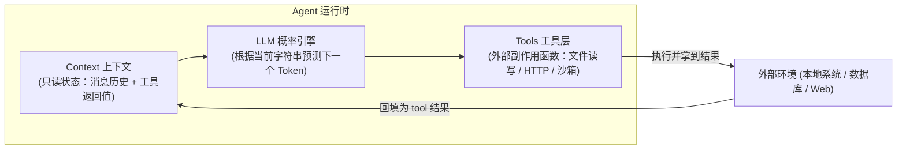
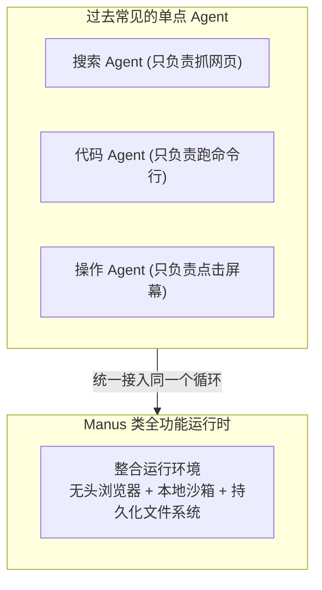
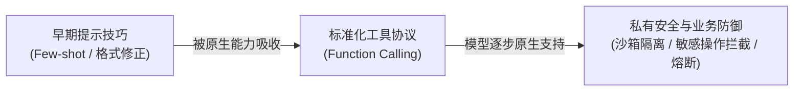

import { Quiz } from '@/components/Quiz'

# 1.1 现代 Agent 核心公式与概念边界

> 很多人以为做 Agent 就是找个强模型、写一段很长的 Prompt。但实际做项目时你会发现：模型往往不是不聪明，而是根本摸不到现场。这一节我们聊聊 Agent 的底层拆解，以及为什么扩充接口比调整提示词管用得多。

---

## 1. 核心公式：拆开看它到底由什么组成

李博杰在《AI Agents in Depth》里把 Agent 概括成一个极简公式：

> **Agent = 大模型 (LLM) + 上下文 (Context) + 工具集 (Tools)**

抛开那些复杂的学术术语，用全栈开发的视角看，这三者其实就是一套标准的状态机与外部系统：

* **大模型（LLM）**：负责根据传入的文本，预测接下来该输出普通回答还是发起工具调用。它没有独立常驻内存，每次调用都是纯函数式的无状态计算。
* **上下文（Context）**：相当于传给当前函数的 Payload。它决定了模型这一秒能获取什么信息。如果报错信息没塞进上下文，模型就算有再高的常识也只能靠猜。
* **工具集（Tools）**：暴露给模型的外部接口。模型想改文件、查数据库、发起网络请求，都必须通过这层函数声明派发出去。

---

## 2. 为什么扩充接口比优化 Prompt 更管用？

不少人刚开始做 Agent 时容易陷入一个误区：任务跑不通，就不断在 Prompt 里追加催促词：“请你务必仔细检查”、“请严格按照真实情况回答”。

但现实很残酷：**信息缺失的问题，无法通过提高态度来解决。**

比如让 Agent 去排查一个前端组件点击没反应的 Bug。如果它只能读代码仓库，它很可能会花几个小时去瞎猜是不是 CSS `z-index` 遮挡了，或者逻辑写错了。但如果你给它配两个具体的工具：
1. `get_browser_console_errors()`：拉取浏览器实时的报错日志；
2. `inspect_dom_node(selector)`：抓取当前节点的实际样式与绑定的事件。

它拿到第一手运行报错，几秒钟就能定位是接口返回了 403。

### 从 Manus 到生产级 Agent 的演进

2024 年底引发讨论的 Manus，核心技术突破并非来自凭空训练出了超越头部厂商的模型，而是系统工程上的整合：

过去做产品往往各玩各的：做搜索的只给搜索接口，做代码的只给终端。Manus 把**浏览器操作、Linux 容器执行、本地文件读写**统统挂在同一个 Agent 身上。模型手脚齐备之后，原本需要多套系统切来切去的复杂任务，就能在一个循环里自主串联了。

---

## 3. 模型越来越强，我们的外部工程代码会被淘汰吗？

强化学习学者 Richard Sutton 在著名的《The Bitter Lesson（苦涩的教训）》中提到：AI 历史上那些试图靠人类手工编写专家规则的做法，最终都会被更通用的算力和模型学习所取代。

这就带出一个很现实的工程疑问：**未来基础大模型如果越来越聪明，我们现在写的这一大堆上下文拼接、输入检查、工具兜底代码（Harness），还有存在的必要吗？**

答案很明确：**模型负责常识推理，Harness 负责把控业务边界与确定性。**

基础模型可以把通用语言理解、逻辑推导甚至多步骤调用练得很纯熟，但任何通用的出厂模型都无法预知：
* 你的哪台生产服务器绝对不能执行 `rm -rf`；
* 哪些数据库字段属于合规审计中的机密数据；
* 当外部第三方 API 超时返回 502 时该如何向用户做平滑降级。

模型的通用能力每往前走一步，外层框架就可以卸下一层繁琐的格式胶水代码，把精力集中在真正的企业安全边界、权限控制与生产级验证上。

---

## 4. 随堂检验

<Quiz
  question="开发一个代码排障 Agent 时，如果模型总是凭空捏造不存在的函数调用导致执行失败，最有效的工程手段通常是什么？"
  options={[
    {
      text: "A. 在 Prompt 里反复用感叹号警告模型绝对不要伪造代码",
      isCorrect: false,
      explanation: "口头强调对上下文缺失无法起效，在长对话中极容易被模型忽略。"
    },
    {
      text: "B. 提供代码符号检索工具并把真实项目结构作为初始上下文传入",
      isCorrect: true,
      explanation: "幻觉多数源于环境感知缺失，给模型提供真实的代码检索手脚能直接阻断瞎猜。"
    },
    {
      text: "C. 关掉工具调用能力，让模型一次性在对话里输出所有解决方案",
      isCorrect: false,
      explanation: "不运行验证就无法形成反馈闭环，排障需要依赖真实的执行与报错反馈。"
    },
    {
      text: "D. 换用体量更小的轻量模型来减少思考过程中的随机发散",
      isCorrect: false,
      explanation: "小模型在复杂指令遵循和长上下文把握上通常更脆弱，无法根治接口缺失。"
    }
  ]}
/>

---

## 延伸阅读

* 《AI Agents in Depth: Design Principles and Engineering Practice》（李博杰，2026）第 1.1 节。
* 下一节：[1.2 ReAct 循环与上下文消融实验](/ch01-fundamentals/02-react-loop-and-ablation)
