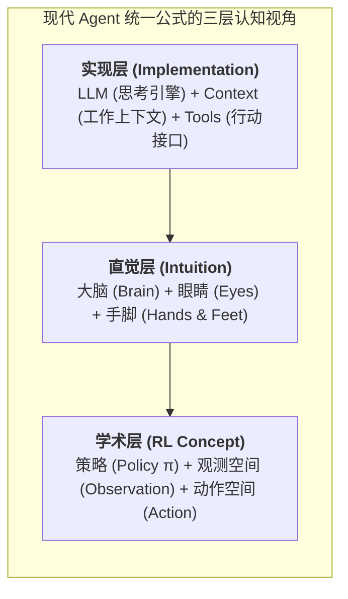
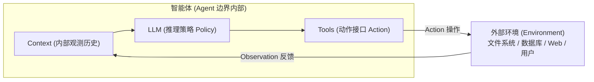
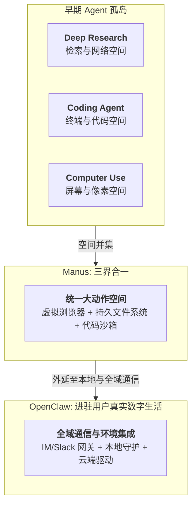
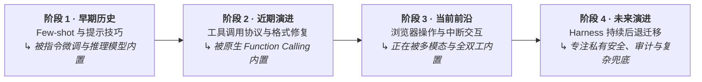

import { Quiz } from '@/components/Quiz'

# 1.1 现代 Agent 核心公式与概念边界

> **本节要点**：跳出表层概念，从系统论与强化学习两个视角彻底理解 Agent 的本质；掌握观测空间（Observation Space）与动作空间（Action Space）如何决定 Agent 能力上限；剖析 Manus 与 OpenClaw 的架构演进逻辑。

---

## 1. 核心公式的三层理解

《AI Agents in Depth》开篇给出了现代 Agent 的统一公式：

> **Agent = LLM (大型语言模型) + Context (工作上下文) + Tools (工具接口)**

这个公式可以在三个不同层次进行精准映射：

| 视角 | 思考引擎 (LLM) | 工作上下文 (Context) | 行动接口 (Tools) |
| :--- | :--- | :--- | :--- |
| **直觉层** | **大脑 (Brain)**：负责理解意图、常识推理、生成规划、做出决策。 | **眼睛 (Eyes)**：决定 Agent 在当前这一刻“能看见什么”（环境状态、历史记录、工具定义）。 | **手脚 (Hands & Feet)**：决定 Agent “能对外部世界做什么”（搜索、读写文件、调 API、发消息）。 |
| **强化学习层** | **策略 (Policy π)**：在给定当前信息时，决定“下一步采取什么行动”的概率分布。 | **内部观测 (Observation)**：将环境信息结构化组织为供策略计算的内部表征。 | **动作空间 (Action Space A)**：Agent 在环境中可合法执行的动作定义集合。 |

---

## 2. 系统工程的第一杠杆：重定义观测与动作空间

当底座模型固定时，**提升 Agent 能力最有效的系统工程杠杆，往往不是去写更长更花哨的提示词，而是重新定义或扩展其“观测空间”与“动作空间”**。

很多看起来需要“更聪明模型”才能解决的难题，本质上都是接口与感知问题：把任务相关的数据带进 Context，或者把所需的操作封装成一个工具，原本不可解的任务往往迎刃而解。

### 经典案例剖析：Manus 与 OpenClaw 的空间跃迁

1.  **Manus（空间的并集）**：
    在 Manus 之前，行业将 Agent 分割在三条独立赛道：深度研究（Deep Research）、代码生成（Coding）与电脑操作（Computer Use）。Manus 并非靠换上一个新模型而脱颖而出，而是**将这三者的观测空间与动作空间取了并集**——赋予模型虚拟浏览器、持久化文件系统与代码执行器，让单体 Agent 跨越了原本的产品边界。
2.  **OpenClaw（向外拓展到用户真实生活）**：
    OpenClaw 进一步将交互界面延伸到用户现有的即时通信软件（WhatsApp, Telegram, Slack, iMessage）中，并将本地网关与云端文档打通。散落在不同设备和云端的数据首次进入了同一个 Agent 的观测空间。

---

## 3. Sutton 的“苦涩的教训”与 Harness 的使命

强化学习之父、图灵奖得主 Richard Sutton 在著名文章《The Bitter Lesson（苦涩的教训）》中回顾了 70 年 AI 史：**凡是试图将人类专家经验硬编码进系统的做法，短期或许有效，但长期必然败给利用算力做通用搜索与学习的方法。**

这引发了一个尖锐的问题：**如果模型未来越来越强，我们今天围绕它写的这套 Harness（缰绳系统）最终会被模型吞噬淘汰吗？**

《AI Agents in Depth》给出的回答是：
> **Harness 工程不是抗拒 Bitter Lesson，而是在工程的时间尺度上践行它！**

大模型的训练周期通常以月甚至年为单位，没有任何模型能在出厂时内化所有特定企业的业务边界与私有安全规范。**模型的当前能力边界，正是 Harness 产生价值的黄金地带。** 模型每内化一层，Harness 就卸下一层，转而去托举下一个全新的能力前沿。

---

## 4. 随堂巩固自测

<Quiz
  question="根据《AI Agents in Depth》的论述，当底座大模型固定且任务解决率较低时，最有效的系统工程改进杠杆通常是什么？"
  options={[
    {
      text: "A. 在系统提示词中无限制地添加更多修饰性的形容词和催促模型认真思考的提示",
      isCorrect: false,
      explanation: "口头修饰属于表面提示词工程，无法弥补系统感知信息的缺失或操作接口的物理匮乏。"
    },
    {
      text: "B. 重新审视并拓展 Agent 的观测空间与动作空间补充关键上下文或提供必要工具",
      isCorrect: true,
      explanation: "系统工程的第一杠杆是接口重构：将不可见的信息带入 Context，将不可操作的动作封装为 Tool。"
    },
    {
      text: "C. 立即更换算法并要求模型在没有任何辅助工具的情况下纯靠内部思考输出结果",
      isCorrect: false,
      explanation: "大模型存在幻觉且缺少与现实世界的交互能力，封闭在无工具状态下无法解决环境交互任务。"
    },
    {
      text: "D. 放弃当前工程方案等待数年后更强大的通用基础大模型出厂自动解决该业务问题",
      isCorrect: false,
      explanation: "企业私有规范和动态环境永远不可能完全在出厂模型中预置，Harness 工程正是当下的核心壁垒。"
    }
  ]}
/>

---

## 📚 权威拓展与延伸阅读

*   📖 **教材章节**：《AI Agents in Depth: Design Principles and Engineering Practice》（李博杰，2026）第 1 章第 1.1 节。
*   ➡️ **下一节**：[1.2 ReAct 循环与上下文消融实验](/ch01-fundamentals/02-react-loop-and-ablation)
