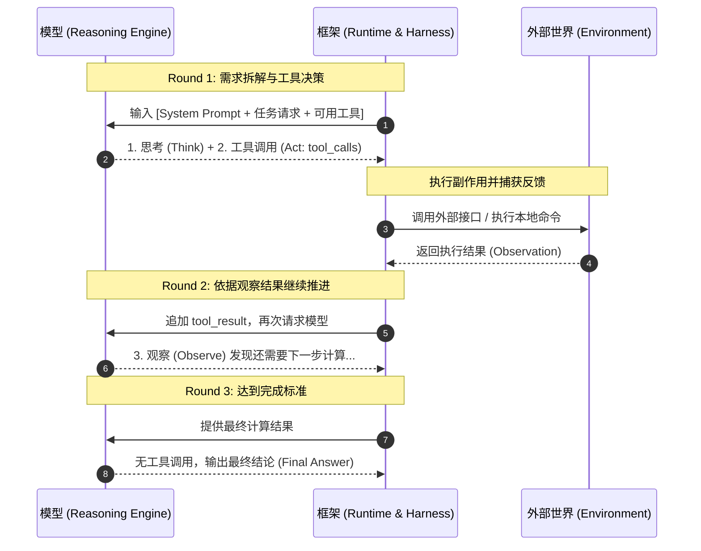
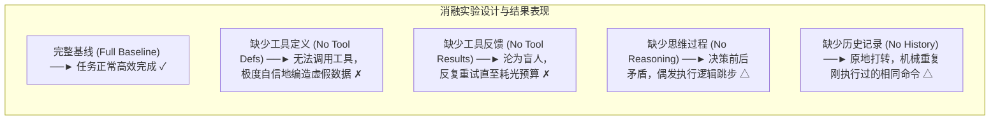

import { Quiz } from '@/components/Quiz'

# 1.2 ReAct 循环与上下文消融实验

> **本节要点**：拆解 Agent 的核心动力心脏——ReAct 循环；掌握无状态 API 下 Trajectory（轨迹）的累积与驱动机制；深入分析《AI Agents in Depth》经典的上下文消融实验，理解为什么缺少工具反馈会陷入死循环，缺少工具定义会导致自信的幻觉。

---

## 1. ReAct 动力内核：Think → Act → Observe

**ReAct (Reasoning + Acting)** 名字只提到了思考与行动，但其工程实体的循环由三阶段构成：



---

## 2. API 协议级消息流转结构

因为 LLM API 严格无状态，每一轮必须把**完整的历史轨迹（Trajectory）**连同静态前缀一起重新发送给模型：

```typescript
// ── 最小 TypeScript ReAct 循环驱动实现 ──
import OpenAI from "openai";

async function runAgent(userPrompt: string, tools: any[]) {
  const client = new OpenAI();
  const messages: any[] = [
    { role: "system", content: "You are an autonomous assistant." },
    { role: "user", content: userPrompt }
  ];

  let iterations = 0;
  const MAX_ITERATIONS = 10; // 必须设置硬上限熔断！

  while (iterations++ < MAX_ITERATIONS) {
    const res = await client.chat.completions.create({
      model: "gpt-4o",
      messages,
      tools
    });

    const assistantMsg = res.choices[0].message;
    messages.push(assistantMsg); // 必须原样塞回轨迹

    // 终止条件：若模型未发起工具调用，说明已得出最终答案
    if (!assistantMsg.tool_calls || assistantMsg.tool_calls.length === 0) {
      console.log("任务完成:", assistantMsg.content);
      return assistantMsg.content;
    }

    // 遍历执行工具调用（可并行执行）
    for (const call of assistantMsg.tool_calls) {
      const output = await executeLocalTool(call.function.name, call.function.arguments);
      messages.push({
        role: "tool",
        tool_call_id: call.id, // 核心信物，必须精准对应
        content: JSON.stringify(output)
      });
    }
  }

  throw new Error("超过最大循环迭代次数，触发安全熔断！");
}
```

---

## 3. 上下文消融实验 (Experiment 1-1)

为了量化证明 Context 中各个组成部分是否不可或缺，《AI Agents in Depth》设计了一组严格的五组对照消融实验：



| 测试组 | 系统提示 | 工具定义 | 工具执行返回 | 内部思考(CoT) | 历史消息 | 最终结果表现 | 深度工程启示 |
| :--- | :---: | :---: | :---: | :---: | :---: | :--- | :--- |
| **完整基线** | ✓ | ✓ | ✓ | ✓ | ✓ | **正常工作完成** | 闭环顺畅 |
| **无工具定义** | ✓ | **✗** | ✓ | ✓ | ✓ | **无法调用，严重幻觉** | 失去了行动能力，模型并不会沉默，而是用极度自信的口吻捏造答案！ |
| **无工具结果** | ✓ | ✓ | **✗** | ✓ | ✓ | **陷入盲人死循环** | 模型发起了调用却看不到返回，误以为未成功，反复重新发送相同调用。 |
| **无思维过程** | ✓ | ✓ | ✓ | **✗** | ✓ | **决策前后不一致** | 工具返回记录了“发生了什么”，思考记录了“为什么做”，两者相互校验。 |
| **无历史消息** | ✓ | ✓ | ✓ | ✓ | **✗** | **重复机械操作** | 遗忘了上一轮的尝试与失败，不断执行完全相同的命令。 |

> 🚨 **工程重磅警示**：  
> **“给出了漂亮回答（Produced an answer）”绝对不等于“完成了任务（Completed the task）”！**  
> 在生产环境中，当上下文缺失关键要素时，Agent 最普遍的失效形式往往不是抛出异常退出，而是**给出一个格式无可挑剔、语气极为自信、但数据全凭捏造的致命错误方案**。

---

## 4. 随堂巩固自测

<Quiz
  question="在《AI Agents in Depth》的上下文消融实验中，当把工具执行结果（Tool Results）从回传消息中剔除时，Agent 最典型的失效表现是什么？"
  options={[
    {
      text: "A. 框架立刻抛出未捕获语法异常终止进程并且终端静默退出不再产生任何输出",
      isCorrect: false,
      explanation: "缺少工具返回属于业务上下文缺失，大模型 API 本身仍会继续返回正常的文本或再次尝试调用。"
    },
    {
      text: "B. Agent 沦为盲目重试状态反复下发相同调用直至消耗完设定的全部轮次上限",
      isCorrect: true,
      explanation: "失去工具反馈等于切断了闭环控制，模型不知道刚才的操作已经发生或结果如何，因此会不断重复该操作直到耗尽预算。"
    },
    {
      text: "C. 模型立刻诚实且主动向用户汇报外部接口出现严重网络故障并请求人工接管",
      isCorrect: false,
      explanation: "模型并不知道接口故障，它只会看到当前上下文没有任何工具返回，从而继续尝试调用。"
    },
    {
      text: "D. 自动跳过该工具并在没有任何输入的前提下成功直接算出完全正确的目标结果",
      isCorrect: false,
      explanation: "没有外部环境的观测数据，模型无法凭空完成需要外部信息支持的真实计算任务。"
    }
  ]}
/>

---

## 📚 权威拓展与延伸阅读

*   📖 **教材章节**：《AI Agents in Depth: Design Principles and Engineering Practice》（李博杰，2026）第 1 章第 1.1.5 节与 Experiment 1-1。
*   💻 **配套代码**：`bojieli/ai-agent-book` 中的 `chapter1/web-search-agent/agent.py`。
*   ➡️ **下一节**：[1.3 生产级 Harness 缰绳工程](/ch01-fundamentals/03-harness-engineering)
