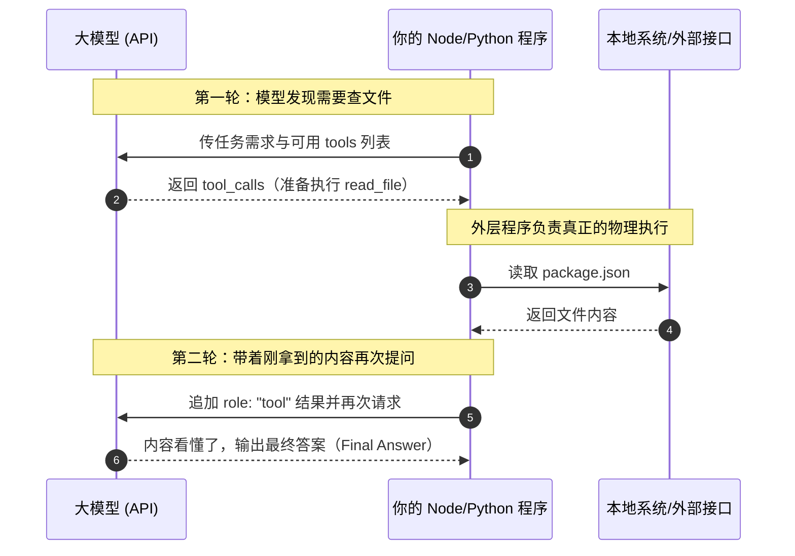
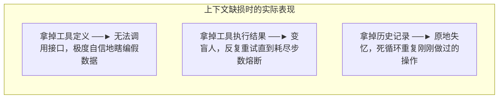

import { Quiz } from '@/components/Quiz'

# 1.2 ReAct 循环与上下文消融实验

> 很多人把 Agent 传得神乎其神，实际上剥离掉外层包装，它的核心运行逻辑就是一个 `while` 循环：模型说要调工具，外层代码替它调完把结果塞回去，再问模型接下来做什么。这一节我们看懂这段循环代码，以及当上下文缺斤少两时，程序会怎么翻车。

---

## 1. 最简运行循环：Think → Act → Observe

ReAct 的名字听起来像学术名词，其实就是三件事：
1. **Think（想）**：模型判断手头信息够不够，不够就决定调哪个工具；
2. **Act（做）**：宿主程序在本地执行这个函数（比如跑个 `curl` 或读个文件）；
3. **Observe（看）**：把执行结果塞回上下文，让模型看到刚才操作的结果。



---

## 2. 一段 40 行的最小实现

因为大模型的 API 是完全无状态的，它不会记住上一秒跟你聊过什么。你必须把所有历史记录装进数组，每一轮完整传回去：

```typescript
import OpenAI from "openai";

async function runAgent(task: string, tools: any[]) {
  const client = new OpenAI();
  const messages: any[] = [
    { role: "system", content: "你是一个协助排查代码的编程助手。" },
    { role: "user", content: task }
  ];

  let step = 0;
  const MAX_STEPS = 10; // 必须设硬上限，防止死循环烧光额度

  while (step++ < MAX_STEPS) {
    const res = await client.chat.completions.create({
      model: "gpt-4o",
      messages,
      tools
    });

    const assistantMsg = res.choices[0].message;
    // 关键点：上一轮模型输出必须原样塞回轨迹，包括 tool_calls
    messages.push(assistantMsg);

    // 如果模型没有发起工具调用，说明活干完了，直接返回结果
    if (!assistantMsg.tool_calls || assistantMsg.tool_calls.length === 0) {
      return assistantMsg.content;
    }

    // 遍历执行模型请求的工具
    for (const call of assistantMsg.tool_calls) {
      const toolResult = await executeTool(call.function.name, call.function.arguments);
      
      // 把执行结果以 role: "tool" 追加进去，tool_call_id 必须对齐
      messages.push({
        role: "tool",
        tool_call_id: call.id,
        content: JSON.stringify(toolResult)
      });
    }
  }

  throw new Error("超过最大步数限制，强制熔断退出");
}
```

注意第 66 行和第 78 行：`messages.push(assistantMsg)` 与返回结果的 `tool_call_id` 是强绑定的。如果你漏塞了模型刚才发出的调用声明，或者 ID 没对上，OpenAI 的接口会直接报 400 格式错误。

---

## 3. 把上下文抽掉一块，会发生什么？

很多人问：上下文里那么多字段，真有必要每次都传吗？省一点不行吗？

《AI Agents in Depth》在第一章做了一组很有意思的对照测试：把完整的消息历史逐一拿掉某一部分，观察模型会怎么表现。



实验测出来的真实反应非常值得警惕：

| 抽掉哪部分 | 模型的实际表现 | 对工程的警示 |
| :--- | :--- | :--- |
| **抽掉工具定义** | 它不会老老实实说“我没有工具”，而是会**用极度确信的语气编造假参数或假结果**。 | 很多偶发严重幻觉，根源不是模型笨，而是接口定义在传输时丢了。 |
| **抽掉工具返回结果** | 发起了调用却看不到回包，模型以为调用丢了，下一次请求**原封不动再次发起同一调用**，直到循环拉满。 | 接口报错或超时必须原样回传给模型，决不能静默吞掉。 |
| **抽掉历史记录** | 彻底失忆。刚读完 `index.ts`，下一秒又发命令去读 `index.ts`，原地打转。 | 长期运行的 Agent 必须做上下文压缩，但不能直接生硬丢弃历史动作。 |

> **关键提醒**：模型给出了非常流畅的回答，绝对不代表任务已经完成。它在上下文残缺时，最擅长的就是一本正经地胡说八道。

---

## 4. 随堂检验

<Quiz
  question="在 ReAct 循环中，如果本地工具执行失败并抛出异常，外层框架最合理的处理方式是哪一种？"
  options={[
    {
      text: "A. 直接终止进程并静默退出，避免让模型看到报错信息",
      isCorrect: false,
      explanation: "直接退出会让整个任务中断，Agent 失去了自愈和重试的机会。"
    },
    {
      text: "B. 将错误堆栈包装成 role: 'tool' 消息回传给模型",
      isCorrect: true,
      explanation: "把报错暴露给模型，模型才能在下一轮调整参数、换用备选方案或修正路径。"
    },
    {
      text: "C. 伪造一个执行成功的假结果传回，防止模型产生焦虑",
      isCorrect: false,
      explanation: "提供虚假结果会导致模型后续所有推导全部建立在错误前提上，引发严重灾难。"
    },
    {
      text: "D. 仅增加当前重试计数，但不把任何消息追加到历史上下文",
      isCorrect: false,
      explanation: "不更新上下文，模型看到的还是上一轮的信息，会继续机械重复相同的失败操作。"
    }
  ]}
/>

---

## 延伸阅读

* 《AI Agents in Depth: Design Principles and Engineering Practice》（李博杰，2026）第 1.1.5 节与 Experiment 1-1。
* 配套代码：`chapter1/web-search-agent/agent.py`。
* 下一节：[1.3 生产级 Harness 缰绳工程](/ch01-fundamentals/03-harness-engineering)
