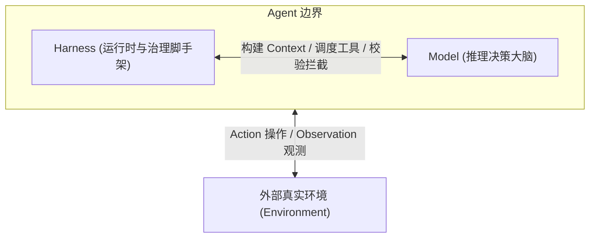
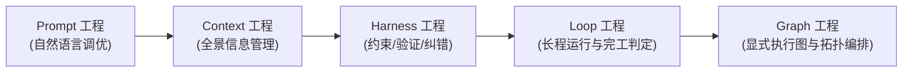
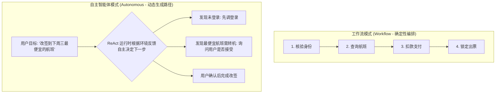
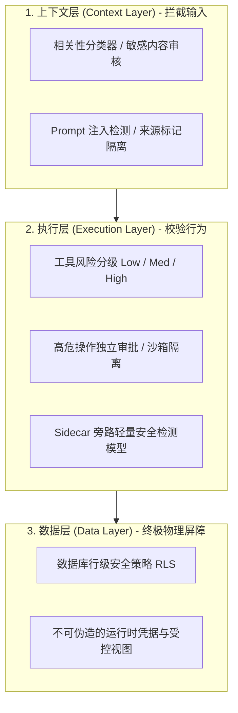

import { Quiz } from '@/components/Quiz'

# 1.3 生产级 Harness 缰绳工程

> **本节要点**：掌握工程落地的分水岭——Harness（缰绳系统）工程。理解从 Prompt 工程到 Loop/Graph 工程的范式演进；掌握工作流（Workflow）与自主智能体（Autonomous Agent）的选择与混合模式；构建“上下文层、执行层、数据层”三层纵深安全护栏体系。

---

## 1. 概念起源与生产公式

“Harness” 原意是指套在烈马身上的**笼头与缰绳**——其目的不是削弱马的奔跑力量，而是**驾驭这股不可预测的力量，使其奔跑在人类期望的轨道上**。

在生产级 Agent 视角下：

> **Agent = Model (模型) + Harness (缰绳系统)**  
> **Harness = 上下文管理 + 工具接口 + 约束 (Constrain) + 验证 (Verify) + 纠错 (Correct)**

一个仅供演示的玩具 Demo，只要有 Model + Context + Tools 就能运行；但一个生产级商业产品，**绝大部分代码都在实现约束、验证与纠错**。

---

## 2. 工程范式的五次浪潮演进

回顾整个 AI 应用工程的发展历程，存在一条清晰的包含扩展链：

1.  **Prompt Engineering（提示词工程）**：优化模型直接接收的单段自然语言指令。
2.  **Context Engineering（上下文工程）**：意识到只调提示词不够，必须系统化管理全局可见信息（前缀缓存、历史裁剪、状态栏）。
3.  **Harness Engineering（缰绳工程）**：视角由“模型看见什么”放大到“模型运行在什么样的系统环境中”，囊括所有基础设施。
4.  **Loop Engineering（循环工程）**：从单次运行扩展到跨轮次自主长程运转：谁来探索下一步、由谁在何时判定真正完工。
5.  **Graph Engineering（图工程）**：2026 年中兴起的高阶编排视角，将 Agent 循环、确定性程序与人工审批建模为显式执行图（如 LangGraph / Microsoft Agent Framework）。

---

## 3. 编排模式的抉择：Workflow vs. Autonomous

到底应该用写死的代码工作流（Workflow），还是完全放手让 Agent 自主规划（Autonomous）？

| 维度 | 工作流模式 (Workflow) | 自主智能体模式 (Autonomous Agent) |
| :--- | :--- | :--- |
| **执行路径** | 由程序员在代码中预先固化（DAG） | 运行时由 Agent 根据环境反馈动态决定 |
| **过程控制** | **极高**（如严格确保“先付款、后出票”，无法越步） | **灵活但不可控**（必须设计显式终止条件与熔断器） |
| **安全边界** | 攻击面被隔离在单个确定性节点内 | 攻击面随自主决策权扩大而增加 |
| **适用场景** | 强合规、步骤固定、分支已知的业务场景 | 开放式探索、未知步骤的复杂问题（如 Coding Agent） |

### 最佳工程实践：混合编排
在实际生产中，两者绝非对立：
*   **外层工作流固化核心安全与合规流程**（如风控审计、用户身份确认、资金结算）；
*   **内层局部节点唤起自主 Agent 处理灵活意图与模糊检索**；
*   或者由自主 Agent 现场编写工作流代码，再交给确定性引擎运行。

---

## 4. 三层安全护栏架构 (Three-Layer Guardrails)

《AI Agents in Depth》将系统的安全防御由浅入深划分为三层，层级越低，越不依赖模型的自主判断，越难被越过：

> 🛡️ **终极法则**：即使黑客通过巧妙的 Prompt 注入彻底攻破了上下文层，甚至欺骗了主模型的执行决策，**底层的数据库行级权限（RLS）与数据层约束依然必须将其越权操作物理拒绝**！

---

## 5. 随堂巩固自测

<Quiz
  question="在设计一个涉及在线扣费与机票改签的生产级航空客服系统时，以下哪种架构编排策略最为合理？"
  options={[
    {
      text: "A. 将整个身份核验与扣款出票业务流程完全交由无约束的自主循环动态自由探索",
      isCorrect: false,
      explanation: "将强合规的支付与出票完全交给不可预测的自主循环，极易发生跳过支付直接出票等灾难性违规事故。"
    },
    {
      text: "B. 采用固定工作流保障核心支付合规而在航班灵活推荐节点嵌入自主 Agent 决策",
      isCorrect: true,
      explanation: "混合架构的最佳实践：用确定性代码严格固化‘先核验、付款后出票’的合规边界，而将复杂偏好比对交给自主 Agent 发挥柔性决策优势。"
    },
    {
      text: "C. 彻底废弃所有代码逻辑仅仅编写一段三万字提示词让大模型自己保证绝不出错",
      isCorrect: false,
      explanation: "提示词属于软约束，面对复杂长程调用模型必然发生指令遗忘，无法提供银行与航空级的高可用安全保障。"
    },
    {
      text: "D. 所有环节严禁使用任何大模型完全退回到二十年前的纯规则关键字静态匹配引擎",
      isCorrect: false,
      explanation: "完全放弃大模型则失去了对用户口语化自然语言意图理解的能力，无法解决传统规则系统维护僵硬的问题。"
    }
  ]}
/>

---

## 📚 权威拓展与延伸阅读

*   📖 **教材章节**：《AI Agents in Depth: Design Principles and Engineering Practice》（李博杰，2026）第 1 章第 1.2 节《Harness Engineering》。
*   📑 **速查手册**：[Agent 核心架构与设计公式速查](/reference/agent-core-architecture)
*   ➡️ **下一节**：[1.4 贯穿全书的核心设计模式](/ch01-fundamentals/04-design-patterns)
