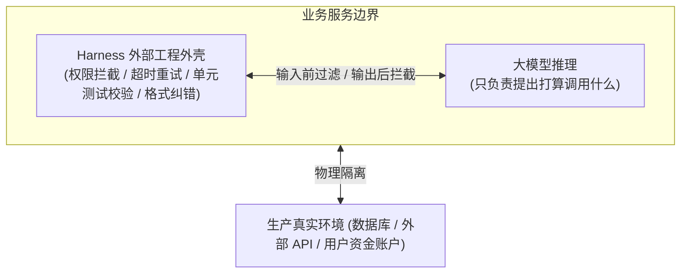
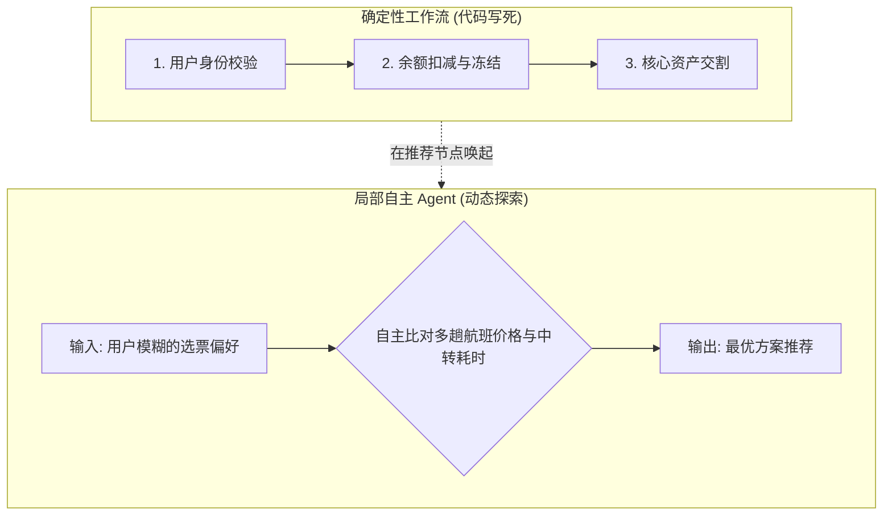
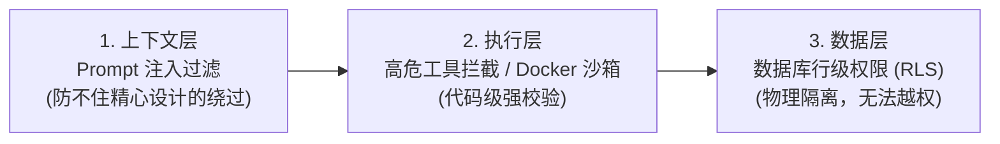

import { Quiz } from '@/components/Quiz'

# 1.3 生产级 Harness 缰绳工程

> 写一个能演示的 Agent Demo 只要半小时，但把它推上线面对真实用户，往往第一天就会被教做人：模型可能陷入死循环反复调同一个接口、把生产数据库的数据当测试数据删了、甚至自作聪明跳过了支付确认直接给用户发货。这一节聊聊外层防护体系（Harness）到底在保什么。

---

## 1. 为什么 Demo 只要调 API，产品却要写几千行外壳？

如果你把 Agent 拆开看，会发现一个残酷的事实：**核心大模型是最靠不住的组件。**

它可能会被用户用一段特殊的 Prompt 绕过安全设定，也可能在第 15 轮对话时突然把第一轮定下的规矩忘得一干二净。所以真正能上线的系统，公式其实长这样：

> **生产级 Agent = 大模型 (Model) + 外层防护脚手架 (Harness)**

Harness 的职责总结起来就三件事：
1. **约束（Constrain）**：限制模型什么能做，什么绝对不能碰（比如只要命令包含 `drop table` 或 `rm -rf`，直接在代码层拒绝执行）；
2. **验证（Verify）**：不听信模型口头汇报的“我已经修好了”，而是用真实的单元测试和状态断言去检验；
3. **纠错（Correct）**：第三方接口超时或者模型格式打架时，外壳负责自动重试、回滚事务或转交人工介入。

---

## 2. 别什么都让 Agent 自主规划：工作流 vs 自主探索

很多团队容易走极端：既然用了大模型，就恨不得从头到尾让模型“自主思考”。

但工程讲究成本和确定性：

* **绝对该用代码写死（Workflow）的场景**：
  身份认证、资金划扣、合规审计、退款流程。这种有严格法律风险或因果顺序的业务，一步都不能走错，必须用传统代码和工作流引擎写死。
* **才适合放手给 Agent（Autonomous）的场景**：
  代码重构与排障、网页端复杂信息抽取、多源数据比对。这类任务路径事先未定，需要根据每一步拿到的环境报错动态修正下一招。

生产中几乎都是**混合编排**：用写死的代码管死核心关卡，在某一个需要灵活处理的中间节点里唤起 Agent 跑几轮循环。

---

## 3. 三道安全防线：层级越低，越不能相信模型

如何保证黑客哪怕攻破了模型，也拿不走数据库？李博杰在书里总结了三层纵深防御：

1. **第一道：上下文层（软防御）**。过滤用户输入里夹带的恶意 Prompt，或者用小模型先审一遍。但这层属于概率防守，黑客换个编码或者加几层比喻就可能漏过去。
2. **第二道：执行层（硬防守）**。所有工具调用必须经过本地函数的白名单校验。跑代码必须扔进用完即毁的容器沙箱，并且网络只放行特定域名。
3. **第三道：数据层（底线防御）**。给 Agent 进程分发的数据库凭据，必须在数据库原生层面启用行级安全（Row-Level Security）。就算模型发疯执行了一条查询全表用户密码的 SQL，数据库也直接返回空结果集。

---

## 4. 随堂检验

<Quiz
  question="设计一个在线订机票与自动扣款的客服系统时，最可靠的工程架构是哪一种？"
  options={[
    {
      text: "A. 将整个扣费与出票流程完全交由模型的 ReAct 循环自由探索",
      isCorrect: false,
      explanation: "核心财务流程完全交给模型自主决策极易发生绕过支付直接出票的严重事故。"
    },
    {
      text: "B. 外层用固化代码把控支付与出票逻辑，仅将航班偏好筛选交给 Agent",
      isCorrect: true,
      explanation: "混合模式最稳妥：合规与资金流用确定性代码写死，灵活的信息搜索交给 Agent 探索。"
    },
    {
      text: "C. 不写任何代码拦截逻辑，把所有合规规则全写在五万字的系统提示词里",
      isCorrect: false,
      explanation: "Prompt 属于软约束，在长上下文下模型必然发生遗忘或被对抗注入。"
    },
    {
      text: "D. 只要模型生成回复时在文本里声明‘我已经扣款’就直接判定付款成功",
      isCorrect: false,
      explanation: "不能把模型的口头声明当成事实，必须通过真实的后端系统状态与对账单据验证。"
    }
  ]}
/>

---

## 延伸阅读

* 《AI Agents in Depth: Design Principles and Engineering Practice》（李博杰，2026）第 1.2 节《Harness Engineering》。
* [Agent 核心架构速查手册](/reference/agent-core-architecture)
* 下一节：[1.4 贯穿全书的核心设计模式](/ch01-fundamentals/04-design-patterns)
