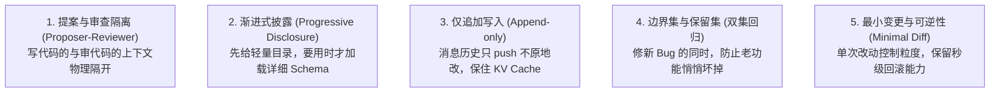
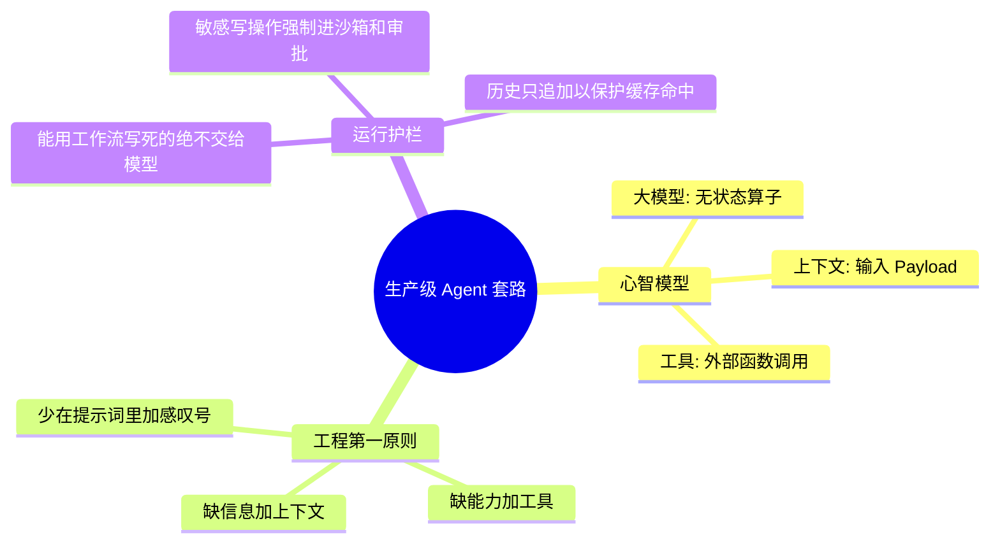

import { Quiz } from '@/components/Quiz'

# 1.4 贯穿全书的五大核心设计模式

> 写 Agent 代码写多了，你会发现无论业务多千奇百怪，底下踩的坑和解决套路就那么几个。与其每次翻车后现想补丁，不如提前把这 5 个生产级设计模式装进脑子。

---

## 1. 五大通用工程模式

### 1. 提案与审查隔离（Proposer-Reviewer）
* **别让模型自己当判官**：很多团队喜欢在 Prompt 里写“请你在生成完代码后自我反思一遍”。学术界和工业界测试都证明，让同一个模型在同一个对话上下文里“反思”，基本是无效劳动，甚至经常把原本写对的代码改错。
* **正确做法**：负责干活的 Agent（Proposer）把产物交出来；另一个独立的 Agent（Reviewer）开辟全新上下文，只看客观证据（比如真实的单测通过日志、终端报错、浏览器渲染截图），不被创作者的心理自我解释干扰。

### 2. 渐进式披露（Progressive Disclosure）
* **别一口气把家底全倒出来**：如果你有 50 个工具，一上来就把它们的全部参数文档全塞进每一轮的 `tools` 参数里，不仅一轮要吃掉几万 Token，模型还极容易挑错工具。
* **分级暴露**：系统常驻的只有工具名和一句话说明（几十 Token）；当模型明确表示需要某个工具时，再动态调出完整的 JSON Schema。Claude Code 的 Skills 系统就是这么省下 80% 上下文的。

### 3. 仅追加写入（Append-only）
* **绝不在原地偷改历史消息**：在处理对话记录时，永远只往数组最后 `push`。
* **保住服务商的 KV Cache**：像 Anthropic、DeepSeek、OpenAI 的 Prompt Caching 机制都依赖“前缀一致性”。只要前面的消息内容一字不改，后续轮次就能命中 90% 以上的缓存折扣；一旦你中间插了一句话或删了一条，整段缓存当场报废，账单直接翻倍。

### 4. 边界集与保留集（双集回归）
* **别急着开香槟**：改了一句 Prompt，刚才那个报错的用例终于跑通了！但先别高兴，你大概率把昨天本来能跑通的三个功能偷偷改崩了。
* **两套用例同时跑**：
  1. **边界集（Boundary Set）**：专门放这次要修复的缺陷用例，验证它是不是真修好了；
  2. **保留集（Retention Set）**：平时跑得好好的核心稳定用例，确保修改没引发回退。

### 5. 最小变更与可逆（Minimal Diff）
* **改动越碎，越容易救火**：让 Agent 改代码，要强制它只输出需要变动的具体行块（比如 search/replace 块），禁止整文件全量重写。
* 任何自动执行的变更，都要生成独立的 Git commit 或快照，确保出问题时能在几秒内完全回滚。

---

## 2. 核心总结与架构权衡

### 课后思考题

> **问题**：如果你的线上 Agent 任务解决率很低，手头预算有限，你只能做一件事：换用更昂贵的大模型、优化上下文传递的信息、或者提供更多工具，你会优先做哪一个？

**参考思路**：
* 如果排查日志发现模型在**凭空瞎猜业务数据**，这是信息盲区，优先补**上下文**；
* 如果模型在思考链里明确说“我想去查数据库”，但没有给它只读 SQL 工具，优先补**工具**；
* 只有当上下文和工具都给齐了，模型却在复杂的十几步推导中反复逻辑混乱跳步，这时候才有必要换更贵的**大模型**。

---

## 3. 随堂检验

<Quiz
  question="为什么在给 Agent 调试 Prompt 或调整工具时，绝不能只看目标缺陷是否被修好，而必须跑‘保留集’测试？"
  options={[
    {
      text: "A. 为了凑满测试用例数量，满足代码仓库的代码覆盖率硬指标",
      isCorrect: false,
      explanation: "保留集的核心是防功能回退，不是为了形式主义刷数字。"
    },
    {
      text: "B. 避免修复了当前 Bug 的同时，悄悄破坏了原本已稳定的历史业务",
      isCorrect: true,
      explanation: "大模型对提示词极度敏感，定向修改极易引发泛化退化，必须靠保留集保障老功能完好。"
    },
    {
      text: "C. 保留集只用来测试长文本，而边界集专门用来测试单轮短对话",
      isCorrect: false,
      explanation: "两者的区别在于‘是否预期发生改变’，与文本长短无关。"
    },
    {
      text: "D. 大模型需要阅读保留集里的所有内容作为 Few-shot 学习样例",
      isCorrect: false,
      explanation: "测试集用于外部自动化评估，不应该被一股脑塞进生产 Prompt 里。"
    }
  ]}
/>

---

## 延伸阅读

* 《AI Agents in Depth: Design Principles and Engineering Practice》（李博杰，2026）第 1.3~1.4 节。
* [Agent 核心架构速查手册](/reference/agent-core-architecture)
* 下一章：[第 2 章 上下文工程与 KV Cache 优化](/ch02-context/01-context-architecture-and-api)
