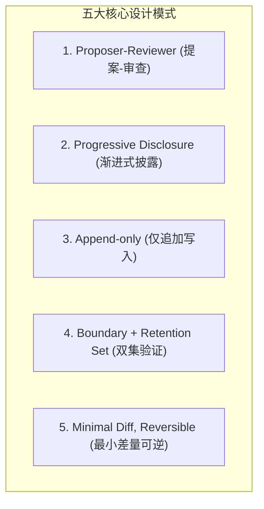
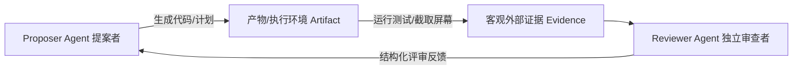
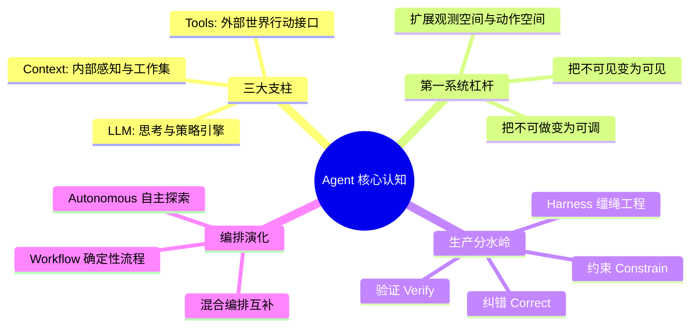

import { Quiz } from '@/components/Quiz'

# 1.4 贯穿全书的核心设计模式与深度思考

> **本节要点**：掌握贯穿整本《AI Agents in Depth》的 5 大金牌设计模式（Proposer-Reviewer、渐进式披露、仅追加写入、边界集+保留集、最小差量与可逆性）；完成第 1 章的深度思考题，构建坚固的架构判断力。

---

## 1. 贯穿全书的五大系统设计模式

在整个 Agent 工程体系中，无论面对上下文管理、工具调度、代码生成还是多智能体协同，以下 5 种设计模式反复出现。掌握它们，就掌握了通向生产级架构的通用钥匙。

### 1. Proposer-Reviewer（提案-审查）
*   **核心法则**：**创建者与审查者必须处于相互隔离的独立上下文！**
*   **底层证据**：学术研究（ICLR 2024）表明，让同一模型在同一上下文里重读自己的输出并“自我纠错”，往往是无效甚至有害的（把对的改错）。
*   **正确姿态**：审查者必须审查**产物本身及其实际执行证据**（如渲染出的前端截图、单元测试的真实通过日志、数据库变动行），而非审查创建者的内心独白。

---

### 2. Progressive Disclosure（渐进式披露）
*   **核心法则**：不把所有知识与定义一次性塞进 Context，**先常驻轻量级可检索目录，按需动态加载详情**。
*   **双重优化**：同时优化上下文预算（Token 消耗）与模型选择的准确率。
*   **典型落地**：
    *   Agent Skills：仅将 Skill 元数据（名字与简短路由描述，约几十 Token）常驻，命中任务后再下发完整 `SKILL.md`（几千 Token）。
    *   Tool Search：先展示元工具，按需检索具体的工具 Schema。

---

### 3. Append-only（仅追加写入）
*   **核心法则**：系统的状态流转与历史轨迹**只向后追加，绝不原地修改历史**。
*   **工程价值**：
    *   **KV Cache 极度友好**：只要前缀不被破坏，已有的历史 Token 缓存全部命中；
    *   **可重放性 (Replayability)**：完整的历史不可变，随时可拉取任意切片复现排查 Bug；
    *   **可审计性 (Auditability)**：每一笔资金流动、代码修改都有据可查。

---

### 4. Boundary Set + Retention Set（边界集 + 保留集双重验证）
*   **核心法则**：对 Agent 系统进行的任何改动（无论是优化提示词、添加工具还是微调权重），必须在两组数据集上同时验证：
    1.  **边界集 (Boundary Set)**：预期**必须被改变/修复**的问题用例；
    2.  **保留集 (Retention Set)**：过去已经正常运行、**绝不允许被破坏**的老业务用例。
*   **警示**：只测前者，容易把“过拟合”误当成“系统进步”；只测后者，容易把“无实质效果的代码”误当成“安全变更”。

---

### 5. Minimal Diff, Reversible（最小差量与可逆性）
*   **核心法则**：每一次修改都保持最小粒度，携带完整的变更因果记录，且必须具备独立一键回滚能力。
*   **工程价值**：一旦线上指标异常，能够立刻精确定位是哪一个特定 Patch 导致的故障，并秒级撤回。

---

## 2. 第 1 章核心总结 (Chapter Summary)

---

## 3. 深度思考题 (Thought Questions)

### 思考题 1（架构抉择 ★★）
> **题目**：如果在一个 Agent 系统中，你只能增加一项能力——更强的底座大模型、更丰富的上下文环境、或者更多的工具接口，你会选择哪一个？在什么业务条件下你的选择会发生改变？

**解题指引**：
*   如果系统处于**“未知信息缺失”**状态（例如不知道公司内部退款政策），再强大的模型也是巧妇难为无米之炊，此时**更丰富的上下文（Context）**是唯一解。
*   如果系统处于**“不可操作”**状态（例如模型清楚要改数据库但没有 SQL 工具），**更多工具（Tools）**是解药。
*   如果系统已经具备了充足的信息与工具，但面临复杂的跨步数长程推理和逻辑规划，**更强的模型（Model）**才会成为瓶颈。

### 思考题 2（KV Cache 经济学 ★★★）
> **题目**：在多轮 ReAct 循环中，随着轮次增加，累积向模型发送的 Token 量呈二次方增长。如何既保留关键历史，又有效降低这种增长？

**解题指引**：
*   **静态前缀固定**：System Prompt 与常用工具绝不修改；
*   **工具输出分层截断**：长日志仅返回摘要并在本地持久化；
*   **仅在接近窗口阈值时才进行批量归档式压缩**，避免每轮频繁变动前序消息破坏缓存。

---

## 4. 随堂巩固自测

<Quiz
  question="在为生产级 Agent 构建质量保障闭环时，为什么《AI Agents in Depth》强调必须同时使用“边界集 (Boundary Set)”与“保留集 (Retention Set)”进行双重回归？"
  options={[
    {
      text: "A. 仅仅为了让评测报告中的测试用例总数看起来更多以满足公司交付规范指标",
      isCorrect: false,
      explanation: "评测集设计的核心在于捕捉真实的系统泛化与退化信号，而不是形式主义地堆砌测试数量。"
    },
    {
      text: "B. 确保修复特定缺陷的同时绝不破坏已有稳定功能避免把过拟合误当作实际进步",
      isCorrect: true,
      explanation: "双集验证原则：边界集验证问题是否被修复，保留集确保老功能没有发生灾难性回退与退化。"
    },
    {
      text: "C. 保留集专门用来测试超长文本而边界集则仅仅用来测试单轮短文本指令遵循",
      isCorrect: false,
      explanation: "双集的划分维度是‘预期是否应该改变’（定向修复 vs 防回归），而不是单纯按文本长度划分。"
    },
    {
      text: "D. 边界集专门供大模型学习而保留集仅用于人类测试人员人工肉眼逐行进行比对",
      isCorrect: false,
      explanation: "在生产级自动化评估基础设施中，两组测试集均由机器自动化运行和度量，实现高频持续集成。"
    }
  ]}
/>

---

## 📚 权威拓展与延伸阅读

*   📖 **教材章节**：《AI Agents in Depth: Design Principles and Engineering Practice》（李博杰，2026）第 1 章第 1.3 节与第 1.4 节。
*   📑 **速查手册**：[Agent 核心架构与设计公式速查](/reference/agent-core-architecture)
*   ➡️ **第一章全部小课已修完！接下来我们将对第 1 章进行课程合理性 Review，并平滑迈入第 2 章！**
