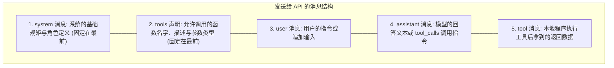

import { Quiz } from '@/components/Quiz'

# 2.1 上下文能力底座与 API 消息结构

> 同样一个大模型，你在网页端用觉得它很聪明，接进公司内部系统却发现它净说胡话。区别不在模型本身，而在你给它喂了什么上下文。这一节我们聊聊大模型 API 真正接收的消息格式，以及多轮工具调用时消息是怎样在背后流转的。

---

## 1. 为什么说上下文才是 Agent 的天花板？

新入行的工程师最容易抱怨大模型“不通人性”：比如让它“把用户登录的 Bug 修一下”，它改了半天，把加密方式给改崩了。

但这真的怪模型吗？它根本不知道：
* 你们团队的代码目录哪块是废弃的旧逻辑，哪块才是线上运行的核心；
* 你们的 Git 提交必须挂上 Jira ID，测试必须通过 ESLint 才能合入；
* 线上数据库到底长什么样、测试环境的连通账号是什么。

OpenAI 研究员翁家翌讲过一段非常实在的话：**“如果在公司里别人拥有和我完全一样的 Context，他们也能做我的工作。团队协作最本质的障碍，就是信息不对齐。”**

对 Agent 也是一样。一个平时技术文档健全、代码结构清晰、目录规范透明的项目，Agent 接进去就能直接跑；而在一个到处靠口头传授、没有一份像样 README 的屎山项目里，哪怕换用再贵的模型也寸步难行。

---

## 2. API 协议层：消息数组到底长什么样？

主流大模型 API（如 OpenAI、Anthropic、DeepSeek）全是基于无状态的 JSON 报文进行通信的。每一轮请求的核心字段就两个：`messages` 数组和 `tools` 列表。



### 看一个真实的多工具调用报文

用户提问：“查一下温哥华现在的时间和天气”。

#### 第 1 步：宿主程序向模型发起初始请求

```json
{
  "model": "gpt-4o",
  "messages": [
    { "role": "system", "content": "你是一个严谨的生活助手。" },
    { "role": "user", "content": "查一下温哥华现在的时间和天气。" }
  ],
  "tools": [
    {
      "type": "function",
      "function": {
        "name": "get_current_time",
        "description": "获取指定时区的当前时间",
        "parameters": {
          "type": "object",
          "properties": { "timezone": { "type": "string" } },
          "required": ["timezone"]
        }
      }
    },
    {
      "type": "function",
      "function": {
        "name": "get_weather",
        "description": "查询城市的实时天气",
        "parameters": {
          "type": "object",
          "properties": { "city": { "type": "string" } },
          "required": ["city"]
        }
      }
    }
  ]
}
```

#### 第 2 步：模型返回工具调用指令（并发下发）

大模型分析后，发现必须调两个接口才能回答，于是一次性返回两个 `tool_calls`：

```json
{
  "role": "assistant",
  "content": null,
  "tool_calls": [
    {
      "id": "call_001",
      "type": "function",
      "function": {
        "name": "get_current_time",
        "arguments": "{\"timezone\":\"America/Vancouver\"}"
      }
    },
    {
      "id": "call_002",
      "type": "function",
      "function": {
        "name": "get_weather",
        "arguments": "{\"city\":\"Vancouver\"}"
      }
    }
  ]
}
```

#### 第 3 步：宿主程序执行并回填结果

外层代码并行发起本地函数调用，将拿到的返回值用 `role: "tool"` 拼入消息末尾，再次发送：

```json
{
  "model": "gpt-4o",
  "messages": [
    { "role": "system", "content": "你是一个严谨的生活助手。" },
    { "role": "user", "content": "查一下温哥华现在的时间和天气。" },
    {
      "role": "assistant",
      "content": null,
      "tool_calls": [ ... ] // 必须把上一轮模型返回的调用原样放回！
    },
    {
      "role": "tool",
      "tool_call_id": "call_001",
      "content": "{\"datetime\":\"2026-09-22T08:00:00-07:00\"}"
    },
    {
      "role": "tool",
      "tool_call_id": "call_002",
      "content": "{\"temperature\": 18, \"condition\": \"晴\"}"
    }
  ]
}
```

> **注意**：`tool_call_id` 是模型把执行结果与上一轮调用对齐的唯一标识。如果写错或漏传，模型不知道这串数据属于谁，API 会直接拒绝处理。

---

## 3. 随堂检验

<Quiz
  question="向大模型回传工具执行结果时，为什么必须严格使用 role: 'tool' 并带上 tool_call_id，而不能把结果包装成普通 user 消息发回去？"
  options={[
    {
      text: "A. 因为包装成 user 消息会被大模型服务商按双倍单价计费",
      isCorrect: false,
      explanation: "服务商计费看的是总 Token 数量，与具体的消息 role 标签无关。"
    },
    {
      text: "B. 保持底座模型 Chat Template 的上下文对齐，防止推理逻辑被切断",
      isCorrect: true,
      explanation: "标准协议里 tool 角色与 ID 是一一对应的闭环。如果改成 user 消息，模型会误以为用户插入了新对话，导致刚才的思考过程被重置或格式报错。"
    },
    {
      text: "C. 底层网络通信协议只允许传输 tool 标签的内容",
      isCorrect: false,
      explanation: "HTTP 和 TCP 只负责传输通用字节，这是应用层的 JSON 协议约定。"
    },
    {
      text: "D. 这样模型才能自动把数据直接写入到开发者的本地硬盘上",
      isCorrect: false,
      explanation: "模型返回的都是文本，把数据写进磁盘完全靠外层程序执行。"
    }
  ]}
/>

---

## 延伸阅读

* 《AI Agents in Depth: Design Principles and Engineering Practice》（李博杰，2026）第 2.1 与 2.2 节。
* 下一节：[2.2 KV Cache 机制与缓存友好设计](/ch02-context/02-kv-cache-optimization)
