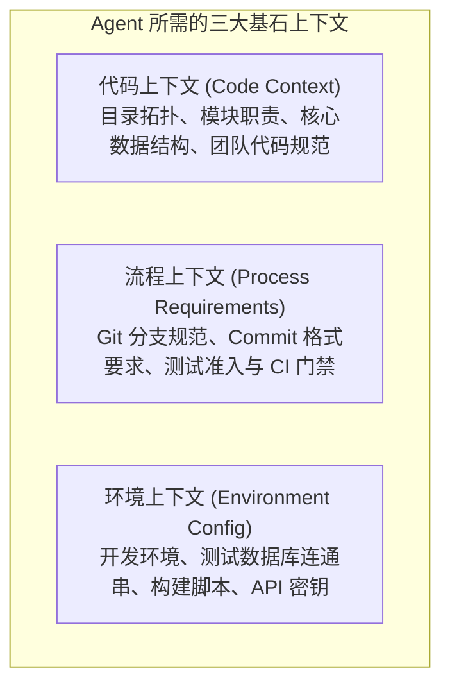
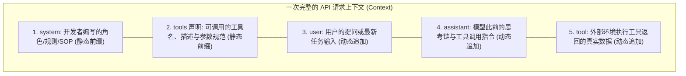

import { Quiz } from '@/components/Quiz'

# 2.1 上下文能力底座与 API 消息结构

> **本节要点**：理解为什么 Context 是决定 Agent 实际能力的根本要素；掌握大模型 API 协议层四大消息角色（System, User, Assistant, Tool）的分工与生命周期；透视多轮工具调用的底层消息流转与 `tool_call_id` 强关联机制。

---

## 1. 为什么说 Context 决定了 Agent 的能力？

在标准评测榜单上表现优异的基础大模型，放到具体企业场景中却常常跌跌撞撞。原因在于：**具体的业务工作依赖大量高度情境化的隐性知识（Tacit Knowledge）**。

以 Coding Agent 为例，一次成功的“帮我修个 Bug”指令，模型需要以下三大核心上下文：



> 💬 **OpenAI 资深研究员翁家翌**：“对人和对模型来说，最重要的都是 Context。如果在 OpenAI 别人拥有我所有的 Context，他们也能做我的工作。团队协作最核心的矛盾，就是上下文的不一致。”

因此，**团队的软件工程素养与文档透明度，直接决定了其 AI-Native 的上限**。那些适合远程异步协作的优秀开源社区（如 Linux 内核维护），其讨论公开、决策留痕、架构文档化，天然为 Agent 提供了完美的上下文培养基。

---

## 2. API 协议层：四大消息角色与工具定义

Chat Completions 风格的无状态 API，通过 `messages` 数组和顶层的 `tools` 字段传递所有上下文：



### 多轮工具调用的 API 请求报文全貌

假设用户询问：“温哥华当前的时间和天气如何？”：

```json
// ── 第 1 次 API 请求（Agent 框架发送） ──
{
  "model": "Qwen3-0.6B",
  "messages": [
    { "role": "system", "content": "You are a helpful assistant..." },
    { "role": "user", "content": "What's the current time and weather in Vancouver?" }
  ],
  "tools": [
    {
      "type": "function",
      "function": {
        "name": "get_current_time",
        "description": "Get current time in timezone",
        "parameters": { "type": "object", "properties": { "timezone": { "type": "string" } } }
      }
    },
    {
      "type": "function",
      "function": {
        "name": "get_weather",
        "description": "Get weather for city",
        "parameters": { "type": "object", "properties": { "city": { "type": "string" } } }
      }
    }
  ]
}
```

模型分析后，识别出两个独立的子任务，在单次响应中并发下发两个工具调用：

```json
// ── 第 1 次模型响应（返回两个 tool_calls） ──
{
  "role": "assistant",
  "content": null,
  "tool_calls": [
    { "id": "call_123", "function": { "name": "get_current_time", "arguments": "{\"timezone\":\"America/Vancouver\"}" } },
    { "id": "call_456", "function": { "name": "get_weather", "arguments": "{\"city\":\"Vancouver\"}" } }
  ]
}
```

框架并行执行这两个工具，将输出原样追加为 `role: "tool"` 消息发起第 2 次请求：

```json
// ── 第 2 次 API 请求（携带全部历史与工具结果） ──
{
  "model": "Qwen3-0.6B",
  "messages": [
    { "role": "system", "content": "..." },
    { "role": "user", "content": "What's the current time and weather in Vancouver?" },
    { "role": "assistant", "content": null, "tool_calls": [ ... ] },
    { "role": "tool", "tool_call_id": "call_123", "content": "{\"datetime\":\"2026-09-21T07:30:00\"}" },
    { "role": "tool", "tool_call_id": "call_456", "content": "{\"temp\":18,\"condition\":\"Clear\"}" }
  ]
}
```

---

## 3. 随堂巩固自测

<Quiz
  question="在向大模型 API 回传工具执行结果时，为什么必须严格使用 role: 'tool' 并附带 tool_call_id，而不能把结果包装成普通 user 消息直接回传？"
  options={[
    {
      text: "A. 仅仅是各家商业公司强制推行的计费标记如果不带该字段就会被扣除双倍费用",
      isCorrect: false,
      explanation: "role 与 ID 是标准协议语义定义，与各家云厂商的计费策略无关。"
    },
    {
      text: "B. 让模型训练好的 Chat Template 能正确匹配调用关系并防止思维链重置与混淆",
      isCorrect: true,
      explanation: "标准角色与 ID 保证了底层 Token 序列能准确对齐工具调用关系。若伪装为 user 消息，模型的 Chat Template 会误以为开启了新话题而重置思维链甚至造成格式错误。"
    },
    {
      text: "C. 因为底层的网络传输层 TCP/IP 协议只支持 tool 角色不支持其它字符串数据传输",
      isCorrect: false,
      explanation: "传输层只负责传输字节流，消息的角色与参数属于最上层的应用层协议约束。"
    },
    {
      text: "D. 这样可以使模型自动具备将所有返回结果立刻自动持久化到本地磁盘硬盘的能力",
      isCorrect: false,
      explanation: "持久化由外层框架（Harness）代码控制，模型本身并没有直接操作底层硬件存储的能力。"
    }
  ]}
/>

---

## 📚 权威拓展与延伸阅读

*   📖 **教材章节**：《AI Agents in Depth: Design Principles and Engineering Practice》（李博杰，2026）第 2 章第 2.1 与 2.2 节。
*   ➡️ **下一节**：[2.2 KV Cache 机制与缓存友好设计](/ch02-context/02-kv-cache-optimization)
