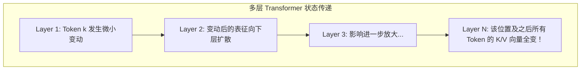
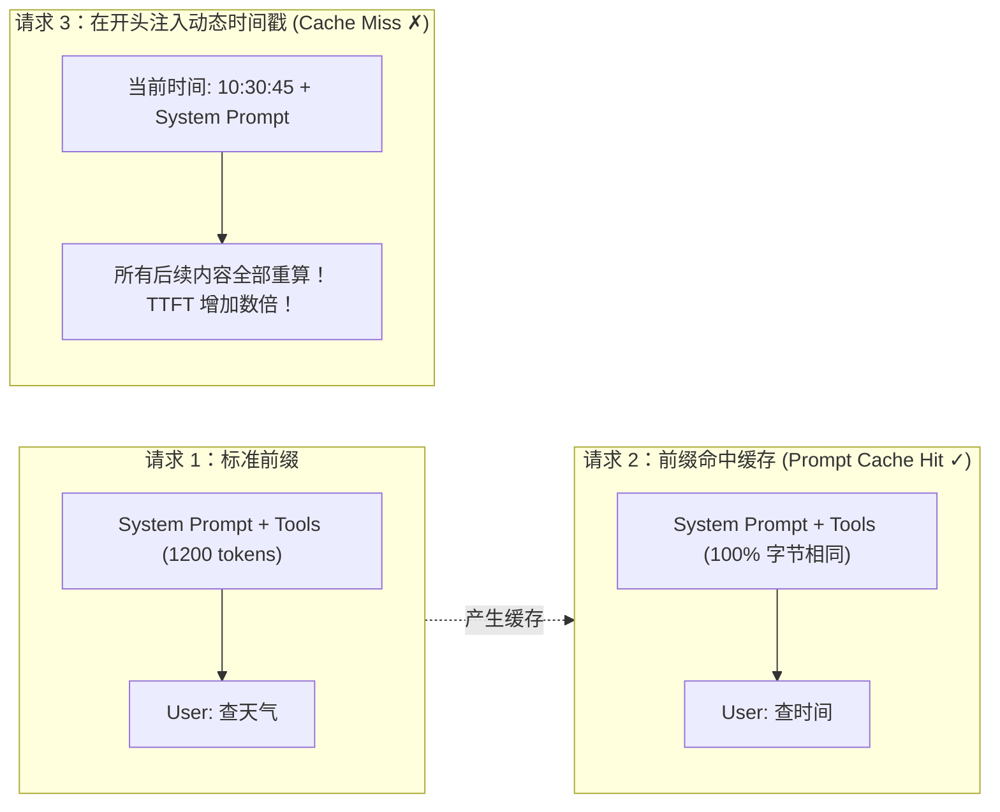

import { Quiz } from '@/components/Quiz'

# 2.2 KV Cache 机制与缓存友好设计

> **本节要点**：深入 Transformer 注意力机制底层，理解 Key-Value 缓存的运作机理；剖析为什么前缀中哪怕多一个空格都会使昂贵的缓存全部报废；掌握工业级生产中极易踩坑的 5 大“上下文反模式”，学会构建毫秒级首字延迟（TTFT）与低成本的缓存友好型 Context。

---

## 1. Attention 机制与为何需要缓存 Key/Value

大模型生成文本时，每个词都需要对前文所有词“看上一眼”，这就是 Self-Attention 机制。
其本质由三个向量矩阵完成协作：

```mermaid
graph TD
    subgraph Attention["Attention 机制的直觉映射：以'北京的天气怎么样'为例"]
        Q["Query (当前词'怎么样'发出的搜索意图):<br/>'请问前文中谁与我的含义最相关？'"]
        K["Key (历史词'北京'、'天气'的身份标签):<br/>'北京'标签偏向地名，'天气'标签偏向气象"]
        V["Value (历史词携带的真实语义信息):<br/>匹配成功后提取出的具体语义内容"]
        
        Q ---|点积匹配打分| K
        K -->|归一化为权重 (Softmax)| W[Attention 权重]
        W -->|加权求和| V
    end
```

### 为什么必须做 KV Cache？
*   **无缓存状态**：当生成第 $N$ 个词时，必须重新对前面 $1 \sim N-1$ 个词完整算一遍 $K$ 和 $V$ 投影矩阵，计算量随长度呈平方阶暴增。
*   **有缓存状态**：每个历史 Token 在第一次输入时计算一次 $K$ 和 $V$ 并写入显存。生成后续词时，直接读取历史缓存，单步计算复杂度降为线性。

---

## 2. 生产级灾难：为什么修改前缀一个字符，后续缓存全部失效？

大模型由几十到上百层 Transformer 堆叠而成。每一层的输出都是下一层的输入。



> ⚠️ **硬性物理约束**：  
> 因果注意力（Causal Attention）保证了当前 Token 仅受它之前的 Token 影响。  
> **如果前缀在第 $k$ 个 Token 发生变化，第 $k$ 个位置之前的所有 KV 缓存可以复用；但从第 $k$ 个位置开始直到末尾的所有缓存，全部失效，必须从头重新 Prefill！**



---

## 3. 极其普遍却危害巨大的 5 大“上下文反模式” (Anti-Patterns)

《AI Agents in Depth》在 Experiment 2-3 中对常见开发错误进行了系统性消融评测：

| 反模式名称 | 常见典型代码 | 破坏后果 | 正确解法 |
| :--- | :--- | :--- | :--- |
| **1. 动态系统提示词** | 在 System Prompt 中拼接 `Current time: {{now}}` | 每一次调用的秒数都在变，**全量前缀缓存命中率恒为 0%** | 将动态时间作为尾部 User 消息或工具返回注入 |
| **2. 动态用户配置** | 在前缀中动态更新 `用户剩余额度: 50` | 状态每变一次，后续长达数千 Token 的工具缓存全部报废 | 通过专门的状态管理接口维护，不侵入静态前缀 |
| **3. 工具定义动态重排** | 每次调用按使用频率动态调整工具顺序 | 重新排列导致从第一个被挪动的工具起，后续缓存全部失效 | **保持工具列表静态顺序绝对固定**（实验证明固定顺序对选型准确率无影响） |
| **4. 固定滑动窗口** | 强制丢弃 5 轮前的消息只保留最新几轮 | 原地破坏历史前缀连续性，且遗忘关键前期工具输出引发**死循环反复调用** | 采用只追加的分层压缩与归档，绝不粗暴截头 |
| **5. 纯文本格式扁平化** | 将消息拍平成 `"USER: ... ASSISTANT: ..."` | 脱离官方 Chat Template，削弱多轮推理能力，易引发误识别 | 严格使用官方标准的结构化角色字典 |

---

## 4. 随堂巩固自测

<Quiz
  question="在构建一个高频并发的 Agent 服务时，某工程师为了让模型每次都知道精准秒级时间，以下哪种做法既能传递时间，又能保住大半缓存？"
  options={[
    {
      text: "A. 直接在 System Prompt 的开头首行插入动态生成的当前系统时间戳字符串",
      isCorrect: false,
      explanation: "在开头插入秒级变动的时间戳会导致后续上万 Token 的前缀缓存全部失效，大幅增加首字延迟与算力成本。"
    },
    {
      text: "B. 保持系统前缀与工具声明绝对不变并将时间戳附加在末尾的消息或状态栏中",
      isCorrect: true,
      explanation: "将变化收敛在尾部：前面的大段静态前缀可百分之百命中 Prompt Cache，仅对末尾几百 Token 进行增量计算。"
    },
    {
      text: "C. 每次交互时随机修改一个工具的函数描述参数以刷新显存防止显存泄漏发生",
      isCorrect: false,
      explanation: "修改工具描述同样会破坏前缀缓存，且与显存垃圾回收完全无关，纯属严重劣化性能的误操作。"
    },
    {
      text: "D. 放弃使用官方 API 并将所有对话拼接成一个巨大的无结构长字符串输入模型",
      isCorrect: false,
      explanation: "纯文本拍平打破了 Chat Template 的结构化界定符，破坏了模型训练出的角色认知与思考链保持机制。"
    }
  ]}
/>

---

## 📚 权威拓展与延伸阅读

*   📖 **教材章节**：《AI Agents in Depth: Design Principles and Engineering Practice》（李博杰，2026）第 2 章第 2.3 节。
*   📑 **速查手册**：[Agent 核心架构与设计公式速查](/reference/agent-core-architecture)
*   ➡️ **下一节**：[2.3 流程驱动 SOP、防注入与 Agent Skills](/ch02-context/03-prompt-engineering-and-skills)
