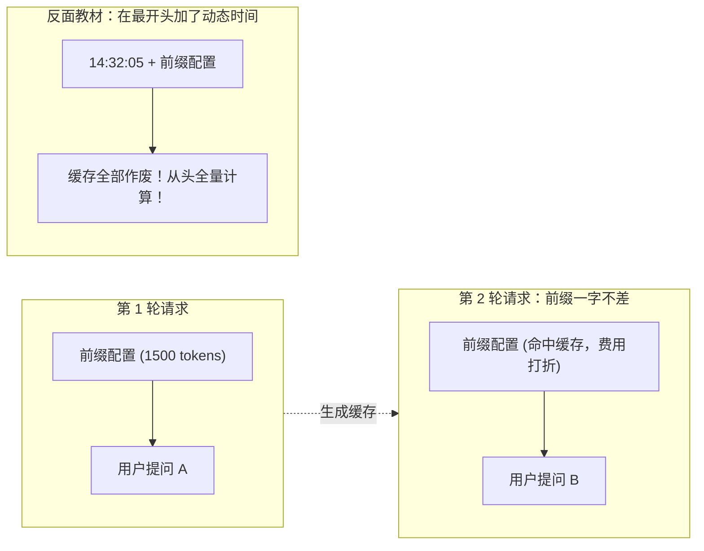

import { Quiz } from '@/components/Quiz'

# 2.2 KV Cache 机制与缓存友好设计

> 你在本地跑 Agent 时觉得挺快，一推上线却发现首字延迟（TTFT）动辄三四秒，云服务商的月末账单还高得吓人。一查监控，缓存命中率居然是 0%。这一节我们搞清楚 KV Cache 的物理规则，以及哪 5 种常见写法会悄悄干废你的缓存。

---

## 1. 为什么各大云厂商都在推 Prompt 缓存？

大模型在生成每一个字时，都要回头去和历史里的所有 Token 算一遍注意力关系。

* **没有缓存**：第 10 轮对话发过去 8000 个 Token，GPU 必须把这 8000 个词从第 1 层到第 96 层全部重算一遍，计算量随长度平方级上升。
* **有缓存（KV Cache）**：前 9 轮已经算过的中间向量直接存在显存里。第 10 轮只需要算最新追加的那几个词，不仅首字响应快几倍，Anthropic 和 DeepSeek 等厂商还会给出 **1折到 2折的巨大折扣**。

---

## 2. 物理铁律：为什么改了一个字符，后面的缓存全作废？

Transformer 结构决定了注意力的单向依赖：
**后面的 Token 依赖前面的结果，但前面的 Token 不受后面影响。**

如果一段 2000 Token 的系统提示词里，你在第 5 个 Token 处改动了一个空格：
* 前 4 个 Token 的缓存还能用；
* **从第 5 个 Token 往后，所有层的计算全部改变，后续 1995 个 Token 的缓存全部报废，GPU 必须从头重算！**

这就是为什么**动态变化的内容绝对不能往前塞**。

---

## 3. 生产环境中最容易踩的 5 大“断缓存反模式”

很多工程师刚接触 Agent 时，直觉写出来的代码往往正好踩在雷区上：

| 反模式 | 常见写法 | 为什么会炸掉缓存 | 正确姿势 |
| :--- | :--- | :--- | :--- |
| **1. 顶层动态时间戳** | 在 System Prompt 首行写 `当前时间: {{new Date()}}` | 每一秒发过去的文本都不同，**全量前缀缓存命中率永远是 0%** | 保持系统前缀静态，时间戳放到末尾最新的一条用户消息里 |
| **2. 动态用户状态塞前缀** | 把 `用户剩余额度: 50` 拼进系统角色定义 | 用户每花一次额度，后续几千 Token 的工具缓存全部失效 | 状态抽离到末尾状态栏或通过工具实时查询 |
| **3. 动态重排工具列表** | 每次根据最近使用频率给 `tools` 数组重新排序 | 数组顺序一变，对应 Token 序列全变，缓存瞬间报废 | **工具列表严格固定静态顺序**（测试表明顺序对模型选择无影响） |
| **4. 粗暴截断头部历史** | 每次只保留最近 3 轮，把更早的消息直接 `shift()` 掉 | 破坏了已有前缀的完整性，不仅缓存报废，模型还容易失忆死循环 | 采用只追加的滑动归档，或等窗口接近用尽时再做批量总结 |
| **5. 消息格式拍平成纯文本** | 自己写代码拼接 `"Human: ... AI: ..."` | 破坏了底座模型的 Chat Template 分界符，增加解析开销 | 严格使用官方标准的结构化角色数组 |

---

## 4. 随堂检验

<Quiz
  question="为了让 Agent 每次推理都能准确感知精确到秒的当前时间，以下哪种做法既能传递时间，又能保住缓存？"
  options={[
    {
      text: "A. 直接在 System Prompt 的首行开头拼接当前秒级时间戳",
      isCorrect: false,
      explanation: "放在首行会导致后面几千甚至上万 Token 的前缀缓存全部失效，极度浪费算力与费用。"
    },
    {
      text: "B. 保持系统提示词与工具声明一字不改，将时间作为尾部最新消息传入",
      isCorrect: true,
      explanation: "将变量收敛在末尾：前面的长前缀全部命中缓存，只有尾部几个 Token 做增量计算。"
    },
    {
      text: "C. 每次请求前随机修改某一个工具的描述文字来刷新显存",
      isCorrect: false,
      explanation: "修改工具描述同样会打碎前缀缓存，纯属劣化性能的操作。"
    },
    {
      text: "D. 放弃官方消息数组格式，把所有历史对话拍平成一个纯文本字符串",
      isCorrect: false,
      explanation: "破坏结构化角色界定符会导致模型思维链对齐能力下降，且无法解决缓存失效问题。"
    }
  ]}
/>

---

## 延伸阅读

* 《AI Agents in Depth: Design Principles and Engineering Practice》（李博杰，2026）第 2.3 节。
* [Agent 核心架构速查手册](/reference/agent-core-architecture)
* 下一节：[2.3 流程驱动 SOP、防注入与 Agent Skills](/ch02-context/03-prompt-engineering-and-skills)
