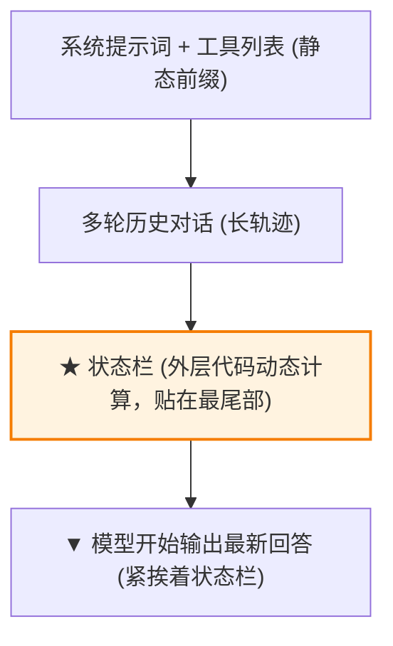
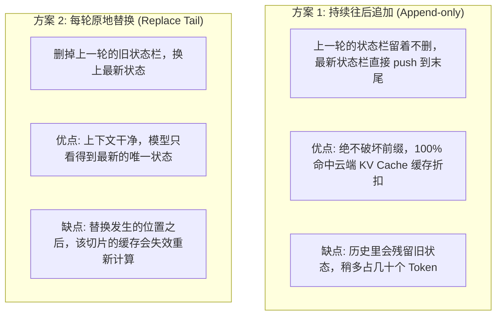

import { Quiz } from '@/components/Quiz'

# 2.4 Agent 状态栏与显式状态蒸馏

> 你在提示词里白纸黑字写着：“每个电话最多只能重拨 3 次”。结果多轮对话之后，Agent 还是拨出了第 4 次。你可能会疑惑：它瞎了吗？前面不是明明白白记录了调过 3 次吗？这一节我们聊聊为什么模型天生数不对数，以及如何用“状态栏”把算好的结论直接送到它嘴边。

---

## 1. 为什么模型数不对调用次数？

很多开发者直觉上以为：大模型上下文那么长，既然历史里全都有，它自然能掌握全局。

但 Transformer 的注意力机制本质上是个**文本模糊匹配器**，不是具备内存寻址的 CPU：
* **它擅长“局部查找”**：比如问它“第 5 轮调用的返回值里有没有报错”，它能快速翻出来；
* **它极不擅长“在线聚合统计”**：如果上下文中散落了 50 条调用记录，要它一边推理，一边从头到尾准确统计某个接口被调用了几次，它大概率会数多或者数漏。

**外层代码几行就可以算清的事情，绝对不要交给模型在脑子里心算。**

与其让模型大海捞针去数数，不如在外层程序里写个 `count++`，把算好的结果直接贴在它眼前。

---

## 2. 什么是 Agent 状态栏？

就像智能手机顶部常驻的电量、时间和 Wi-Fi 图标一样，**状态栏是由外层程序汇总好、在每一轮请求前动态贴在消息最末尾的结构化摘要**：

```xml
<agent_status>
  【当前进度】
  [✓] 1. 查询订单历史记录
  [✓] 2. 调客服接口获取优惠方案
  [▶] 3. 等待用户确认是否接受改签 (当前步骤)
  
  【调用配额拦截】
  phone_call: 已调用 3/3 次 ✗ (已达上限，禁止再调)
  web_search: 已调用 2/10 次
</agent_status>
```



根据 Transformer 的位置偏好，**距离输出位置最近的信息会获得极高的注意力权重**。把状态栏贴在最尾巴上，模型一低头就能看清：调用次数已满，必须立刻停止。

---

## 3. 状态栏更新：持续追加 vs 轮次替换

任务每推进一步，状态都在变（比如进度打勾、次数增加）。怎么把新状态喂给模型？



### 怎么选？
* **Claude Code 类终端工具大多倾向“持续追加”**：状态栏本身很短（百十来个 Token），直接 `push` 进去对节省 API 缓存最划算。
* **超长多步骤业务倾向“每轮替换”**：如果状态栏里塞了很大的当前代码树或者待办列表，而且要跑大几十轮，把旧的顶掉能保证模型不会被已经完成的过时信息干扰。

---

## 4. 随堂检验

<Quiz
  question="在为复杂 Agent 引入状态栏（Agent Status Bar）技术时，最符合工程设计原则的做法是什么？"
  options={[
    {
      text: "A. 把状态栏强制写在第一行的系统提示词里，让模型最先看到",
      isCorrect: false,
      explanation: "写在最前头会导致每一轮时间或计数变化时，后续上万 Token 的前缀缓存全部报废。"
    },
    {
      text: "B. 由外层程序计算好统计指标并贴在轨迹尾部，利用位置优势约束当前决策",
      isCorrect: true,
      explanation: "外层代码负责确定性的计数与状态追踪，贴在末端既能强力引导注意力，又把对缓存的影响降到最小。"
    },
    {
      text: "C. 严禁写任何代码统计，要求模型完全靠自己回忆历史消息并在心中默数",
      isCorrect: false,
      explanation: "模型在长上下文下极容易数漏调用次数，状态栏的意义就是用确定性代码替代不可靠的心算。"
    },
    {
      text: "D. 状态栏只能记录操作系统的内存和 CPU 占用率，不能写入业务进度",
      isCorrect: false,
      explanation: "状态栏的核心是业务状态提炼（待办项、配额计数、当前模式），不仅仅是服务器硬件指标。"
    }
  ]}
/>

---

## 延伸阅读

* 《AI Agents in Depth: Design Principles and Engineering Practice》（李博杰，2026）第 2.6 节《Agent Status Bar》。
* [Agent 核心架构速查手册](/reference/agent-core-architecture)
* 下一节：[2.5 上下文分层压缩与防腐烂策略](/ch02-context/05-compression-strategies)
