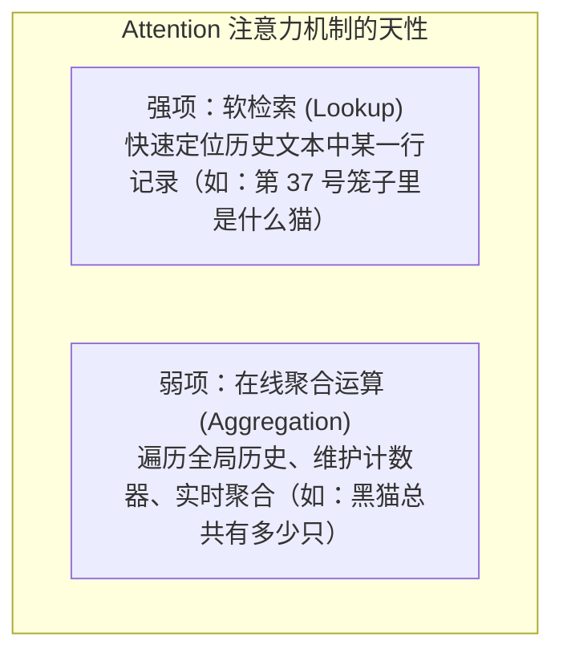
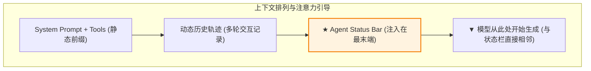
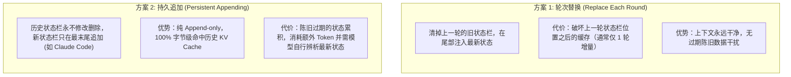

import { Quiz } from '@/components/Quiz'

# 2.4 Agent 状态栏与显式状态蒸馏

> **本节要点**：理解为什么大模型的上下文学习是“软检索”而非“真运算”；掌握利用 Agent 状态栏（Status Bar）将散落的隐式状态显式蒸馏的核心技术；对比两种状态栏更新机制对 KV Cache 命中率与显存开销的数学平衡点。

---

## 1. 理论根基：In-Context Learning 是“检索”而非“运算”

在长程任务中，Agent 经常出现以下致命失败：
*   **重复调用超限**：规定“每个号码最多拨打 3 次”，但 Agent 打了 3 次后，依然拨打第 4 次；
*   **目标漂移 (Goal Drift)**：任务走到第 15 步时，彻底遗忘了用户最开始的核心诉求；
*   **黑白猫统计难题**：假设上下文记录了 100 只猫的检查日志（90 只黑猫、10 只白猫），如果不开启极耗算力的思维链逐个累加，直接问模型比例，模型几乎无法准确数对。



> 🔑 **核心洞见**：  
> 注意力机制擅长在单次前向传播中进行信息点对点匹配，但在缺少外力干预下，**无法自动在上下文内部维护一个计数器或状态机**。  
> 必须由外层框架（Harness）通过代码替它完成统计，并将计算好的**显式结论（Explicit State）**直接呈现在模型眼前！

---

## 2. 什么是 Agent 状态栏 (Agent Status Bar)？

正如智能手机顶部常驻的电量、时间、Wi-Fi 信号栏一样，**Agent 状态栏是框架在每轮推理前，动态注入在 Context 最末尾的结构化元信息**：

```xml
<agent_status>
  【环境与时空感知】
  当前时间: 2026-09-21 16:30:15
  当前工作目录: /Users/project/src (分支: feature-auth)
  
  【任务进展与 TODO (外部记忆)】
  [✓] 1. 查询用户既有账单记录
  [✓] 2. 致电客服获取优惠方案 (已获 $59/月 方案)
  [▶] 3. 与用户确认是否接受改期方案 (等待用户确认中)
  
  【工具调用统计与配额约束】
  phone_call 已调用: 3/3 次 ✗ (达到上限，禁止继续外呼)
  web_search 已调用: 2/10 次
</agent_status>
```



*   **注意力导向 (Attention Steering)**：因为状态栏紧挨着模型即将输出的位置，根据 Transformer 的位置偏置（Position Bias），它能获得极高的注意力权重，强力纠偏模型的下一步决策。

---

## 3. 状态栏更新的两种实现与 KV Cache 成本权衡

随着任务推进，状态在不断变化（TODO 勾选、计数累加），如何更新这块动态信息？



### 两种策略的损益平衡点 (Break-even Analysis)
设每个状态栏包含 $S$ 个 Token，两轮之间新增 $R$ 个 Token，预估更新 $N$ 轮，缓存输入计费折扣为 $\alpha$（如 $\alpha = 0.1$）：

*   **选择【持久追加】**：当状态栏内容极小（$S$ 很小）、对话轮次较短、两轮间生成内容较多时，追加写入成本最低；
*   **选择【轮次替换】**：当状态栏数据量较大、更新极其频繁或属于长程复杂任务时，每轮替换仅使尾部极小切片重算，反而比堆积几十个过期状态栏更省钱、更清晰。

---

## 4. 随堂巩固自测

<Quiz
  question="在为具备多步复杂调用能力的 Agent 引入状态栏（Agent Status Bar）技术时，以下哪项陈述最符合其设计原理？"
  options={[
    {
      text: "A. 状态栏必须强制替换原本系统开头的 System Prompt 以便让模型最优先看到",
      isCorrect: false,
      explanation: "在开头替换 System Prompt 会导致后续全量上万 Token 的前缀缓存彻底失效，造成严重的性能与资费雪崩。"
    },
    {
      text: "B. 由框架计算显式统计指标并注入在轨迹尾部以充分利用位置偏置强化当前约束",
      isCorrect: true,
      explanation: "注意力机制是软检索，由框架代码完成显式计数与 TODO 维护并追加在紧挨着生成位置的尾部，引导效果最强且利于缓存。"
    },
    {
      text: "C. 状态栏中的所有数字统计必须完全交由大模型纯靠内部心算估算严禁写代码维护",
      isCorrect: false,
      explanation: "大模型极其容易算错和数错，状态栏的根本价值就是用确定性外部代码替代模型的不可靠心算。"
    },
    {
      text: "D. 状态栏只允许记录当前服务器主机的 CPU 使用率和内存占用其余信息无权写入",
      isCorrect: false,
      explanation: "状态栏的核心是业务状态提炼（TODO 进度、调用计数、任务约束），而非仅仅是底层机器硬件监控。"
    }
  ]}
/>

---

## 📚 权威拓展与延伸阅读

*   📖 **教材章节**：《AI Agents in Depth: Design Principles and Engineering Practice》（李博杰，2026）第 2 章第 2.6 节《Agent Status Bar》。
*   📑 **速查手册**：[Agent 核心架构与设计公式速查](/reference/agent-core-architecture)
*   ➡️ **下一节**：[2.5 上下文分层压缩与防腐烂策略](/ch02-context/05-compression-strategies)
