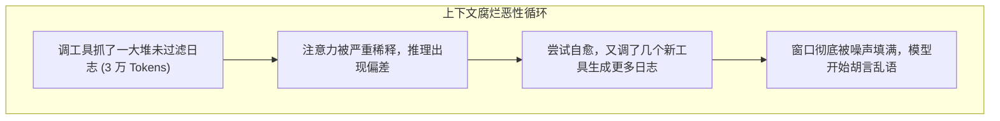
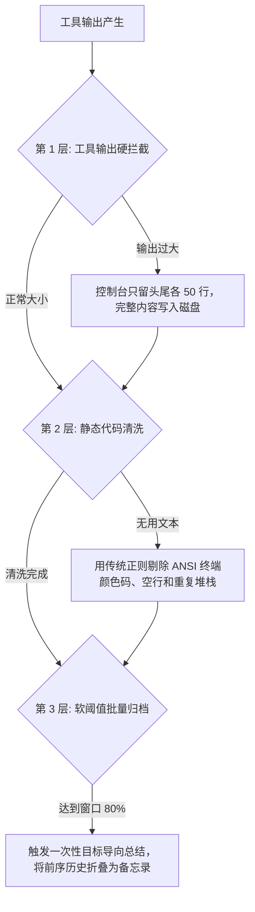
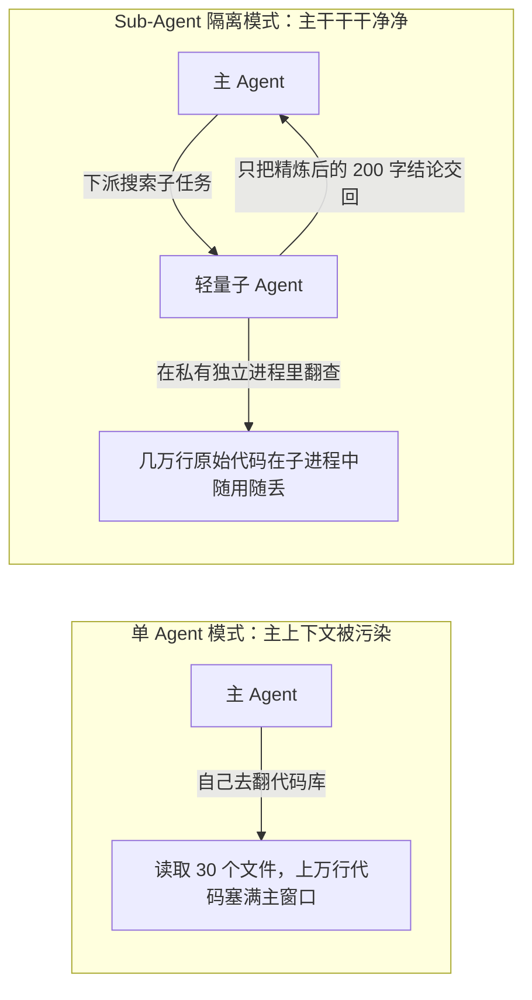

import { Quiz } from '@/components/Quiz'

# 2.5 上下文分层压缩与防腐烂策略

> 很多人以为：现在的模型上下文都支持 100 万甚至 200 万 Token 了，哪还需要费劲做压缩？实际上，**装得下**和**找得到**完全是两码事。窗口越长，每轮请求越贵、响应越慢；更要命的是“上下文腐烂”：当上下文塞满了几万行编译日志和网页杂质，模型的智商会断崖式下跌。这一节我们聊聊生产环境的分层压缩方案，以及为什么“用子 Agent 隔离”比事后压缩聪明得多。

---

## 1. 装得下，不代表能做对：上下文腐烂

* **物理溢出（Context Overflow）**：Token 超标，API 直接报 400 崩溃。这是显性的硬错误，很容易发现。
* **上下文腐烂（Context Rot）**：窗口还没满，但里面塞满了无关的控制台堆栈、被抓取的网页广告和废弃的尝试过程。注意力被海量噪声稀释，模型开始答非所问、遗忘第一轮定下的规矩，甚至原地死循环。

---

## 2. 目标导向压缩：带着问题去提炼

普通的文本总结往往是“无目的概括”，模型会把重要代码和细枝末节平均压缩，结果把关键的人名、端口号给弄丢了。

生产中公认最高效的是**目标导向压缩（Context-Aware Compression）**：
在压缩 Prompt 里明确传入：**“当前目标是什么，需要保留哪些维度的证据”**。

> **提示词示范**：  
> `我们当前的核心任务是：定位用户注册时手机验证码无法发送的 Bug。请审查上面的多轮排查记录，剔除所有无关的样式代码与正常接口日志，仅保留：1. 报错的准确接口路径；2. 错误码与返回体；3. 已经尝试过且证明无效的 2 种假设。`

这样能把十几万 Token 的臃肿过程，精准提炼成几百字的干货摘要，关键事实一个不丢。

---

## 3. Claude Code 的分层减负漏斗

在工程实现上，压缩决不是等到窗口快爆了才临时抱佛脚，而是在每一层物理过滤：

1. **第 1 层：输出硬截断**。运行一次 `git log` 或 `npm test` 输出了 5000 行，外层代码直接拦腰截断，只保留最前 50 行和报错最末 50 行，全文存进临时文件。
2. **第 2 层：代码级静态清洗**。终端里的彩色控制字符、无意义的 loading 旋转动画字符，用几行正则直接干掉，不消耗任何大模型 Token。
3. **第 3 层：软阈值触发归档**。不要每轮都去动历史，等总长度达到 80% 警戒线时，才触发一次批量归档，避免反复打碎前置 KV Cache。

---

## 4. 终极解法：以隔离代替压缩（子 Agent 模式）

压缩终究是有损的。**更高级的系统架构，是在噪音进入主干之前就把它隔绝掉。**

让主 Agent 专注负责架构设计与全局把控；需要遍历文件、搜寻报错时，启动一个临时子 Agent。子 Agent 查了几万 Token 的日志，最终只回传两句核心结论：
`“排查发现 auth.ts 第 42 行校验缺失，已找到对应位置。”`

子 Agent 执行完毕当场销毁，成千上万行的搜索垃圾不会留在主上下文里，**主干的 KV Cache 稳如泰山**。

---

## 5. 随堂检验

<Quiz
  question="在处理复杂排障任务时，为什么采用‘子 Agent 上下文隔离’通常比在主 Agent 里频繁做文本压缩更省心？"
  options={[
    {
      text: "A. 因为子 Agent 的所有调用在大模型服务商那里都是完全免费的",
      isCorrect: false,
      explanation: "子 Agent 同样消耗 Token 费用，优势在于隔离噪声而不是免单。"
    },
    {
      text: "B. 将大规模探索的噪声留在临时子会话中，主干只接收结论，保护了主干缓存与推理质量",
      isCorrect: true,
      explanation: "以隔离代替压缩：繁琐的中间排查在独立沙箱里自生自灭，主干保持精简且前缀缓存不被破坏。"
    },
    {
      text: "C. 只要派生了子 Agent，不管多弱的模型就都能百分百保证写出零 Bug 代码",
      isCorrect: false,
      explanation: "子 Agent 只是上下文管理架构，不能直接神化单步代码的正确率。"
    },
    {
      text: "D. 操作系统底层不允许同一个进程对话超过 10 轮，必须换进程",
      isCorrect: false,
      explanation: "这是大模型上下文治理的架构选择，与操作系统进程规范无关。"
    }
  ]}
/>

---

## 延伸阅读

* 《AI Agents in Depth: Design Principles and Engineering Practice》（李博杰，2026）第 2.7 节与 Experiment 2-10。
* [Agent 核心架构速查手册](/reference/agent-core-architecture)
* 下一章：[第 3 章 记忆机制与企业级 Agentic RAG](/ch03-memory-rag/01-user-memory-system)
