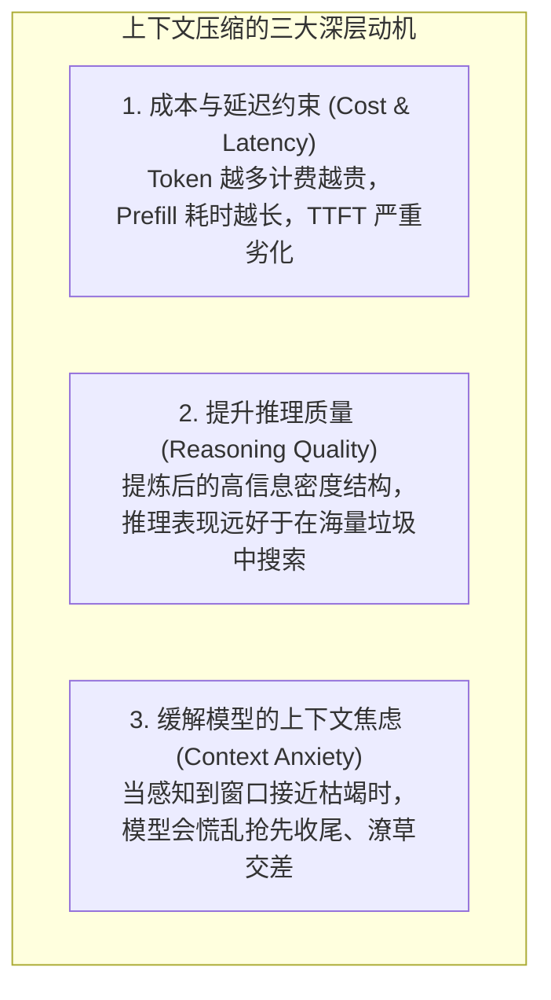
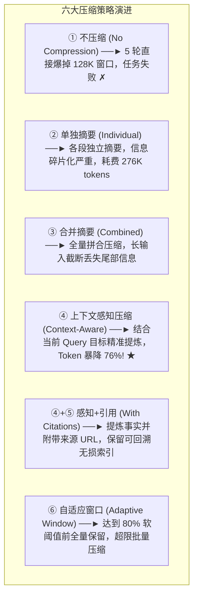
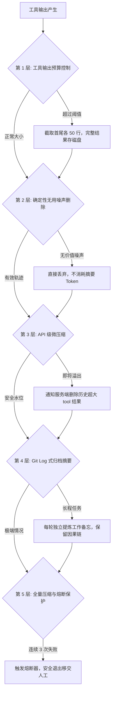
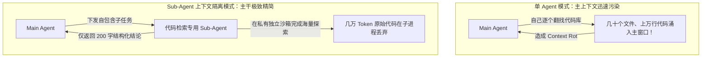

import { Quiz } from '@/components/Quiz'

# 2.5 上下文分层压缩与防腐烂策略

> **本节要点**：理解为什么即使上下文窗口足够大，依然必须进行压缩；掌握“上下文腐烂 (Context Rot)”与“上下文焦虑 (Context Anxiety)”的底层机理；透视 Experiment 2-10 六大压缩策略对比与 Claude Code 生产级五层压缩漏斗；掌握终极优化模式——“以隔离代替压缩 (Sub-Agent Context Isolation)”。

---

## 1. 为什么压缩不仅是长度问题？三大驱动力

很多开发者误以为：只要云厂商把上下文窗口开放到 200 万 Token（2M），我们就不需要做上下文压缩了。这是极其危险的误解！

### Context Overflow（溢出） vs Context Rot（上下文腐烂）
*   **Context Overflow (溢出)**：超出了物理 Token 上限，系统直接返回 400 报错崩溃。这是显性错误。
*   **Context Rot (上下文腐烂)**：**装得下，但找不到了**。随着无用工具输出（如几千行未筛选的 HTML）充满窗口，注意力被严重稀释，模型原本敏锐的推理与规范遵循能力悄然衰退，陷入原地打转。这是隐性致命慢性病。

---

## 2. 六大压缩策略实战量化对比 (Experiment 2-10)

《AI Agents in Depth》通过“追踪 OpenAI 联合创始人去向”的长程调研任务，测试了 6 种压缩方案：

> 🏆 **核心技术突破：Context-Aware Compression（上下文感知压缩）**  
> 压缩不是简单地让模型对大段文字做无目的概括。在压缩 Prompt 中明确传入：  
> `当前搜索目标是：{query}` 以及 `当前已知事实是：{context}`。  
> 模型便能精准剔除噪声，将 15 万字符压缩为 2000 字符，同时**百分之百保留后续决策所需的核心人名与职务变动**！

---

## 3. 生产级五层阶梯压缩漏斗 (Claude Code 实践)

---

## 4. 终极范式：以隔离代替压缩 (Sub-Agent Context Isolation)

压缩是信息已经进入上下文后、不得不付出的“有损补救措施”。
**更高级的系统架构，是在噪音进入主上下文之前就将其彻底隔绝！**

*   **工程成效**：主 Agent 的上下文只有一进一出两条干净消息，**前缀 KV Cache 毫发无损**，探索过程中的成千上万行代码垃圾随 Sub-Agent 的销毁而直接释放。

---

## 5. 随堂巩固自测

<Quiz
  question="在复杂长程任务中，为什么采用 Sub-Agent 上下文隔离（Context Isolation）往往比在单体 Agent 中频繁执行上下文压缩更为优越？"
  options={[
    {
      text: "A. 因为子智能体永远不会消耗任何 Token 因而可以做到完全无成本免费运行",
      isCorrect: false,
      explanation: "子智能体依然需要消耗自身的推理 Token，其优势在于不污染父智能体的主上下文。"
    },
    {
      text: "B. 隔离将海量探索噪音留在子进程使主干前缀缓存稳定且避免了后置有损压缩",
      isCorrect: true,
      explanation: "以隔离代替压缩：繁重的中间探索在独立的私有空间消耗并销毁，主 Agent 仅接收纯粹结论，既保住了主干 KV Cache 又根除了上下文腐烂。"
    },
    {
      text: "C. 只要派生了子智能体无论主模型多弱都能百分之百保证写出没有缺陷的代码",
      isCorrect: false,
      explanation: "子智能体是上下文与架构维度的隔离治理方案，不能盲目等同于能够无条件提升单体代码逻辑正确率。"
    },
    {
      text: "D. 操作系统底层禁止单个进程内存在多轮会话必须通过多智能体多进程执行",
      isCorrect: false,
      explanation: "这纯粹是 Agent 系统工程在 Context 经济学与注意力优化层面的架构抉择，与操作系统进程规范无关。"
    }
  ]}
/>

---

## 📚 权威拓展与延伸阅读

*   📖 **教材章节**：《AI Agents in Depth: Design Principles and Engineering Practice》（李博杰，2026）第 2 章第 2.7 节与 Experiment 2-10。
*   📑 **速查手册**：[Agent 核心架构与设计公式速查](/reference/agent-core-architecture)
*   ➡️ **第二章全部小课已修完！接下来我们将对第 2 章进行课程合理性 Review，并进入第 3 章！**
