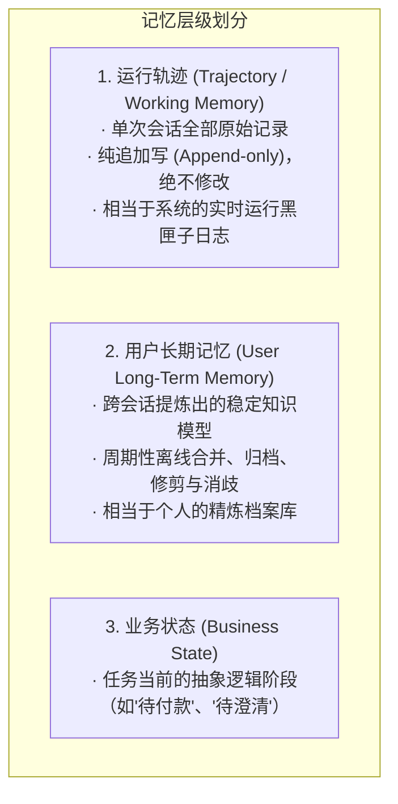
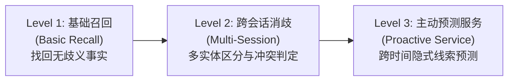
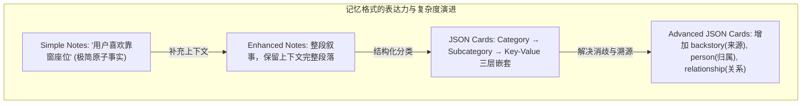

import { Quiz } from '@/components/Quiz'

# 3.1 用户记忆系统：三层评估与四种存储范式

> **本节要点**：跳出单轮上下文，理解 Agent 跨会话长期记忆（User Long-Term Memory）的构建法则。掌握衡量记忆优劣的三层进阶评估体系；对比四种典型记忆存储格式的表达力与开销；透视认知科学映射（情景/语义/程序记忆）与可执行代码记忆（User as Code）范式。

---

## 1. 记忆的双层时空：轨迹 (Trajectory) vs. 长期记忆 (Long-Term Memory)

在设计记忆系统前，必须首先厘清“短期单会话日志”与“跨会话长期沉淀”的区别：



> 🔑 **核心哲学**：**轨迹是原始日志（Log），长期记忆是提炼档案（Archive）**。混淆两者的系统，要么让 Context 被日志淹没，要么在提炼时丢失溯源证据。

---

## 2. 评测记忆能力的“三层进阶框架”

如何客观证明你的记忆系统比别人的更聪明？《AI Agents in Depth》建立了从简单召回到前瞻预测的 3 个等级：



*   **Level 1（基础召回）**：用户此前说“我的会员号是 12345”，后续询问时能百分之百精准命中返回。
*   **Level 2（跨会话消歧与关联）**：用户在不同时间讨论过“本田”和“特斯拉”。当用户发来“帮我预约汽车保养”时，Agent 能识别拥有两辆车，主动反问：“您指的是周五已预约的本田，还是尚未预约的特斯拉？”面对夫妻双方前后矛盾的转账修改，能根据时间线准确判断最终有效意图。
*   **Level 3（主动服务 - 最高试金石）**：综合相隔数月的孤立事实产生先验洞察。例如用户新订购了去东京的国际机票，Agent 调阅数月前的护照档案，主动提醒：“您的护照将在下月到期，不符合入境 6 个月有效期要求，建议立即加急补办！”

---

## 3. 四种用户记忆存储格式演进对比



| 存储格式 | 数据结构示例 | 核心优势 | 主要缺陷与代价 |
| :--- | :--- | :--- | :--- |
| **1. Simple Notes** | `"user.email: a@b.com"` | 写入极快，$O(1)$ 操作，Token 消耗极小 | 割裂了复合事实的内部因果关联 |
| **2. Enhanced Notes** | `"用户在科技公司任高级工程师，带领5人团队..."` | 语义叙事完整，上下文丰富 | 冗余度高，单属性变动需重写整段 |
| **3. JSON Cards** | `work.position.title = "Lead"` | 层次分明，支持部分字段局部精准更新 | 难以容纳跨维度的复杂边缘事实 |
| **4. Advanced JSON Cards** | 包含 `person`, `relationship`, `backstory`, `timestamp` | **精准同名消歧**（区分我的牙医 vs 父亲的牙医） | 维护与提炼的 LLM 调用成本较高 |

---

## 4. 前沿探索：可执行代码记忆 (User as Code)

当文本卡片遇到复杂的条件判断、时效推算和药物过敏检测时，语言模型的“心算”极其不可靠。
《AI Agents in Depth》提出的 **User as Code** 将用户记忆表示为**强类型的 Python 对象与确定性规则函数**：

```python
# ── 用户状态被建模为强类型可执行对象 ──
state = {
    "passport": PassportInfo(number="AB1234567", expiry_date=date(2027, 2, 18)),
    "trips": [
        Trip(destination="Tokyo", departure_date=date(2026, 10, 15), is_international=True)
    ]
}

# ── 约束检查完全由确定性代码执行，拒绝模型幻觉 ──
def check_passport_validity(state):
    for trip in state["trips"]:
        if trip.is_international:
            days = (state["passport"].expiry_date - trip.departure_date).days
            if days < 180:
                emit_alert(f"护照有效期仅剩 {days} 天，不足 180 天要求！", trip)
```

通过“代码存储状态，函数执行规则”，使状态聚合、冲突检测与约束校验能够在客观世界被**绝对验证**。

---

## 5. 随堂巩固自测

<Quiz
  question="在为家庭管家 Agent 设计用户记忆架构时，为了有效区分家庭中多个成员的同名联系人（如用户的医生与父亲的医生），最佳的存储方案是？"
  options={[
    {
      text: "A. 采用极简便签将所有提到的医生姓名和电话无差别混排存入全局纯文本文件中",
      isCorrect: false,
      explanation: "无结构纯文本丢失了主体与亲属关系，Agent 遇到同名实体时完全无法做出正确消歧判断。"
    },
    {
      text: "B. 采用包含主体身份亲属关系与来源背景的高级情境卡片（Advanced JSON Cards）",
      isCorrect: true,
      explanation: "Advanced JSON Cards 引入了 person、relationship 与 backstory 字段，天生具备对多主体复杂关系的精准消歧能力。"
    },
    {
      text: "C. 每次会话结束后直接将全部用户记忆清空以防止下次会话受到任何历史信息干扰",
      isCorrect: false,
      explanation: "直接清空记忆摧毁了跨会话连续性，使 Agent 彻底沦为无法积累经验的单轮问答机器。"
    },
    {
      text: "D. 强行通过修改模型底层权重的方式为每一个家庭成员专门微调一套独立的大模型",
      isCorrect: false,
      explanation: "为家庭成员分别微调千亿模型成本极端昂贵且更新迟钝，完全违背了软件工程的性价比准则。"
    }
  ]}
/>

---

## 📚 权威拓展与延伸阅读

*   📖 **教材章节**：《AI Agents in Depth: Design Principles and Engineering Practice》（李博杰，2026）第 3 章第 3.1 节。
*   ➡️ **下一节**：[3.2 生产级 RAG：分块、混合检索与神经重排](/ch03-memory-rag/02-rag-pipeline-hybrid)
