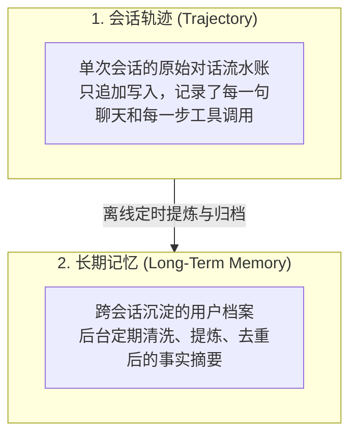

import { Quiz } from '@/components/Quiz'

# 3.1 用户记忆系统：从会话日志到长期档案

> 很多产品号称“支持长期记忆”，背后其实就是把用户过去的所有聊天记录从数据库搜出来，一股脑塞进 Prompt 里。聊上一个星期，上下文就塞爆了；更糟糕的是，如果用户提过“我的家庭医生姓张，我父亲的医生也姓张”，模型下次预约门诊必然张冠李戴。这一节我们聊聊长期记忆的真实架构，以及为什么把用户状态写成强类型代码比纯文本更可靠。

---

## 1. 概念先分清：聊天轨迹 vs 长期记忆

很多系统之所以记忆做得一团糟，是因为把“日志”和“档案”混在了一起：



* **轨迹（Trajectory）**是系统运行的**原始黑匣子日志**。它必须完整、真实，但绝不能把过去一年的全量日志每轮都发给大模型。
* **长期记忆（Long-Term Memory）**是后台定时加工出来的**结构化用户画像**。比如用户聊了一百句日常，长期记忆里最终只留下三行：“常用护照号、偏好靠窗座位、对海鲜过敏”。

---

## 2. 怎么衡量记忆做得到位？三个梯度

《AI Agents in Depth》把记忆系统的能力划分为三级，越往上越考验系统设计：


* **Level 1（基础死记硬背）**：用户上周提过“我的工号是 9527”，今天问“我工号多少”，能查到并答对。这是只要接了向量检索就能做到的及格线。
* **Level 2（跨时间实体消歧）**：用户有两个月前聊过本田车，昨天又聊了特斯拉。今天他说“帮我约个下周的车辆保养”，系统不能盲目乱派单，而是能识别出他有两辆车，主动询问：“您是要约周五那辆本田，还是新提的特斯拉？”
* **Level 3（主动服务预警）**：真正体现专业度的高阶形态。比如用户今天刚订了飞东京的机票，Agent 调阅三个月前登记的证件信息，立刻主动提示：“您护照还有 4 个月到期，日本入境要求至少 6 个月有效期，建议今天尽快去加急换发。”

---

## 3. 记忆该用什么格式存？

四种典型存储格式各有利弊：

| 格式 | 存储示例 | 优点 | 缺点与翻车点 |
| :--- | :--- | :--- | :--- |
| **1. 极简键值 (Simple Notes)** | `"user.city = '杭州'"` | 读写极快，Token 极省 | 割裂了上下文因果（不知道什么时候搬的家） |
| **2. 自然语言叙事** | `"用户在杭州任职前端架构师，家里有一只猫..."` | 语境丰富，模型读着自然 | 任何一个字段变动，都得把整段重新写一遍 |
| **3. 结构化 JSON** | `{"travel": {"seat": "window"}}` | 层次清晰，支持部分字段局部精准更新 | 很难表达跨关系的复杂事实 |
| **4. 带背景的高级 JSON** | 包含 `person`、`relationship`、`backstory`、`timestamp` | **精准消歧**（分清“我的牙医”和“父亲的牙医”） | 后台提炼时的提示词开销较大 |

---

## 4. 进阶思路：可执行代码记忆 (User as Code)

当记忆涉及到**日期推算、条件约束、数值比对**时，千万别指望大模型在自然语言里靠默算去校验——它算错日期的概率非常高。

最好的办法是用**强类型的代码对象存状态，用确定性函数做逻辑校验**：

```typescript
// 把用户的状态沉淀为标准的强类型数据
interface UserProfile {
  passportExpiry: string; // '2026-11-20'
  itineraries: Array<{
    destination: string;
    departureDate: string; // '2026-10-15'
    isInternational: boolean;
  }>;
}

// 约束校验完全交由普通的 TypeScript 函数运行，零幻觉！
function checkTravelAlerts(user: UserProfile) {
  for (const trip of user.itineraries) {
    if (trip.isInternational) {
      const daysLeft = daysBetween(trip.departureDate, user.passportExpiry);
      if (daysLeft < 180) {
        return `出发时护照有效期仅剩 ${daysLeft} 天，不足 6 个月要求，请提示用户换发！`;
      }
    }
  }
  return null;
}
```

把模型不擅长的数学计算和条件分支交给底层纯函数，模型只负责负责提取信息和向用户组织措辞，整个系统就会极其稳固。

---

## 5. 随堂检验

<Quiz
  question="在为智能助理设计长期记忆存储时，要区分家庭中不同成员提及的同名角色（如‘我的医生’与‘岳父的医生’），最稳妥的存储形式是哪一种？"
  options={[
    {
      text: "A. 把所有医生姓名和电话无差别追加到同一个未分类纯文本文件中",
      isCorrect: false,
      explanation: "丢失了主体归属和亲属关系，后续检索时极易发生实体混淆与错误关联。"
    },
    {
      text: "B. 采用携带主体身份、关系归属与来源背景的结构化卡片（Advanced JSON Cards）",
      isCorrect: true,
      explanation: "显式记录 person 和 relationship 字段，能天然支持多主体的精准消歧，彻底解决张冠李戴问题。"
    },
    {
      text: "C. 每次会话结束时把所有历史记忆全部清空，从零开始问用户",
      isCorrect: false,
      explanation: "清空记忆破坏了长期陪伴与跨会话体验，让助理退化为无记忆的单次脚本。"
    },
    {
      text: "D. 为每一个家庭成员专门微调训练一个独立的百亿参数大模型",
      isCorrect: false,
      explanation: "微调成本极高且更新缓慢，无法应对日常高频变动的个人事实记忆。"
    }
  ]}
/>

---

## 延伸阅读

* 《AI Agents in Depth: Design Principles and Engineering Practice》（李博杰，2026）第 3.1 节。
* 下一节：[3.2 生产级 RAG：分块、混合检索与神经重排](/ch03-memory-rag/02-rag-pipeline-hybrid)
