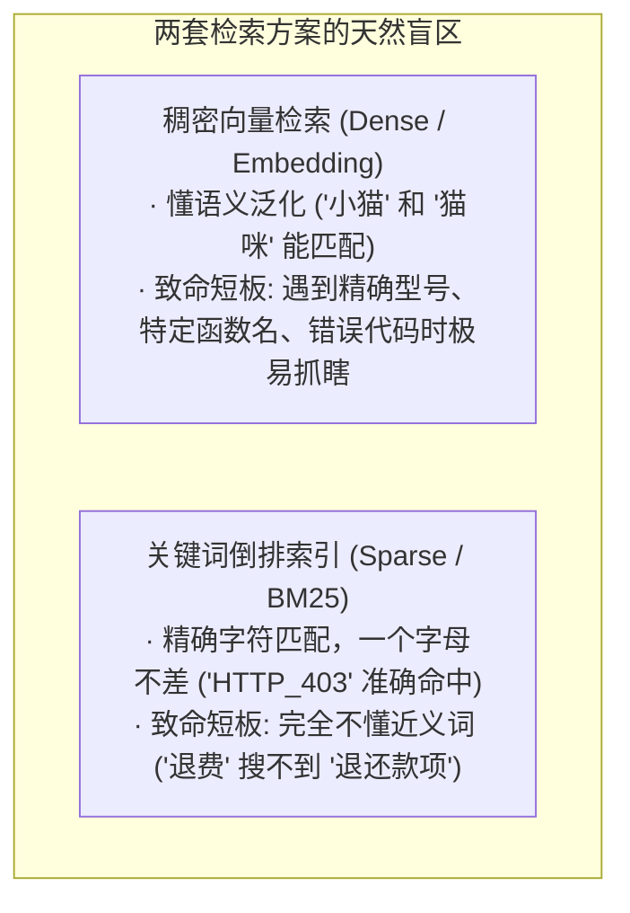
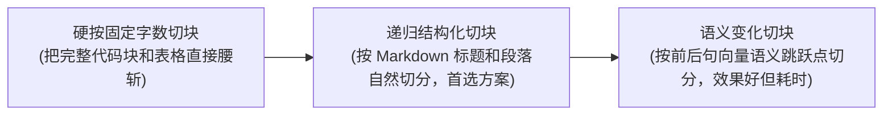

import { Quiz } from '@/components/Quiz'

# 3.2 生产级 RAG：分块、混合检索与神经重排

> 网上的 RAG 教程通常写得很轻巧：把 Markdown 拆开，调个 Embedding 接口存进向量数据库，用户问一句就搜 Top-3 喂给模型。但一放到生产环境，马上翻车：搜特定的报错代码“ERR_403”，向量检索给你端出来一堆“权限相关”的鸡汤大论，偏偏漏掉了最核心的排障手册。这一节我们看懂企业级 RAG 的真实三阶流水线。

---

## 1. 为什么纯向量检索在真实项目中靠不住？

很多新手以为向量检索是万能的，实际上它和传统的关键字搜索正好各占一边极端：



只用向量检索，用户查具体的报错代号或者手机型号，往往搜出一堆风马牛不相及的“相似概念”；只用关键字检索，用户换了个口语问法，直接全盘搜空。

---

## 2. 入库前切块：切得不好，后面全是徒劳

切块（Chunking）是很多人最容易应付的一步，随手写个每 500 字硬切一刀：



* **切太小（比如 64 字）**：一句话脱离了上下文，全是“它”、“该接口”，模型拿到了也猜不出主体是谁；
* **切太大（比如 3000 字）**：塞了三个不同的大主题，向量特征被稀释，检索命中时还会带入大量无关废话。
* **通用工程经验**：**300 ~ 800 Token** 为一块，并且设置 **15% 的重叠区域（Overlap）**，防止正好在核心结论处被切成两半。

---

## 3. 企业级三阶混合检索流水线

既要抓住同义词，又要死磕特定错误代码，成熟方案一定是**双路并发 + 重新排序**：

```mermaid
flowchart TD
    Q[用户输入: '支付接口报 ERR_403 怎么排查'] --> Fork{双路并行检索}
    
    Fork -->|抓泛化意图| Dense[向量检索: 搜出 Top-50 候选]
    Fork -->|抓精确代号| BM25[BM25 倒排: 搜出 Top-50 候选]
    
    Dense --> Merge[RRF 排名融合池 (合并去重)]
    BM25 --> Merge
    
    Merge -->|提取前 30 条候选| Rerank[Cross-Encoder 神经重排器]
    Rerank -->|深度打分，选出最准的前 3 条| LLM[送入 Prompt 回答问题]
```

### 1. 为什么不用分数相加，而用 RRF 排名融合？
向量检索算出来的是余弦相似度（0~1 的小数），BM25 算出来的是词频相关分（可能从 0 到几十分）。两者的分值体系完全不同，根本没法直接相加。

**RRF（Reciprocal Rank Fusion）**非常巧妙地抛弃了具体分值，**只看它们排第几名**：
```text
RRF 得分 = 1 / (60 + 向量排名) + 1 / (60 + BM25 排名)
```
哪怕两边分数体系再混乱，两边都排在前列的文档，一定能被迅速推到最前面。

### 2. 为什么还要再加一层重排器（Reranker）？
* **初筛（Embedding）**：把问题和文档分别算成一个孤立向量，毫秒级从百万条里挑出几十条，快但粗糙；
* **精排（Cross-Encoder）**：把问题和这几十条候选直接拼在一起，让模型逐字做交叉注意力比对。虽然计算量大，但只跑 30 条候选，毫秒内就能把最相关的 3 条精准挑出来。

---

## 4. 随堂检验

<Quiz
  question="在搭建面向研发运维排障的内部技术知识库时，哪种检索架构能在保证错误码精准定位的同时，又支持口语化提问？"
  options={[
    {
      text: "A. 仅使用普通的语义向量数据库，关闭一切传统的关键词倒排索引",
      isCorrect: false,
      explanation: "单路纯向量检索在遇到特定错误码与符号时极容易泛化过度，导致关键配置文档排在后面甚至无法召回。"
    },
    {
      text: "B. 采用向量检索与 BM25 并行查找，通过 RRF 融合后再经过重排器精选",
      isCorrect: true,
      explanation: "工业标准方案：BM25 锁死特定错误码，向量兼顾日常自然语言，重排器确保最精准的上下文送入模型。"
    },
    {
      text: "C. 将所有技术文档按每两行一段强行切开，完全不保留段落重叠",
      isCorrect: false,
      explanation: "过于碎片化的切分会彻底破坏代码和段落的因果关系，导致切片失去上下文价值。"
    },
    {
      text: "D. 每次查询时让大模型把公司全部几百万字的项目文档全读一遍",
      isCorrect: false,
      explanation: "全量文档暴力读取严重超出上下文限制，单次延迟和费用在商业上完全不可行。"
    }
  ]}
/>

---

## 延伸阅读

* 《AI Agents in Depth: Design Principles and Engineering Practice》（李博杰，2026）第 3.2 节。
* [Agent 核心架构速查手册](/reference/agent-core-architecture)
* 下一节：[3.3 结构化索引：RAPTOR、GraphRAG 与虚拟文件系统](/ch03-memory-rag/03-structured-indexing)
