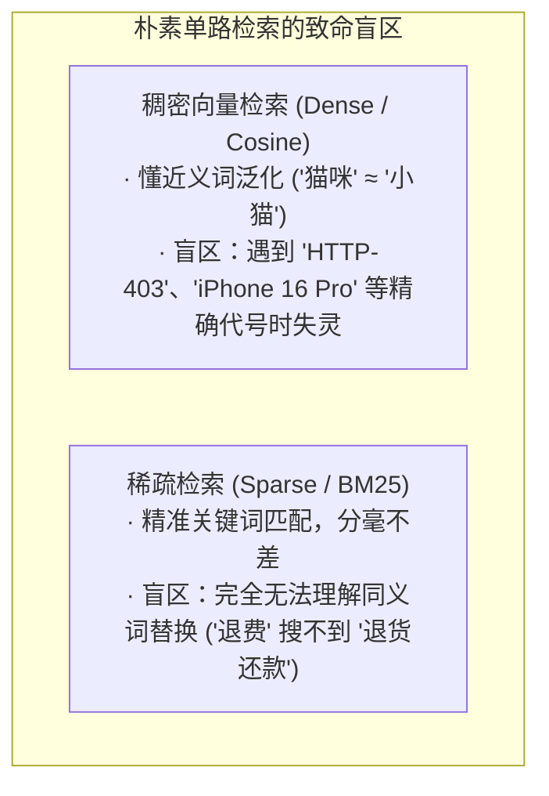
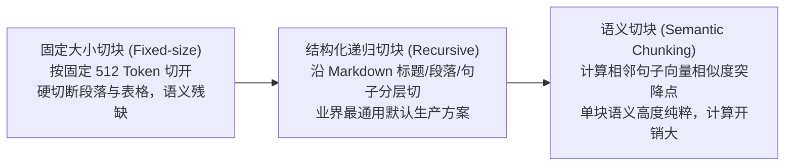

import { Quiz } from '@/components/Quiz'

# 3.2 生产级 RAG：分块、混合检索与神经重排

> **本节要点**：掌握工业级知识库检索增强生成（RAG）的三阶生产级流水线；对比三种文档分块策略（固定、结构化递归、语义分块）；理解稠密向量（Dense/HNSW）与稀疏关键词（Sparse/BM25）的互补性；掌握 RRF 排名融合与 Cross-Encoder 神经重排的核心数学机制。

---

## 1. 为什么朴素 RAG 在真实业务中频频翻车？

初学者常常认为：**“把 PDF 切碎、扔进向量数据库、Top-K 搜出来喂给大模型”** 就是 RAG。但在生产中，朴素 RAG 存在两大天然盲区：



如果只选其中一种，系统要么把专业代号搜成无关泛化解释，要么因一个错别字而全盘搜空！

---

## 2. 知识库预处理：文档切块策略 (Chunking)

在把文档入库前，必须做离线切分。切块粒度是系统性能的关键权衡点：



*   **过小切块（如 64 Tokens）**：碎片脱离了上下文，充满代词歧义（“其营收提升了 5%”——指哪家公司？）。
*   **过大切块（如 4000 Tokens）**：单个切片杂糅多个主题，向量表征被稀释，检索命中时带入大量无关噪声。
*   **黄金实践**：通常采用 **256 ~ 1024 Tokens** 配合 **10% ~ 20% 的相邻重叠 (Overlap)**，防止关键句子恰好在切缝处被一分为二。

---

## 3. 生产级三阶混合检索流水线 (Hybrid Retrieval)

为了兼顾“语义泛化”与“精确代号”，生产级知识库标准架构如下：

```mermaid
flowchart TD
    UserQuery[用户提问 Query: 'HTTP 403 权限拒绝处理'] --> Fork{并发双路检索}
    
    Fork -->|稠密语义流| Dense[Dense 检索: BGE-M3 / HNSW 向量索引]
    Fork -->|稀疏关键词流| Sparse[Sparse 检索: BM25 倒排索引]
    
    Dense -->|返回 Top-50 候选| Fusion[RRF 排名融合池 (Reciprocal Rank Fusion)]
    Sparse -->|返回 Top-50 候选| Fusion
    
    Fusion -->|综合筛选 Top-30| Rerank[Cross-Encoder 神经重排器 (bge-reranker)]
    Rerank -->|精准提取 Top-3 高置信切片| Final[注入 Context 驱动模型作答]
```

### 核心技术点 1：RRF 倒数排名融合
向量相似度（0~1 的余弦值）与 BM25 分数（0 到几十的分值）量纲完全不同，无法直接相加。
RRF（Reciprocal Rank Fusion）完全抛弃绝对分值，仅依据各路排名的倒数进行加权：

```text
RRF_Score(d) = Σ_{m ∈ {dense, sparse}} [ 1 / (60 + rank_m(d)) ]
```

*   平滑常数（通常取 60）有效缩小了第 1 名与第 2 名的过大分差，兼顾稳健性。

### 核心技术点 2：Bi-Encoder 与 Cross-Encoder 的分工协作
*   **初筛层 (Bi-Encoder 双塔)**：Query 与文档分别独立编码为向量，计算极快（毫秒级），适合从百万文档中捞出 Top-50；
*   **精排层 (Cross-Encoder 单塔重排器)**：将 Query 与候选切片拼在一起完整输入模型，做全自注意力交互（逐字比对），打分极度精准，虽耗时但仅处理几十个候选。

---

## 4. 衡量检索质量的三大核心指标

| 指标名称 | 形象解读 | 业务指示意义 |
| :--- | :--- | :--- |
| **Recall@K (命中率)** | 前 K 个候选文档中，是否包含了能解答问题的标准切片？ | **RAG 的生命线**：只要关键文档没被召回进 Context，模型就绝无可能答对。 |
| **MRR (平均倒数排名)** | 第一个正确答案切片排在第几名？（第 1 名得 1 分，第 10 名得 0.1 分） | 衡量首位命中的敏锐度，MRR 越高，越利于精简 Context。 |
| **nDCG (归一化折损累计增益)** | 整体排序列表的质量（越相关的切片越靠前得分越高）。 | 衡量候选列表排序与人类认知相关度的贴合度。 |

---

## 5. 随堂巩固自测

<Quiz
  question="在搭建面向复杂企业 API 故障排查的 RAG 知识库系统时，以下哪种检索架构能够最有效地兼顾专业错误码的精确匹配与口语化问题的语义泛化？"
  options={[
    {
      text: "A. 仅使用基础语义向量数据库进行单路检索并完全关闭任何传统的全文关键词搜索",
      isCorrect: false,
      explanation: "单路纯向量检索在面对特定的错误码（如 ERR_AUTH_403）时极易发生语义平滑，丢失精准定位能力。"
    },
    {
      text: "B. 采用稠密向量与 BM25 并发检索并通过 RRF 排名融合后由重排器进行深度精选",
      isCorrect: true,
      explanation: "工业级三阶流水线：Dense 抓口语近义词，BM25 抓错误码，RRF 平滑融合两路结果，Cross-Encoder 最终精准把关。"
    },
    {
      text: "C. 将所有技术文档按每两行一段极其破碎地切开且完全不留任何相邻上下文重叠",
      isCorrect: false,
      explanation: "过于破碎的切分彻底破坏了语法段落结构，导致切片完全丧失独立可读性与语义完整度。"
    },
    {
      text: "D. 检索时强制让大模型把整个百万字技术文档库全部重新阅读一遍再给出回答",
      isCorrect: false,
      explanation: "全库暴力阅读超出了上下文窗口限制，会产生巨额调用费用与不可接受的长延迟。"
    }
  ]}
/>

---

## 📚 权威拓展与延伸阅读

*   📖 **教材章节**：《AI Agents in Depth: Design Principles and Engineering Practice》（李博杰，2026）第 3 章第 3.2 节。
*   📑 **速查手册**：[Agent 核心架构与设计公式速查](/reference/agent-core-architecture)
*   ➡️ **下一节**：[3.3 结构化索引：RAPTOR、GraphRAG 与虚拟文件系统](/ch03-memory-rag/03-structured-indexing)
