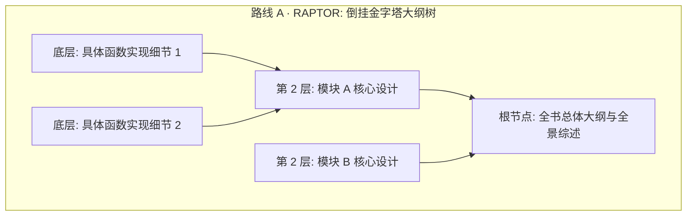
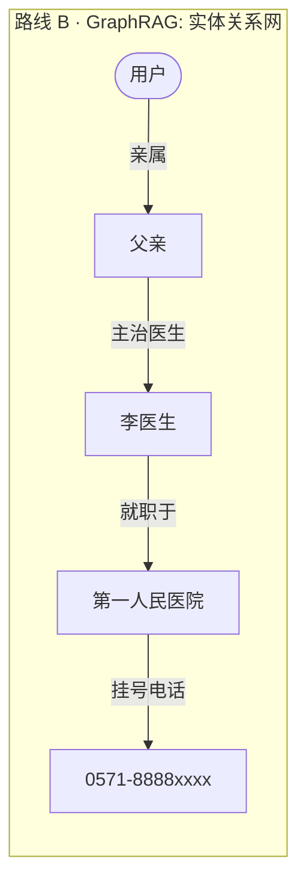

import { Quiz } from '@/components/Quiz'

# 3.3 结构化索引：RAPTOR、GraphRAG 与虚拟文件系统

> 把长文档切碎扔进向量库，最怕遇到两类问题：第一类是“全局统计题”（比如问“上季度退货工单里质量问题占多大比例”，向量库只能搜出 15 条切片，模型就拿这 15 条瞎算百分比）；第二类是“多跳关系题”（比如查“我爸的主治医生在哪个门诊坐诊”，关系一多，单次搜索就抓瞎）。这一节我们聊聊怎么建立结构化索引，让知识不散架。

---

## 1. 为什么光靠扁平切片肯定不够？

扁平切片就像把一本书撕成几百张小纸条扔在盒子里：


**信息如果在入库前没有做结构提炼，靠模型在检索时临时拼凑，必然顾此失彼。**

---

## 2. 两种主流结构化升级路线：RAPTOR vs GraphRAG

为了把散乱的小纸条重新串起来，业内目前有两大流派：





| 维度 | RAPTOR（树状大纲索引） | GraphRAG（知识图谱网络） |
| :--- | :--- | :--- |
| **组织形式** | 自底向上递归聚类形成的大纲树 | 实体与关系三元组构成的网状图 |
| **擅长的提问** | **“宏观概括与层层下钻”**（如：讲讲整套系统架构是怎么演进的） | **“跨多主体的顺藤摸瓜”**（如：李医生就职医院的挂号电话是多少） |
| **同名实体消歧** | 靠父级章节的语境来约束 | **天然支持**：每个实体是一个独立节点，连接不同的关系线 |
| **维护成本** | 离线跑几轮总结即可，成本较低 | 图提取和维护成本极高，复杂逻辑转成三元组容易失真 |

---

## 3. 极简实用范式：虚拟文件系统（Filesystem Paradigm）

除了复杂的图数据库，近来备受推崇的一种务实做法是：**把所有知识组织成开发者最熟悉的虚拟文件系统**。

```
viking://
├── docs/                # 外部技术文档
│   ├── .abstract.md     # L0: 一句话极简简介 (~50 字，快速判断相关性)
│   ├── .overview.md     # L1: 核心大纲与核心原理 (~1000 字，大部分决策看这就够了)
│   └── payment_api.ts   # L2: 完整的底层实现代码 (仅在需要扣细节时才点开读)
├── user/                # 用户的个性化记忆
└── skills/              # Agent 的各类任务操作规范
```

### 三层按需阅读机制（L0 / L1 / L2）
1. **L0 快速扫视（目录页）**：每个文件夹留一个 50 字的极简摘要，Agent 扫一眼就知道要不要进这个目录；
2. **L1 读懂骨架（核心架构）**：把大纲读进上下文，80% 的日常问答在这一层就能准确回答；
3. **L2 深入现场（按需读源码）**：只有需要改动某一行或者对比某个私有参数时，才调工具打开深层文件。

> **工程优势**：所有的知识都是普通的 Markdown 或代码，**可以用 Git 做完整的版本管理和 Diff 审计**。哪条知识改错了，工程师扫一眼 Commit 记录就能一键回滚，不需要去向量库里大海捞针捞坏数据。

---

## 4. 随堂检验

<Quiz
  question="当用户提出‘查一下我父亲的主治医生所在医院的急诊电话’这种跨越多个实体层级的问题时，哪种知识索引结构定位最准确？"
  options={[
    {
      text: "A. 把整篇网页切成 200 字小碎片、不留任何关联关系的纯扁平向量库",
      isCorrect: false,
      explanation: "扁平切片切断了跨实体的长关系链，单步向量检索极难一次性将父亲、医生、医院和电话完整召回。"
    },
    {
      text: "B. 基于实体与关系网络的 GraphRAG 图谱结构，支持顺着关系边多跳追溯",
      isCorrect: true,
      explanation: "GraphRAG 专为多跳推理设计，可以沿着‘用户 -> 父亲 -> 医生 -> 医院 -> 电话’的路径清晰定位最终目标。"
    },
    {
      text: "C. 把全市几千家医院的全部简介无脑拼在开头的系统提示词中",
      isCorrect: false,
      explanation: "这会瞬间打爆上下文窗口，且单次请求成本高得无法承受。"
    },
    {
      text: "D. 仅保留医院名称，让模型在回答时凭借常识自己编造一个电话号码",
      isCorrect: false,
      explanation: "依靠模型直觉猜电话会直接产生严重的虚假事实幻觉，属于不可容忍的故障。"
    }
  ]}
/>

---

## 延伸阅读

* 《AI Agents in Depth: Design Principles and Engineering Practice》（李博杰，2026）第 3.3 节。
* [Agent 核心架构速查手册](/reference/agent-core-architecture)
* 下一节：[3.4 Agentic RAG 与 Anthropic 上下文检索突破](/ch03-memory-rag/04-agentic-rag-and-contextual-retrieval)
