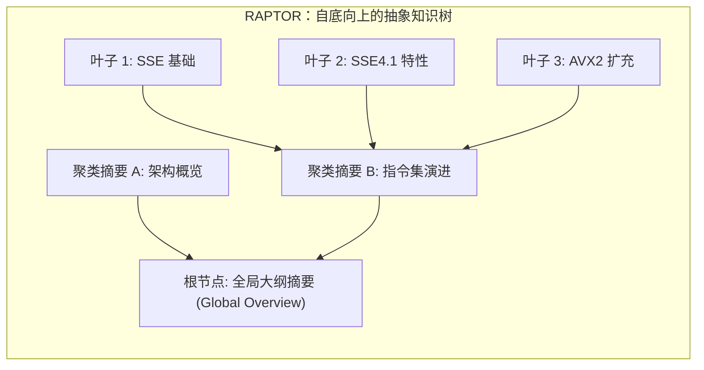
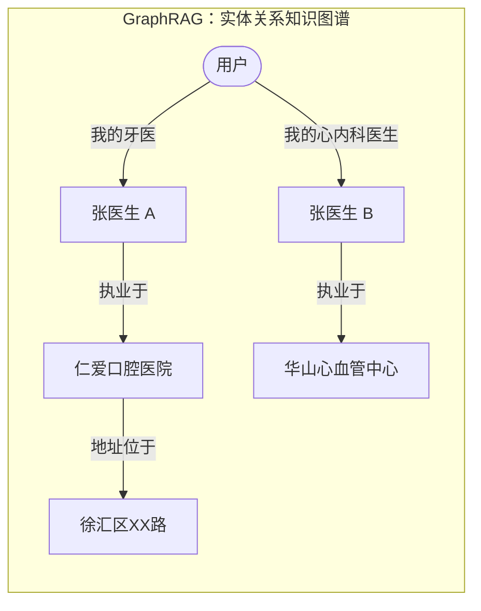

import { Quiz } from '@/components/Quiz'

# 3.3 结构化索引：RAPTOR、GraphRAG 与虚拟文件系统

> **本节要点**：跳出“扁平切片”的局限。剖析“黑猫白猫统计”与“边界语义缺失”两大经典故障；掌握树状抽象索引 RAPTOR 与知识图谱 GraphRAG 的核心结构与适用场景；深入理解以 OpenViking 为代表的“虚拟文件系统 (Filesystem Paradigm)”在 Agent 知识工程中的优雅实践。

---

## 1. 为什么扁平文本切片远远不够？

把文档简单切成扁平片段后，面对复杂结构化信息，朴素 RAG 会出现两大系统性失效：


> 🚨 **结论**：如果不在入库前投入算力进行**主动归纳、提炼全局摘要并显式抽取规则边界**，纯靠向量检索出来的只是冰山一角，模型必然以偏概全。

---

## 2. 两大主流结构化索引体系：RAPTOR vs GraphRAG

为了给零散的知识赋予拓扑结构，业界发展出两条互补的技术路径：





| 维度 | RAPTOR (递归抽象树) | GraphRAG (实体关系图) |
| :--- | :--- | :--- |
| **底层组织形式** | 树状层次结构（叶子切片 $\to$ 聚类主题 $\to$ 全局综述） | 实体-关系-实体 三元组网络（知识图谱） |
| **擅长的查询类型** | **“自顶向下逐步钻取”**（如：解释 CPU 架构演进全貌） | **“跨实体多跳关联”**（如：查询我的牙医所在的医院地址） |
| **同名实体消歧** | 依赖高层上下文语义约束 | **天生支持**：不同实体节点通过专属关系边天然隔离 |
| **局限性** | 无法直接沿网络关系跳转 | 复杂条件逻辑（“如果下雨就改去博物馆”）在被拆成三元组时严重退化 |

---

## 3. 虚拟文件系统范式 (The Filesystem Paradigm)

除了复杂的图数据库与向量库，字节跳动火山引擎开源的 **OpenViking** 提出了第三种极其优雅的架构哲学：**将所有上下文与知识映射为虚拟文件系统**。

```
viking://
├── resources/           # 外部知识：文档、代码库、网页
│   ├── arch.md
│   ├── .abstract        # L0 极简摘要 (~100 tokens)
│   └── .overview        # L1 核心大纲 (~2000 tokens)
├── user/memories/       # 用户记忆：偏好、画像、习惯
└── agent/               # Agent 自身：Skills 技能文档与执行经验
    ├── skills/
    └── memories/
```

### 三层按需渐进式加载机制 (L0 / L1 / L2)
*   **L0 (Summary 一句话摘要)**：目录常驻，约 100 Token，供 Agent 快速判断该目录是否与任务相关；
*   **L1 (Overview 架构大纲)**：约 2000 Token，包含核心骨架与使用场景，80% 的业务决策在此即可完成；
*   **L2 (Full Text 完整原文)**：仅在需要执行深度细节比对时，按需精确读取对应底层文件。


> 🌟 **工程红利**：以 Markdown 纯文本配合 Git 管理知识。人类工程师可以直接打开文件进行修改、纠偏与版本回滚；Agent 也可以像读写代码一样通过 PR 机制更新自身知识。

---

## 4. 随堂巩固自测

<Quiz
  question="在需要解答跨越多个实体层级关系的复杂咨询（如“我父亲的主治医生所就职医院的急诊电话是多少”）时，以下哪种知识索引架构最为擅长？"
  options={[
    {
      text: "A. 采用将每个网页随机切成 200 字小碎片且无任何关联的纯扁平向量检索",
      isCorrect: false,
      explanation: "扁平切片切断了跨实体的长关系链，单步向量检索很难一次性把父亲、主治医生、医院和急诊电话串联起来。"
    },
    {
      text: "B. 采用基于实体与关系三元组的 GraphRAG 知识图谱支持沿网络边进行多跳遍历",
      isCorrect: true,
      explanation: "GraphRAG 专为多跳关系推理设计，能够自然顺着 用户 -> 父亲 -> 主治医生 -> 医院 -> 电话 的关系网络顺藤摸瓜。"
    },
    {
      text: "C. 强行将整本医学通史完整塞进 System Prompt 中让大模型直接暴力阅读全文",
      isCorrect: false,
      explanation: "这会导致上下文窗口极大消耗且无法解决特定家庭用户的私有关系定位问题。"
    },
    {
      text: "D. 仅保存一句话摘要并在用户提问时由模型根据世界常识凭空猜测一个电话号码",
      isCorrect: false,
      explanation: "凭借常识盲目猜测电话号码会引发严重的虚假事实幻觉，造成不可挽回的现实损失。"
    }
  ]}
/>

---

## 📚 权威拓展与延伸阅读

*   📖 **教材章节**：《AI Agents in Depth: Design Principles and Engineering Practice》（李博杰，2026）第 3 章第 3.3.1 与 3.3.2 节。
*   📑 **速查手册**：[Agent 核心架构与设计公式速查](/reference/agent-core-architecture)
*   ➡️ **下一节**：[3.4 Agentic RAG 与 Anthropic 上下文检索突破](/ch03-memory-rag/04-agentic-rag-and-contextual-retrieval)
