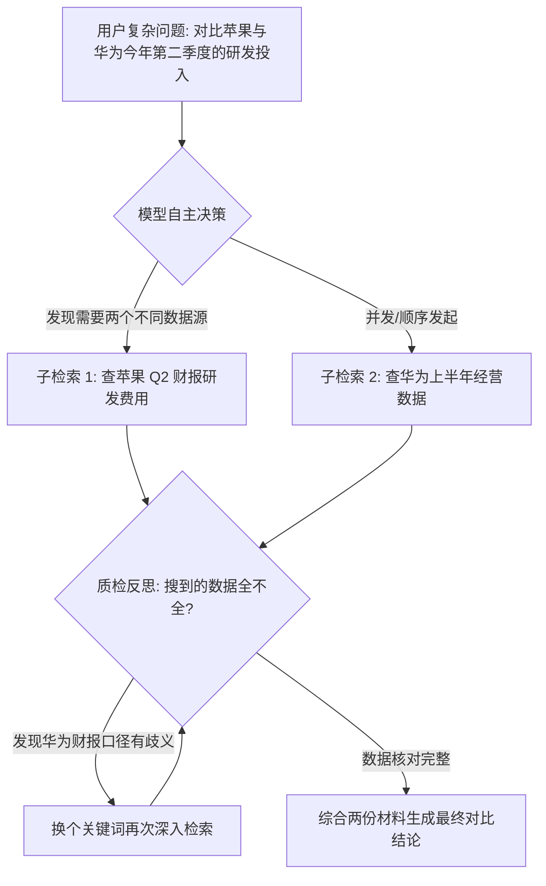
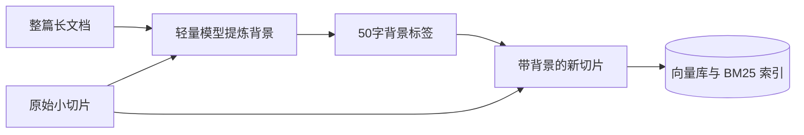

import { Quiz } from '@/components/Quiz'

# 3.4 Agentic RAG 与 Anthropic 上下文检索突破

> 传统 RAG 就像个死板的传话筒：用户输入一句话，程序机械地调一次向量搜索，搜到什么就全塞给模型生成回答。如果用户提问很含糊，或者需要对比两份不同年份的报表，这种单向流立刻抓瞎。这一节我们聊聊把检索做成主动自愈循环（Agentic RAG），以及 Anthropic 提出的“上下文增强切块”是如何解决切片断章取义难题的。

---

## 1. 别搞单向流水线：让 Agent 自己把控检索节奏

传统 RAG 的致命弱点在于**只有一次出手机会**：
`提问 -> 检索 -> 生成`。一旦那一次没搜准，后续回答全盘皆输。

**Agentic RAG** 的核心思路很简单：**把检索动作做成 Agent 的普通工具（Tool），让模型根据情况自主决定怎么搜、搜几轮。**



### 它比传统 RAG 聪明在哪？
1. **该查才查**：问“你好”或者通识常识，直接作答，不浪费检索开销；
2. **拆解复杂多跳**：问“A 公司和 B 公司哪个利润率高”，自动拆成两笔查询分别检索；
3. **搜不好能自愈**：如果第一轮搜出来的文档全是废话，质检步骤会驱动它“换个关键词再搜一次”，而不是硬着头皮胡说。

---

## 2. 怎么解决切片断章取义？Anthropic 的上下文前缀法

做 RAG 的同学普遍遇到过这种坑：一篇 100 页的集团财报，第 45 页被切出了这样一段文字：
> *“在该业务线中，第三季度的运营利润率环比提升了 2.4%，主要归因于海外直销比例的提高。”*

如果用户搜：**“某科技集团智能手机业务 2024 年 Q3 利润为什么提升？”**
* 向量检索很难匹配：因为这段话里压根没出现“某集团”、“智能手机”这些词！
* 关键词检索直接得 0 分。
* 这段文字就成了**信息孤儿**。

### Anthropic 的解法：给每个切片加一段背景帽子

在把每个 Chunk 入库前，调轻量大模型（如 `gpt-4o-mini` 或 `claude-3-haiku`）生成一段 50 字的全局上下文，直接拼在切片最前头：

```text
[所属文档: 某科技集团 2024 年度财报 | 章节: 第四章·智能手机业务运营分析]
在该业务线中，第三季度的运营利润率环比提升了 2.4%，主要归因于海外直销比例的提高。
```



加了这一顶“帽子”之后：
无论是向量检索还是 BM25 搜手机、搜年份、搜科技集团，这段话都能被稳稳命中！官方测试表明，配合重排器，**检索失败率直接暴跌 67%**。

### 很多人担心：每个切片都调一次模型，费用不爆炸了吗？
**答案是：靠 Prompt Caching 薅羊毛！**
处理同一篇文档的几百个切片时，前面的整篇大文档是**完全不变的静态前缀**，只有尾部需要加工的小切片在变。整篇长文档 100% 命中各厂商的缓存折扣，成本直接砍掉 90%，处理起来又快又便宜。

---

## 3. 极简实战代码：带自我审查的主动检索

```typescript
import { OpenAI } from 'openai';

export class AgenticRAG {
  private client = new OpenAI();

  async retrieveWithCheck(userQuery: string, maxAttempts = 2): Promise<string[]> {
    let query = userQuery;
    let attempt = 0;

    while (attempt++ < maxAttempts) {
      // 1. 执行本地检索
      const docs = await this.doSearch(query);

      // 2. 质检节点：让轻量模型看一眼搜回来的证据够不够回答
      const evaluation = await this.evaluateEvidence(userQuery, docs);

      if (evaluation.isSufficient) {
        return docs;
      }

      // 3. 证据不够，根据模型建议换个关键词再来一轮
      console.warn(`第 ${attempt} 轮检索结果不够充分，换词重试: ${evaluation.suggestedQuery}`);
      query = evaluation.suggestedQuery;
    }

    return [];
  }

  private async evaluateEvidence(q: string, docs: string[]) {
    const res = await this.client.chat.completions.create({
      model: 'gpt-4o-mini',
      response_format: { type: 'json_object' },
      messages: [{
        role: 'user',
        content: `用户问题: "${q}"\n检索到的内容: ${JSON.stringify(docs)}\n请判断内容是否足以回答问题，输出JSON: {"isSufficient": boolean, "suggestedQuery": "如果不足，建议更换的更准检索词"}`
      }]
    });
    return JSON.parse(res.choices[0].message.content || '{}');
  }

  private async doSearch(q: string) {
    return [`关于 ${q} 的本地资料切片`];
  }
}
```

---

## 4. 随堂检验

<Quiz
  question="根据 Anthropic 的 Contextual Retrieval 原理，为什么在切片前拼上一段 50 字的全局背景能大幅降低搜索失败率？"
  options={[
    {
      text: "A. 文档切碎后脱离了原本章节，丢失了公司名和主语，加了背景才能被向量和关键词检索同时抓取",
      isCorrect: true,
      explanation: "物理切块破坏了语境。像‘第三季度利润增长 2%’这种切片根本不含公司名或部门名，加上背景前缀彻底补齐了缺失的关键实体。"
    },
    {
      text: "B. 添加背景文字仅仅是为了凑满向量模型最小 2048 Token 的输入长度要求",
      isCorrect: false,
      explanation: "向量模型并不要求凑满长度，切片大小以 300~800 Token 居多。"
    },
    {
      text: "C. 加了背景之后，就可以完全放弃向量检索，只靠浏览器百度搜索",
      isCorrect: false,
      explanation: "背景增强是给向量数据库和 BM25 倒排索引提供更准确的特征，而非放弃本地库。"
    },
    {
      text: "D. 这样可以直接修改大模型服务商存放在云端的权重参数",
      isCorrect: false,
      explanation: "RAG 属于外部检索增强，不涉及对大模型权重的修改或训练。"
    }
  ]}
/>

---

## 延伸阅读

* 《AI Agents in Depth: Design Principles and Engineering Practice》（李博杰，2026）第 3.3 节。
* Anthropic 官方技术报告：《Introducing Contextual Retrieval》（2024）。
* 下一节：[3.5 知识动态更新与双层记忆生命周期](/ch03-memory-rag/05-knowledge-updates-and-two-tier-memory)
