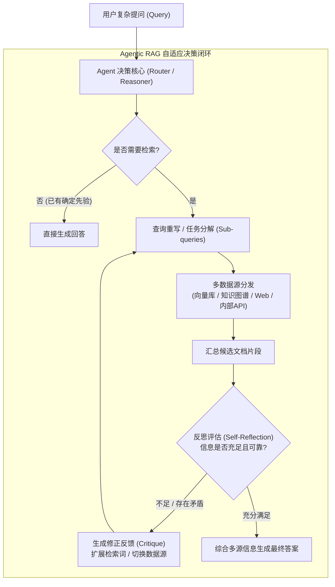
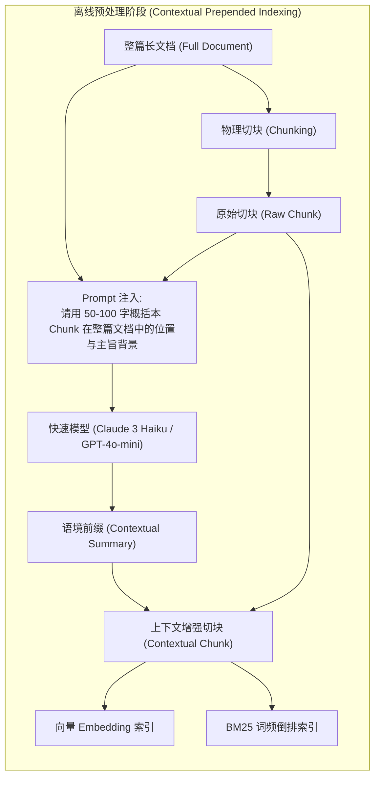

import { Quiz } from '@/components/Quiz'

# 3.4 Agentic RAG 与 Anthropic 上下文检索突破

> **本节要点**：跳出“单次检索-生成”的被动范式，掌握主动迭代的 **Agentic RAG** 智能循环机制；深度解密 Anthropic 提出的 **Contextual Retrieval（上下文增强检索）** 如何破解分块断章取义的行业顽疾；通过工程代码实现带自我反思修正的主动检索调度引擎。

---

## 1. 范式革命：从 Passive RAG 到 Agentic RAG

传统 RAG（无论是 Naive 还是拼接了 Rerank 的 Advanced RAG）本质上是一个**静态被动的线性漏斗（Linear Pipeline）**：
```text
Query → Retrieve → Rerank → Generate
```

然而在实际复杂业务中，这一流程面临致命缺陷：
1. **Query 表达不准**：用户问题模糊、暗含多重假设或术语不匹配时，单次召回注定失效；
2. **检索不足或过度**：简单问题不需要检索（白白增加延迟与成本），跨领域复杂问题单次检索无法拼凑完整拼图；
3. **缺乏批判性验证**：检索回来的内容可能包含冲突、过时或无关信息，模型盲目接受直接导致幻觉。

**Agentic RAG** 将 RAG 重新定义为 **Agent 驱动的工具调用与闭环推理过程**：



### Agentic RAG 的四大核心机制
1. **自适应路由 (Adaptive Routing)**：根据 Query 复杂度动态决策走轻量模型直出、轻量向量检索、还是多步拓扑检索；
2. **查询改写与子问题拆解 (Query Rewriting & Decomposition)**：面对“比较 2024 年 Q1 和 Q3 的净利润”，将其自动拆解为两个独立的精准子检索；
3. **自我反思与验证 (Corrective Evaluation / CRAG)**：引入打分节点，判断检索片段是否切题（Relevant）、是否有害（Noisy）；
4. **回退保底 (Fallback Search)**：当内网知识库召回评分为零时，自动降级至 Web Search 工具联网求证。

---

## 2. 行业破局：Anthropic Contextual Retrieval 深度剖析

在 RAG 落地过程中，工程师面临的最普遍头痛问题就是**文档分块（Chunking）导致的语境撕裂**。

### 2.1 传统切片的“语境孤岛”陷阱

假设有一份 100 页的《某科技集团 2024 年度财报》，在第 45 页出现如下文本切块：
> *“在该业务线中，第三季度的运营利润率环比提升了 2.4%，主要归因于供应链管理优化和海外直销比例的提高。”*

当用户检索：**“该科技集团智能手机业务 2024 年 Q3 利润率为什么提升？”** 时：
* 传统向量检索几乎很难匹配：因为这个 Chunk 里根本没有出现“某科技集团”、“智能手机业务”等关键词！
* BM25 稀疏检索更是直接零分。
* 这个 Chunk 沦为了**语义孤儿（Contextual Orphan）**。

### 2.2 上下文检索（Contextual Chunking）的核心解法

Anthropic 官方研究提出了极其优雅的解决方案：**在切片存入数据库前，利用廉价/快速大模型为每一个切片添加 50-100 token 的“全局语境前缀”！**



经过处理后，原本干瘪的切片变成了：
```text
【文档背景：某科技集团 2024 年度财报，章节：第四章·消费者业务与智能硬件部门运营分析。】
在该业务线中，第三季度的运营利润率环比提升了 2.4%，主要归因于供应链管理优化和海外直销比例的提高。
```

### 2.3 惊人收益与成本控制 (Prompt Caching 赋能)

Anthropic 官方实测数据表明：
* 仅仅引入 Contextual Retrieval，检索失败率（Failure Rate）降低了 **35%**；
* 若将 **Contextual Embeddings** 与 **Contextual BM25** 结合，失败率降低 **49%**；
* 进一步叠加 **Reranking**，召回失败率骤降达 **67%**！

> 💡 **成本考量**：对数百万字的大型文档库，每个 Chunk 都调用一次 LLM 岂不是很贵？
> **关键秘诀是 KV Cache（Prompt Caching）**！由于整篇文档对于同一批切片是固定不变的前缀，只有尾部的 Raw Chunk 在变，整篇长文档完全命中厂商的 Prompt Cache，调用成本直降 90%，处理速度提升 2-4 倍！

---

## 3. 全栈实战：构建带自我反思的 Agentic RAG 检索器

下面我们用 TypeScript 实现一个具备上下文增强处理与自我验证反思（Self-Reflective RAG）的轻量级闭环骨架：

```typescript
// agentic-rag-engine.ts
import { OpenAI } from 'openai';

interface ChunkWithContext {
  id: string;
  rawContent: string;
  contextSummary: string;
  fullIndexedText: string;
  vector?: number[];
}

export class AgenticRAGRetriever {
  private client = new OpenAI();

  /**
   * 离线预处理：实现 Anthropic 上下文增强分块
   */
  async generateContextualChunk(fullDoc: string, rawChunk: string): Promise<string> {
    const prompt = `
<document>
${fullDoc}
</document>

以下是从上述文档中提取的一个切片内容：
<chunk>
${rawChunk}
</chunk>

请用简明扼要的 1~2 句话（50字以内），概括该切片在整篇文档中的背景、所属主体及核心上下文。
切勿展开多余解释，直接输出背景描述即可。
`;

    const response = await this.client.chat.completions.create({
      model: 'gpt-4o-mini',
      messages: [{ role: 'user', content: prompt }],
      temperature: 0,
    });

    const contextPrefix = response.choices[0].message.content?.trim() || '';
    return `[背景: ${contextPrefix}]\n${rawChunk}`;
  }

  /**
   * 在线检索反思循环 (Self-Reflection RAG Loop)
   */
  async retrieveWithCritique(query: string, maxRetries = 2): Promise<string[]> {
    let currentQuery = query;
    let attempts = 0;

    while (attempts <= maxRetries) {
      console.log(`[Agentic RAG] 执行检索 (第 ${attempts + 1} 次尝试), Query: "${currentQuery}"`);
      
      // 1. 执行混合召回 + 重排 (Mock)
      const candidateDocs = await this.executeHybridSearch(currentQuery);

      // 2. 评判节点 (Critic Node)：评估召回结果相关性
      const evaluation = await this.evaluateRelevance(query, candidateDocs);

      if (evaluation.isSatisfactory || attempts === maxRetries) {
        console.log(`[Agentic RAG] 评估通过或已达最大尝试次数，生成最终结果`);
        return candidateDocs;
      }

      // 3. 产生修正意见并重写查询
      console.warn(`[Agentic RAG] 召回不足: ${evaluation.critique}，正在重写查询...`);
      currentQuery = evaluation.refinedQuery || currentQuery;
      attempts++;
    }

    return [];
  }

  private async evaluateRelevance(originalQuery: string, docs: string[]) {
    const prompt = `
用户初始问题: "${originalQuery}"
检索到的文档候选:
${docs.map((d, i) => `[${i + 1}] ${d}`).join('\n')}

请作为严格的质检 Agent，判断这些候选文档是否足以回答用户问题？
请以 JSON 格式输出：
{
  "isSatisfactory": boolean,
  "critique": "如果不充分，说明缺少什么关键信息",
  "refinedQuery": "针对缺失信息，重写一个更精准的检索词"
}
`;
    const res = await this.client.chat.completions.create({
      model: 'gpt-4o-mini',
      response_format: { type: 'json_object' },
      messages: [{ role: 'user', content: prompt }],
    });

    return JSON.parse(res.choices[0].message.content || '{}');
  }

  private async executeHybridSearch(q: string): Promise<string[]> {
    // 模拟混合检索与 Rerank 过程
    return [`关于 "${q}" 的检索证据切片 A`, `关于 "${q}" 的检索证据切片 B`];
  }
}
```

---

## 4. 架构选型矩阵：四代 RAG 全面对比

在架构设计评审中，切忌无脑盲目上最复杂的拓扑。根据业务场景量体裁衣是高级架构师的核心素养：

| 维度 | Naive RAG | Advanced RAG | Agentic RAG | Contextual Retrieval |
| :--- | :--- | :--- | :--- | :--- |
| **工作拓扑** | 单向线性流 | 预处理+过滤+重排 | 有向图/自适应循环回路 | 预处理增强（可与各代叠加） |
| **检索控制** | 盲目无条件检索 | 规则/阈值过滤 | 动态自发推理、子目标拆解 | 强化切片语境（解决断章取义） |
| **Query 适应度** | 极度敏感（要求提问极准） | 中等（靠 Rerank 纠偏） | 极高（自动改写纠偏与反思） | 极高（兼顾语义与专有名词） |
| **单次响应延迟** | 极低（数百毫秒） | 较低（0.8s - 1.5s） | 较高（2s - 8s，多轮 LLM 交互） | 极低（运行时完全无额外延迟） |
| **最佳适用场景** | 简单 FAQ、产品规格速查 | 企业级文档搜索、知识库 | 深度行业分析报告、代码审计 | **全场景通用推荐作为基石基础设施** |

---

## 5. 本节练习与反思

<Quiz
  question="根据 Anthropic 的 Contextual Retrieval 原理，为什么为 Chunk 添加全局背景能够大幅提升检索召回率？"
  options={[
    "因为长文本切片后会丢失篇章级实体信息与主旨，导致关键词与向量均无法命中用户提问",
    "因为添加了背景描述后，文档的 Chunk 长度能刚好凑满 8192 token 的最大窗口",
    "因为加入上下文前缀后，向量数据库就不再需要建立 BM25 倒排索引与向量索引了",
    "因为该方法可以通过 Prompt 注入直接修改底层大模型的权重矩阵"
  ]}
  correctIndex={0}
  explanation="文档分块的物理切片破坏了语境连续性。单独的一个切片常常缺乏主语、所属业务线或年份（如'第三季度利润提升2.4%'），导致 BM25 和向量召回无法将其与用户的完整问题关联起来。添加 50-100 token 的全局背景说明彻底补齐了缺失语义。"
/>

<Quiz
  question="在工程实践中，为什么 Anthropic 能够以极低的成本为数十万个 Chunk 批量生成上下文前缀？"
  options={[
    "利用了 LLM 厂商的 Prompt Caching 机制，全文只需加载一次即可被各切片低成本复用缓存",
    "因为全部使用了客户端本地纯规则正则表达式进行提取，完全没有调用远程大语言模型",
    "因为跳过了所有分块的向量 Embedding 生成步骤，只保留最基础的无格式原始文本",
    "因为所有切片均共享完全相同的一句话固定前缀，无须针对各切片具体位置定制生成"
  ]}
  correctIndex={0}
  explanation="由于处理同一篇文档的所有切片时，文档主体内容是完全固定的前置 Prompt，只有待处理的 Chunk 发生变化，因此整篇前置文档完美命中了大模型厂商的 KV Cache（Prompt Caching），API 输入成本可下降高达 90%，使得百万 token 级的批量增强具备极高的商业可行性。"
/>
