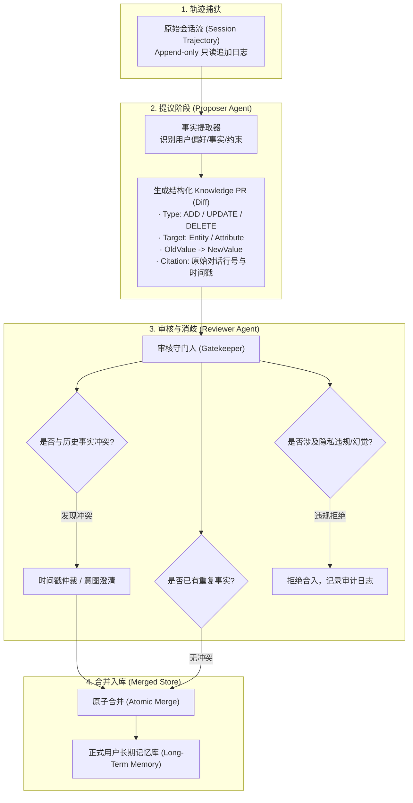
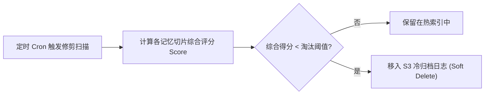

import { Quiz } from '@/components/Quiz'

# 3.5 知识 PR 更新闭环与双层终极记忆架构

> **本节要点**：攻克 Agent 生产落地中“只增不减、脏数据腐烂”的致命痛点；掌握源自顶级工程实践的 **知识 PR（Pull Request）审核更新机制**；构建统一集成短期执行与长期沉淀的 **双层终极记忆架构（Two-Tier Memory Architecture）** 与遗忘修剪算法。

---

## 1. 记忆系统的阿喀琉斯之踵：更新与污染

很多初学者构建 Agent 时，往往简单地将用户说的每一句话都扔进向量数据库。然而运行数周后，系统必定遭遇灾难性崩溃：
1. **幻觉与误解沉淀**：如果 Agent 误解了用户意图，或者用户自己开了个玩笑（如“我明天要去火星上班”），错误信息被当成真实记忆固化，造成永久性认知污染；
2. **时态与状态冲突**：半年前用户说“我住在北京”，昨天说“上个月我举家搬迁到了深圳”。若缺乏版本与冲突解决机制，检索时两者同时召回，Agent 将陷入逻辑混乱；
3. **不可逆膨胀与信噪比归零**：海量无意义的琐碎对话填满索引库，检索召回的纯净度急剧衰退。

> ⚠️ **工业界铁律**：**没有严格审核与冲突消解的写入，就是在对知识库慢性下毒。**

---

## 2. 知识 PR 机制：Proposer-Reviewer 提议审核范式

借鉴软件工程中最成熟的代码协同模式——Git Pull Request，《AI Agents in Depth》提出了知识库的 **PR 更新机制**：



### 知识 PR 的核心数据协议

每一次对记忆库的修改，都必须打包为一个具备完整审计追溯链的不可变 PR 对象：

```typescript
export interface KnowledgePullRequest {
  id: string;
  createdAt: string;
  sourceSessionId: string;
  proposedBy: 'proposer_agent_v1';
  operations: Array<{
    action: 'CREATE' | 'UPDATE' | 'DELETE';
    category: 'user_profile' | 'system_preference' | 'domain_fact';
    key: string;
    oldValue: any | null;
    newValue: any;
    confidence: number; // 提取置信度 (0.0 - 1.0)
    evidence: {
      rawMessageQuote: string; // 原始会话原句证明
      timestamp: number;
    };
  }>;
  reviewStatus: 'PENDING' | 'APPROVED' | 'REJECTED' | 'NEEDS_HUMAN_REVIEW';
  reviewerFeedback?: string;
}
```

---

## 3. 双层终极记忆架构 (The Two-Tier Architecture)

为了同时满足 **实时交互的低延迟** 与 **海量知识的高召回**，顶尖 Agent 系统均采用短期与长期解耦的“双层存储模型”：

```mermaid
graph TD
    User["用户实时交互 (User)"] <--> T1
    
    subgraph Tier1["Tier 1: 运行态工作记忆区 (Working Context / Fast Tier)"]
        T1["· 毫秒级极速响应 (In-Memory / Redis / Local Cache)<br/>· 当前任务状态栏 (Status Bar) 与 Scratchpad<br/>· 滑动窗口内最近 N 轮未压缩原始对话<br/>· 只追加，不执行复杂的向量写入与图合并"]
    end
    
    Tier1 -->|异步批处理 / 会话结束事件| Pipeline["异步沉淀管道 (Async Extraction Pipeline)"]
    
    subgraph Pipeline["异步流式清洗与更新"]
        ExtractNode["语义抽取与实体对齐"] --> PRNode["生成知识变更 PR"]
        PRNode --> ReviewNode["Reviewer 审核与去重"]
    end
    
    Pipeline -->|审批通过| Tier2
    
    subgraph Tier2["Tier 2: 持久态长期记忆库 (Long-Term Memory / Slow Tier)"]
        Tier2_V["多维向量索引 (Vector Embeddings)"]
        Tier2_G["实体关联知识图谱 (Graph Store)"]
        Tier2_S["结构化画像 JSON (Profile Store)"]
        Tier2_A["原始会话冷归档 (Raw Trajectory Lake)"]
    end
    
    Tier2 -.->|按需检索召唤 (Hybrid Recall)| Tier1
```

### 两层核心分工明细
*   **Tier 1（工作上下文层）**：
    *   **职责**：支撑当前秒级甚至亚秒级的 ReAct 推理循环；
    *   **载体**：LLM 提示词窗口、Redis 状态机、内存 scratchpad；
    *   **特性**：读写极快、生命周期绑定单次任务或单会话、免除写放大（Write Amplification）。
*   **Tier 2（长期沉淀层）**：
    *   **职责**：跨任务、跨周期的认知沉淀；
    *   **载体**：PostgreSQL / Milvus / Neo4j / S3 冷存湖；
    *   **特性**：高容灾、结构化与向量结合、异步更新与严格审计。

---

## 4. 记忆生命周期：艾宾浩斯衰减与修剪算法

长期记忆不能只增不减。仿生认知科学的精髓在于**遗忘（Forgetting）不仅是一种节省空间的手段，更是提高决策信噪比的智慧**。

```text
Memory_Score(m) = w_r * R(t) + w_f * ln(1 + Access_Count) + w_i * Importance(m)
```

其中各项构成：
*   **时间衰减因子** `R(t) = exp(-λ * (t - t_last))`：基于艾宾浩斯遗忘曲线，越久未被激活的信息衰减越多；
*   **访问频次增益** `ln(1 + Access_Count)`：被反复命中召回的高价值事实（如“用户的电子邮箱地址”）具备强大的驻留能力；
*   **固有重要性权重** `Importance(m)`：用户明确强调的基石原则（如“我对坚果严重过敏”）设置最高基础分，不受时间衰减影响。



---

## 5. 第 3 章知识体系全景回顾与综合自测

经过本章的系统训练，我们完整贯通了现代 Agent 记忆与检索的核心技术底座：
1. **3.1 用户记忆系统**：确立了“轨迹（日志）”与“长期记忆（档案）”的时空分野，掌握了三层进阶评估与四种存储结构演进；
2. **3.2 生产级 RAG 管道**：剖析了语义断句分块、BM25 + 向量混合检索（RRF）以及 Cross-Encoder 神经重排；
3. **3.3 结构化索引体系**：探索了 RAPTOR 树状递归摘要、GraphRAG 实体知识网络与虚拟文件系统（VFS）；
4. **3.4 Agentic RAG 范式**：解锁了从被动检索到主动反思循环的飞跃，吃透了 Anthropic Contextual Retrieval 的破局原理；
5. **3.5 知识 PR 与双层架构**：建立了 Proposer-Reviewer 防污染安全护栏，完成了 Tier 1 与 Tier 2 工业级分层落地。

---

## 6. 本节练习与反思

<Quiz
  question="为什么在 Agent 生产级架构中，强烈反对在每次会话结束时直接将用户原话批量写入长期向量数据库？"
  options={[
    "因为缺乏提议审核（PR）机制会导致用户玩笑、误解或临时冲突事实污染知识库，造成信噪比毁灭性下降",
    "因为向量数据库只支持只读模式，无法在创建之后进行任何新增记录的插入操作",
    "因为大语言模型只能理解纯 JSON 格式的数据，无法理解从向量数据库检索出的自然语言文本",
    "因为直接写入向量数据库会导致底层的 Embedding 模型发生参数漂移并损毁模型权重"
  ]}
  correctIndex={0}
  explanation="会话轨迹充满临时口误、语境假设与非持久事实。未经过滤直接写入相当于向长期知识库倾倒未经净化的脏数据，会导致严重的事实冲突、隐私泄露和不可逆的检索精度腐烂。必须经过 Proposer 提议与 Reviewer 审核验证方可合并。"
/>

<Quiz
  question="在双层记忆架构（Two-Tier Memory Architecture）中，Tier 1（工作记忆）与 Tier 2（长期记忆）的交互原则是什么？"
  options={[
    "Tier 1 负责秒级交互低延迟推理，Tier 2 负责跨会话沉淀；Tier 1 的更新通过异步流式管道清洗审核后再沉淀到 Tier 2",
    "Tier 1 与 Tier 2 必须在每次函数调用时执行强一致性的同步两阶段提交，否则立即报错回滚",
    "Tier 2 必须常驻在客户端浏览器的 LocalStorage 中，而 Tier 1 仅保存在离线磁盘阵列中",
    "Tier 1 仅用于存储不可编辑的系统提示词（System Prompt），不记录任何用户动态状态"
  ]}
  correctIndex={0}
  explanation="双层架构的核心在于快慢解耦：Tier 1 追求超低延迟和无写放大，支撑当前会话的快速 ReAct 运转；Tier 2 追求持久化、结构化与高召回，通过异步批处理流水线承接清洗审核后的高纯度事实。"
/>
