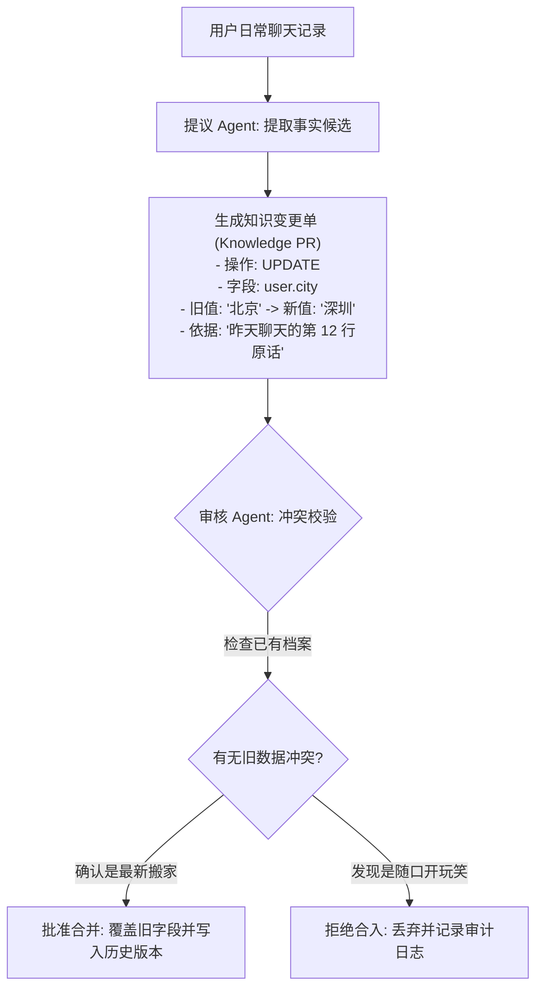
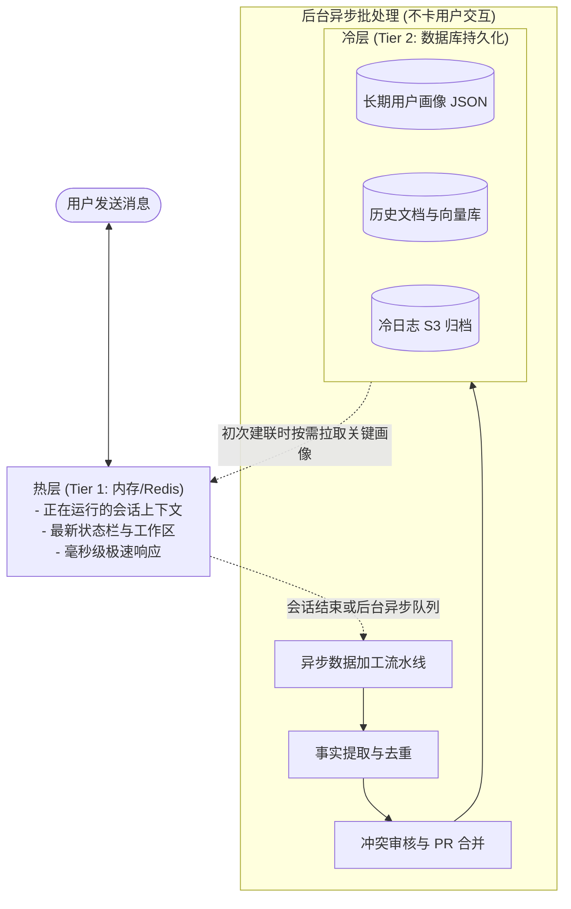
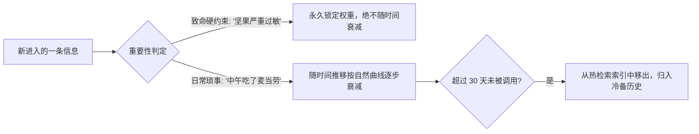

import { Quiz } from '@/components/Quiz'

# 3.5 知识 PR 更新闭环与双层终极记忆架构

> 很多初创团队喜欢展示“我们的 Agent 能记住半年前你说的每一句话”。但真跑半年后，系统就彻底瘫痪了：用户半年前说“我单身”，上周说“我和老婆去度蜜月”，模型订酒店时开始精神分裂。记忆如果只增不改、不加审核，等于是在给系统慢性下毒。这一节我们聊聊怎么像提 Git PR 一样管理记忆，以及生产级的冷热双层存储架构。

---

## 1. 为什么记忆系统最怕“只存不删”？

无脑往向量数据库里存对话，不出一个月就会遇到三类致命翻车：

1. **玩笑与随口一提变成永久真理**：用户开玩笑说了一句“我明天去火星开会”，结果被提取成一条永久事实，以后每次聊天模型都提醒他带宇航服；
2. **状态更新引发逻辑打架**：去年说“我住在北京”，昨天说“我们搬家到深圳了”。搜索时两条同时命中，模型不知道该以哪个为准；
3. **噪声淹没核心偏好**：成千上万句琐碎废话塞满数据库，真正关键的“对海鲜过敏”反而搜不出来了。

---

## 2. 知识 PR 机制：像审查代码一样审查新记忆

解决记忆冲突最稳妥的方案，是借鉴程序员每天都在用的 **Git Pull Request** 流程：

每次对长期记忆的写入，都必须明确声明：**这条新事实的来源是什么、推翻了哪条旧结论、根据时间戳谁更具效力**。这样哪怕记录被改错了，也能顺藤摸瓜回滚到上一版。

---

## 3. 冷热双层架构：别让存记忆拖慢了实时回复

如果用户每说一句话，程序都当场调模型去提取画像、查重、入库，那一次回复至少要延迟好几秒。成熟团队普遍采用**读写分离的冷热双层设计**：

* **热层（Tier 1）**：只保存在内存和 Redis 里。处理当前这几轮对话，追求极致的响应速度，不写任何沉重的大数据库；
* **冷层（Tier 2）**：在用户关掉对话框或者后台空闲时，由后台 Worker 慢慢分析这趟对话，提炼出有价值的新事实，经过审核后持久化入库。

---

## 4. 遗忘机制：懂得遗忘才是高信噪比的保证

并不是所有事情都配被永久记住。艾宾浩斯遗忘曲线在系统设计里同样适用：

* **永久保留项**：用户明确声明的铁律（如“代码必须用 TypeScript 编写”、“对头孢药物过敏”），权重拉满，不受时间影响；
* **自然衰退项**：临时提了一嘴的话题，如果一个月内再也没人提过，自动降低其检索评分，最终移入冷存储。既能为数据库瘦身，更能防止老旧记忆出来搅局。

---

## 5. 随堂检验

<Quiz
  question="为了防止 Agent 在多轮交互中因为用户前后的矛盾表述（如‘我单身’与‘我和妻子打算出游’）导致状态混乱，最有效的治理手段是什么？"
  options={[
    {
      text: "A. 采用带版本与依据审核的 PR 机制，通过时间戳与上下文消歧解决冲突后再入库",
      isCorrect: true,
      explanation: "将记忆更新视作代码 PR：记录变更原因、时间戳和原始依据，遇到新老冲突时能够明确识别最新有效状态并覆盖旧数据。"
    },
    {
      text: "B. 只要用户说出新内容，就立刻无脑插入一条全新记录，完全不检查已有数据",
      isCorrect: false,
      explanation: "无脑直接插入会导致矛盾信息同时存在于知识库中，检索时两败俱伤，模型直接产生逻辑混乱。"
    },
    {
      text: "C. 每次出现冲突时立刻删除用户整个账号的历史记录并注销系统",
      isCorrect: false,
      explanation: "这种极端破坏性操作完全无法满足日常真实产品的可用性需求。"
    },
    {
      text: "D. 仅将所有信息保存在客户端浏览器的 LocalStorage 中，服务端永不记录",
      isCorrect: false,
      explanation: "换设备后记忆全部丢失，且客户端存储无法支撑大体量的向量混合检索和后台异步清洗。"
    }
  ]}
/>

---

## 延伸阅读

* 《AI Agents in Depth: Design Principles and Engineering Practice》（李博杰，2026）第 3.4 节。
* [Agent 核心架构速查手册](/reference/agent-core-architecture)
* 下一章：[第 4 章 工具系统与 MCP 协议标准](/ch04-tools/01-tool-taxonomy-and-aci)
