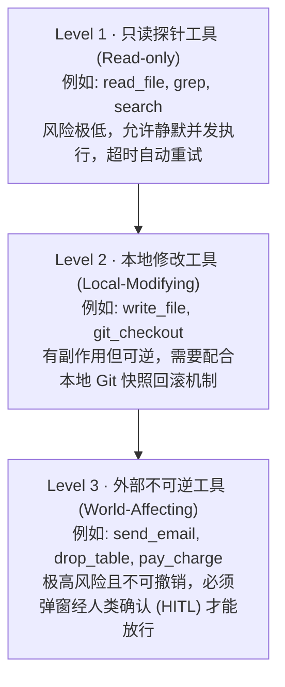
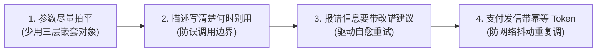

import { Quiz } from '@/components/Quiz'

# 4.1 工具分类学与 ACI 界面设计法则

> 只靠大模型本身，它充其量是个“打字机”：不知道当下的实时汇率，改不了你硬盘里的文件，更不敢直接让它调扣款接口。给它配工具，就是给它装上手和脚。但给 Agent 设计工具，跟平时给前端写 API 完全是两回事：前端开发者能看懂隐晦的入参约定，而大模型全靠你的 JSON Schema 来猜。如果接口设计得别扭，模型就会不断传错参数。这一节我们聊聊面向模型的接口设计（ACI）。

---

## 1. 工具的三级风险分类

在生产环境里，决不能把所有工具一视同仁。必须根据操作的破坏性和可逆性，划出清晰的防线：



| 风险等级 | 代表工具 | 可逆性 | 执行策略 |
| :--- | :--- | :--- | :--- |
| **Level 1 (只读)** | `cat`, `grep`, `fetch_url` | 100% 可逆，无副作用 | 框架直接自动放行，支持失败静默重试 |
| **Level 2 (本地写)** | `edit_file`, `exec_script` | 可逆（靠版本控制或沙箱快照） | 限制在受控沙箱目录，提供一键回滚操作 |
| **Level 3 (外部影响)** | `send_email`, `stripe_pay` | **几乎不可逆**（发出去的邮件撤不回） | **强制弹窗转人工确认（HITL）**，强制带幂等令牌 |

---

## 2. ACI 界面设计的 4 条实用铁律

为什么管这个叫 **ACI（Agent-Computer Interface）**？因为你的接口不是给人调的，是给“靠概率猜字的模型”调的。



### 1. 参数尽量扁平，拒绝深层嵌套
* **反面教材**：设计了一个包含四层嵌套的大 JSON 对象，里面有各种可选的数组和对象。模型在生成很长的 JSON 时，极其容易括号不匹配或者把字段放错层级。
* **正面做法**：入参越扁平越好。如果参数确实很多，拆成两个职责单一的小工具。

### 2. 工具描述（Description）写清楚“什么时候不要用”
模型的工具描述不只是给人看的注释，它就是 **System Prompt 的一部分**！
* 写清楚：在什么场景下调它；
* **更要写清楚：在什么情况下坚决不能调它**（比如声明“只支持文本文件，严禁用来修改图片或二进制文件”）。

### 3. 报错信息要能指导重试（Error as Feedback）
工具执行失败时，**千万别只返回一个 `500 Internal Error`**。模型看到这个根本不知道怎么自愈。
好的错误返回长这样：
```json
{
  "status": "error",
  "code": "FILE_NOT_FOUND",
  "message": "文件 src/app.ts 不存在",
  "suggestion": "同目录下存在 src/app.tsx，你是否是要编辑该文件？"
}
```
模型看到这段建议，下一轮就能立刻自动改对参数。

### 4. 关键操作强制带幂等键（Idempotency Key）
网络轻微卡顿或者接口超时时，模型以为刚才没成功，很可能在下一轮再次发起一模一样的调用。
对于发邮件、扣款等关键操作，接口必须要求传入一个 `idempotency_key`。服务端收到重复的 Key 直接返回上次的缓存结果，绝不扣两次钱。

---

## 3. TypeScript + Zod 实战写法

```typescript
import { z } from 'zod';

// 1. 用 Zod 定义强类型与清晰的参数说明
export const EditFileSchema = z.object({
  filePath: z.string().describe('待修改文件的绝对路径，必须是文本文件'),
  targetContent: z.string().describe('待替换的原代码片段，必须与原文件完全一致（含缩进）'),
  replacementContent: z.string().describe('替换后的新代码内容'),
});

// 2. 工具定义：重点说明使用限制
export const editFileTool = {
  name: 'edit_file',
  description: `用于精确替换文本文件中的代码片段。
【使用限制】：
- 仅限文本文件，禁止修改图片、音视频等二进制文件；
- targetContent 必须在原文件中唯一存在；如果匹配到多处，操作将直接报错拒绝。`,
  parameters: zodToJsonSchema(EditFileSchema),
};

// 3. 执行器：参数校验失败时，提供友好的错误反馈
export async function handleEditFile(rawArgs: unknown) {
  const result = EditFileSchema.safeParse(rawArgs);
  if (!result.success) {
    return JSON.stringify({
      status: 'error',
      error_type: 'INVALID_ARGUMENTS',
      message: '参数格式不匹配，请检查传入字段',
      details: result.error.format()
    });
  }

  // 正常执行替换...
  return JSON.stringify({ status: 'success', message: '修改已生效' });
}
```

---

## 4. 随堂检验

<Quiz
  question="在为 Coding Agent 设计一个用于修改代码的本地文件工具时，以下哪种接口与错误处理设计最利于 Agent 自愈？"
  options={[
    {
      text: "A. 工具执行抛错时仅向模型回传一行粗暴的‘500 Internal Server Error’",
      isCorrect: false,
      explanation: "缺少具体报错原因，模型无法知道是路径写错、权限不足还是内容不匹配，失去纠错自愈机会。"
    },
    {
      text: "B. 采用扁平参数，并在执行失败时返回具体原因与建议（如提示相近的文件名）",
      isCorrect: true,
      explanation: "扁平参数减少格式生成错误，而带有上下文线索的错误信息能直接引导模型在下一轮调用中自主修正。"
    },
    {
      text: "C. 把参数设计成深层嵌套的 5 层复合对象，要求模型一次性配置完所有环境",
      isCorrect: false,
      explanation: "深层嵌套极易造成 JSON 生成格式截断或层级混乱，大幅降低调用成功率。"
    },
    {
      text: "D. 任何修改操作一律自动跳过文件存在性检查，直接强制覆盖写盘",
      isCorrect: false,
      explanation: "不做检查的盲目覆盖极易损坏用户已有的代码资产，造成灾难性数据丢失。"
    }
  ]}
/>

---

## 延伸阅读

* 《AI Agents in Depth: Design Principles and Engineering Practice》（李博杰，2026）第 4.1 节。
* [Agent 核心架构速查手册](/reference/agent-core-architecture)
* 下一节：[4.2 MCP 协议架构：统一工具总线标准](/ch04-tools/02-mcp-protocol-architecture)
