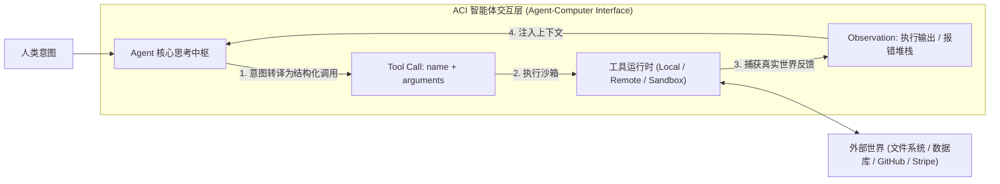
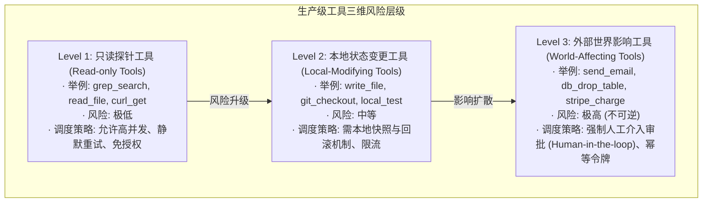
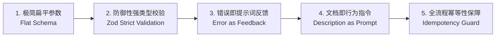

import { Quiz } from '@/components/Quiz'

# 4.1 工具分类学与 ACI 界面设计法则

> **本节要点**：工具（Tools）是 Agent 从“语言生成器”跃迁为“数字行动实体”的根本桥梁。掌握生产级工具的三维风险分类学；吃透面向模型的 **ACI（Agent-Computer Interface）** 界面设计五大黄金法则；学会使用 TypeScript + Zod 打造具备自愈错误反馈的工业级工具。

---

## 1. 从“嘴炮”到“实体”：为什么工具定义了 Agent 的上限？

纯大语言模型（LLM）存在三大天然宿命局限：
1. **时空停滞**：参数固化在训练切片时间点，不知道此时此刻的实时汇率、股价或天气；
2. **无物理手脚**：模型只能输出 Token 字符流，无法凭空修改磁盘文件、调用内部微服务或给客户发邮件；
3. **精准计算瘫痪**：在长数字乘除法、日期差值推算或矩阵逆变换上，自回归生成极易陷入微小累计误差。

**工具调用（Function Calling / Tool Execution）** 是打破上述局限的终极杠杆。
如同人类依赖计算机界面（GUI）工作，Agent 依赖专为其设计的 **ACI（Agent-Computer Interface，智能体计算机交互界面）** 与外部世界进行交互。



---

## 2. 生产级工具三维分类学 (Tool Taxonomy)

在工业级 Agent 架构中，严禁将所有工具混为一谈、无差别对待。必须根据**操作对系统状态的不可逆性与破坏性**，将工具严密划分为三个风险等级：



| 维度 | Read-only Tools | Local-Modifying Tools | World-Affecting Tools |
| :--- | :--- | :--- | :--- |
| **典型操作** | 文件检索、文档查看、API 查询 | 本地文件写入、代码修改、分支切换 | 生产数据库写库、银行扣款、邮件发送 |
| **可逆性** | 完全可逆（无副作用） | 可逆（依赖 Git 快照或本地备份） | **绝大多数不可逆**（短信发出无法收回） |
| **重试策略** | 遇到网络超时可自动指数退避重试 | 需先清理污染现场再执行重试 | **严禁无条件重试**（必须依赖幂等令牌） |
| **授权策略** | 系统全自动静默执行 | 依据沙箱权限白名单隔离放行 | **必须弹窗请求人类确认（HITL）** |

---

## 3. ACI 界面设计五大黄金法则

为 Agent 设计工具，与为人类前端设计 RESTful API 存在本质区别：
人类程序员能查阅几万字的手册、理解隐晦的入参约定；但 **Agent 是概率预测模型，其调用工具完全依赖于 Tool Schema 的提示词表征**。

良好的 ACI 设计直接决定了 Agent 的调用成功率（Function Call Accuracy）。



### 法则 1：极简扁平入参 (Flat Schema)
*   **反模式（Anti-pattern）**：三层深度嵌套的庞大 JSON 对象，包含大量可选嵌套字段。LLM 在补全多层括号时极易出现 JSON 格式截断或字段放错层级。
*   **最佳实践**：优先采用**平铺扁平参数**。如果必须传入复杂配置，拆解为多个单一目的的小工具。

### 法则 2：文档即行为指令 (Description as Prompt)
工具的 `description` 不只是给人类看的注释，而是**给 LLM 看的 System Prompt 延伸**！
*   必须明确指明：**在什么前置条件下调用本工具**；
*   必须声明：**什么时候绝对不要调用本工具**；
*   入参字段必须附带正反例（Example）。

### 法则 3：错误输出即高质量修复反馈 (Error as Feedback)
当工具执行抛出异常时，**绝对不要只返回 `status: 500` 或 `Failed`**！
Agent 具备利用错误自我修复（Self-healing）的本能。高质量的 ACI 返回结构如下：
```json
{
  "status": "error",
  "error_code": "FILE_NOT_FOUND",
  "message": "文件 /app/config.json 不存在。",
  "suggestion": "检测到该目录下存在 /app/config.example.json，是否需要先执行 copy_file？"
}
```

### 法则 4：全流程幂等性设计 (Idempotency Token)
LLM 在遇到网络轻微卡顿或超时重传时，会重复发出相同的 Tool Call。
对于高危工具（如创建付款单），工具入参必须包含一个由 Agent 根据上下文生成的唯一 `idempotency_key`。后端服务端校验此 Key，确保重复请求只执行一次。

---

## 4. 全栈实战：基于 TypeScript + Zod 定义生产级 ACI

以下展示符合现代工业级规范的 Agent 工具定义模式：

```typescript
import { z } from 'zod';

// 1. 使用 Zod 定义强类型与详尽字段描述
export const FileEditSchema = z.object({
  filePath: z.string().describe('待修改文件的绝对路径，必须以 / 或盘符开头'),
  targetSnippet: z.string().describe('文件中需要被替换的精确代码片段，必须与原文件字符逐字匹配，包含缩进'),
  replacementSnippet: z.string().describe('用于替换的新代码内容'),
  createIfNotExists: z.boolean().default(false).describe('若目标文件不存在，是否自动创建新文件'),
});

export type FileEditInput = z.infer<typeof FileEditSchema>;

// 2. 导出符合 OpenAI / MCP 规范的 Tool Definition
export const fileEditTool = {
  name: 'file_edit',
  description: `安全地编辑本地文件内容。
【使用限制】：
- 仅支持文本文件，严禁用于修改 .png、.exe 等二进制文件。
- 替换内容必须保证原子性，如果 targetSnippet 在文件中出现多次，执行将报错回滚以防破坏代码。`,
  parameters: zodToJsonSchema(FileEditSchema),
};

// 3. 具备自愈式错误反馈的执行器
export async function executeFileEdit(args: unknown): Promise<string> {
  // ACI 防御层：参数严格校验
  const parseResult = FileEditSchema.safeParse(args);
  if (!parseResult.success) {
    return JSON.stringify({
      status: 'error',
      code: 'INVALID_ARGUMENTS',
      message: '工具入参格式错误，请检查参数类型',
      details: parseResult.error.format(),
    });
  }

  const { filePath, targetSnippet, replacementSnippet } = parseResult.data;
  
  try {
    // 执行文件替换逻辑...
    return JSON.stringify({
      status: 'success',
      message: `成功更新文件: ${filePath}`,
      diffSummary: `替换了 1 处代码块`,
    });
  } catch (err: any) {
    // 关键：将错误转化为引导模型纠偏的精确提示
    return JSON.stringify({
      status: 'error',
      code: 'TARGET_NOT_FOUND',
      message: `在 ${filePath} 中未能找到匹配的 targetSnippet。`,
      suggestion: '建议先调用 view_file 工具重新确认目标代码片段的精确行号与缩进。',
    });
  }
}
```

---

## 5. 本节练习与反思

<Quiz
  question="在为 Agent 设计 ACI（Agent-Computer Interface）工具时，当工具执行失败时，以下哪种做法最符合最佳工程实践？"
  options={[
    "返回富含语义的结构化错误信息，包括失败原因和具体的纠错建议（Suggestion），引导 Agent 在下一轮自愈修复",
    "直接吞掉错误并返回一个空字符串，防止错误信息干扰大语言模型的上下文注意力和生成质量",
    "立即强行终止整个 Agent 进程，避免模型产生连锁反应造成不可控的计算资源消耗",
    "在系统提示词中将重试次数设为 100 次，并以相同的入参原样发起并发暴力请求"
  ]}
  correctIndex={0}
  explanation="Agent 具备 Think-Act-Observe 闭环自愈能力。只要环境提供精确的错误细节（如'未找到 targetSnippet，但第 42 行有相似内容'），Agent 就能自发修正参数并发起下一次正确的调用。空报错或静默失败会彻底切断 Agent 的推理链条。"
/>

<Quiz
  question="对于'外部世界影响（World-Affecting）'类别的工具（如调用第三方网关转账、发邮件、生产数据库删除操作），架构层面上必须具备的核心机制是什么？"
  options={[
    "强制人工确认（Human-in-the-loop）审批护栏与业务级幂等性保障机制",
    "必须配置最低 10 次的自动静默超时重试，确保每次外部调用都绝对成功",
    "将所有参数压缩为一个无格式的纯文本长字符串，完全绕过 JSON Schema 校验",
    "强制要求每次调用必须由多台不同的物理服务器并发重复执行一次"
  ]}
  correctIndex={0}
  explanation="高危工具的操作在物理世界中不可逆。生产级 Harness 架构必须在此类工具调用前设立人工拦截审批（Human-in-the-loop），并通过幂等性令牌（Idempotency Token）防止由于网络超时导致的重复扣款或重复发信等重大事故。"
/>
