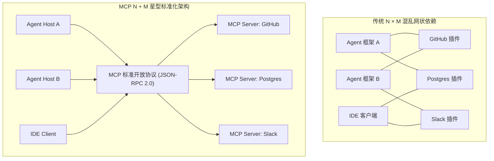
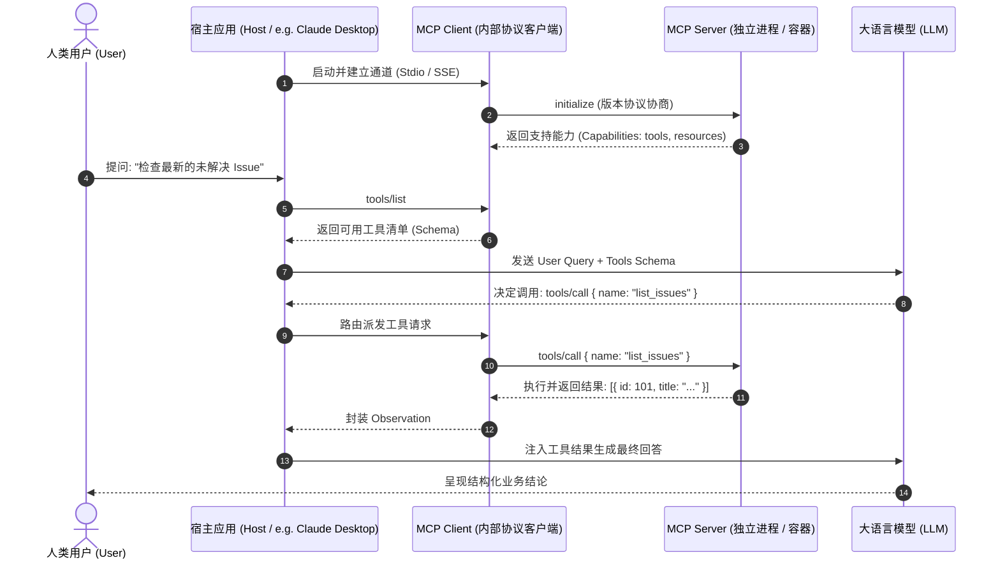

import { Quiz } from '@/components/Quiz'

# 4.2 MCP 协议深度解析：标准架构与 JSON-RPC 规范

> **本节要点**：解密被誉为“AI 时代 USB-C 接口”与“Agent 界 LSP”的 **Model Context Protocol (MCP)**；掌握 Host-Client-Server 三层核心拓扑；搞清 MCP 三大基元（Tools, Resources, Prompts）的分工；掌握 JSON-RPC 2.0 底层报文与两种主要传输通道（Stdio vs. SSE）；使用官方 TypeScript SDK 实战构建工业级 MCP 服务端。

---

## 1. 行业痛点：从 N×M 网状地狱到 N+M 星型标准化

在 MCP（Model Context Protocol）诞生之前，AI Agent 工具生态面临着与 20 年前编程语言 IDE 类似的噩梦：
* 每一个 Agent 框架（LangChain、LlamaIndex、AutoGen、自研平台）都定义了自己的工具抽象接口；
* 每一个 SaaS 平台（GitHub、Slack、PostgreSQL、Notion）都需要为不同的框架重复编写定制适配插件；
* 如果系统中有 $N$ 个框架和 $M$ 个外部数据源，行业需要维护 $N \times M$ 个点对点绑定。



Anthropic 开源的 **Model Context Protocol (MCP)** 彻底解决了这一割裂。正如 **LSP（Language Server Protocol）** 统一了编程语言与所有代码编辑器一样，MCP 统一了大模型与所有外部世界工具和数据的通讯标准。

---

## 2. MCP 核心架构：Host、Client 与 Server 三角色模型

MCP 严格定义了系统中各参与者的职责边界：



### 三角色职责明细
1. **Host（宿主应用）**：
   * 典型代表：Claude Desktop、Antigravity IDE、企业级 Agent 控制台；
   * 核心职责：负责用户界面渲染、管理 LLM 的 API 连接、**实施最高安全控制（弹窗拦截请求与权限确认）**、调度下属的一个或多个 Client。
2. **Client（协议客户端）**：
   * 运行在 Host 内部的协议引擎；
   * 核心职责：与具体的某一个 Server 维持 1:1 的连接，负责双向 JSON-RPC 序列化、心跳保活、协议握手与版本对齐。
3. **Server（协议服务端）**：
   * 独立运行的轻量级程序（本地二进制进程、Node.js 脚本或远程 Docker 容器）；
   * 核心职责：将具体系统（如本地 Git、远程数据库）的能力封装为标准规范并暴露。

---

## 3. MCP 三大基元 (Primitives) 详解

MCP 将上下文交互拆解为三种独立且正交的原语：

| 基元类型 | 触发主体 | 核心语义 | 业务典型应用场景 |
| :--- | :--- | :--- | :--- |
| **Tools（工具）** | 模型驱动 (Model-driven) | 具有副作用或需要动态计算的可执行函数 | 跑测试、执行 SQL 查询、发邮件、创建 Pull Request |
| **Resources（资源）** | 宿主驱动 (Host/App-driven) | 类似 REST API 的只读文本或二进制数据源，支持 URI 唯一定位与订阅 | 读取项目 `README.md`、实时监听构建日志流、读取数据库 Schema |
| **Prompts（提示词）** | 用户交互驱动 (User-driven) | 预置在 Server 端的可重用模板与工作流意图包装 | `/review-pr`（代码审查工作流）、`/explain-bug` |

---

## 4. 传输协议与底盘通道：Stdio vs. SSE

MCP 底层完全基于 **JSON-RPC 2.0** 规范，目前官方标准化了两种主要传输层：

### 4.1 Stdio Transport（标准输入输出通道）
* **原理**：Host 启动 Server 作为一个子进程（Subprocess），通过标准的 `stdin` 和 `stdout` 进行流式通信；
* **优势**：
  * **零网络开销**：无需分配端口，不存在端口冲突或网络防火墙问题；
  * **极高安全性**：天然与主机网络隔离，无法被外部局域网非法探测；
  * **进程生命周期共死**：Host 退出时操作系统自动级联清理子进程，无僵尸进程残留；
* **定位**：本地桌面客户端、CLI 与 IDE 工具链的首选标准。

### 4.2 SSE Transport（Server-Sent Events + HTTP POST）
* **原理**：客户端发起 HTTP GET 请求建立长连接监听服务端事件流（SSE），发送控制指令则通过标准 HTTP POST；
* **优势**：支持跨主机分布式部署，Server 可以驻留在专用高性能集群或独立云端；
* **定位**：企业级微服务集群、共享集中式 Agent 服务。

---

## 5. 全栈实战：使用官方 SDK 编写生产级 MCP Server

下面我们使用 `@modelcontextprotocol/sdk`（TypeScript 官方核心库）构建一个提供本地开发环境诊断的 MCP Server：

```typescript
// server.ts
import { Server } from '@modelcontextprotocol/sdk/server/index.js';
import { StdioServerTransport } from '@modelcontextprotocol/sdk/server/stdio.js';
import {
  CallToolRequestSchema,
  ListToolsRequestSchema,
} from '@modelcontextprotocol/sdk/types.js';
import * as os from 'os';

// 1. 初始化 MCP 服务端元数据
const server = new Server(
  {
    name: 'system-diagnostic-mcp-server',
    version: '1.0.0',
  },
  {
    capabilities: {
      tools: {}, // 声明具备工具暴露能力
    },
  }
);

// 2. 注册可用工具列表 (tools/list 响应)
server.setRequestHandler(ListToolsRequestSchema, async () => {
  return {
    tools: [
      {
        name: 'get_system_metrics',
        description: '获取当前服务器或本机的 CPU 核心数、内存使用率与系统负载',
        inputSchema: {
          type: 'object',
          properties: {
            detailed: {
              type: 'boolean',
              description: '是否返回详细的网络接口信息',
            },
          },
        },
      },
    ],
  };
});

// 3. 实现工具具体执行逻辑 (tools/call 响应)
server.setRequestHandler(CallToolRequestSchema, async (request) => {
  if (request.params.name === 'get_system_metrics') {
    const totalMem = os.totalmem();
    const freeMem = os.freemem();
    const usedMemPercent = (((totalMem - freeMem) / totalMem) * 100).toFixed(2);

    const metrics = {
      platform: os.platform(),
      cpus: os.cpus().length,
      freeMemoryMB: Math.round(freeMem / 1024 / 1024),
      usedMemoryPercent: `${usedMemPercent}%`,
      loadAvg: os.loadavg(),
    };

    return {
      content: [
        {
          type: 'text',
          text: JSON.stringify(metrics, null, 2),
        },
      ],
    };
  }

  throw new Error(`未知的工具调用指令: ${request.params.name}`);
});

// 4. 绑定标准输入输出传输通道并启动
async function main() {
  const transport = new StdioServerTransport();
  await server.connect(transport);
  console.error('[System Diagnostic MCP] 服务已成功通过 Stdio 通道就绪运行');
}

main().catch((err) => {
  console.error('MCP Server 启动失败:', err);
  process.exit(1);
});
```

---

## 6. 本节练习与反思

<Quiz
  question="在 MCP（Model Context Protocol）体系中，Tools 与 Resources 这两种核心原语的最本质区别是什么？"
  options={[
    "Tools 是由模型自主推理决定触发的可执行操作（通常带有计算或副作用），而 Resources 是由宿主或用户驱动的只读上下文数据源",
    "Tools 只能返回纯布尔值 true 或 false，而 Resources 只能返回经过 Base64 编码的二进制图片数据",
    "Tools 仅能通过远程 SSE 协议调用，而 Resources 仅能通过本地 Stdio 标准流进行读取",
    "Tools 在执行时绝对不会消耗任何 Token，而 Resources 每次读取都会自动扣除开发者账户余额"
  ]}
  correctIndex={0}
  explanation="MCP 原语分工极度明确：Tools 面向大模型的动态决策（具备参数、可能引发外部改变），Resources 面向结构化数据的被动挂载（如文档、Schema、日志，具备固定 URI 且无副作用），Prompts 则是针对特定业务目标预制的提示词流。"
/>

<Quiz
  question="为什么在本地 IDE 和桌面客户端（如 Claude Desktop）中，MCP 首选 Stdio（标准输入输出）作为主要传输通道？"
  options={[
    "Stdio 免除了本地端口占用与冲突风险，天然具备进程间隔离，且随宿主进程退出自动销毁",
    "Stdio 支持在没有操作系统和内核支持的纯裸机硬件上直接进行光纤通信",
    "Stdio 能够自动将传输的所有自然语言文本直接翻译为底层的 GPU 汇编机器指令",
    "Stdio 协议完全不依赖 JSON 字符串解析，因此在内存中运行完全没有任何 CPU 损耗"
  ]}
  correctIndex={0}
  explanation="Stdio 依托操作系统管道（Pipes），不仅启动迅速、零网络配置，而且子进程完全受宿主掌控。一旦父进程中断，操作系统会自动杀死子进程管道，杜绝了遗留僵尸进程或开放未授权本地端口的安全漏洞。"
/>
