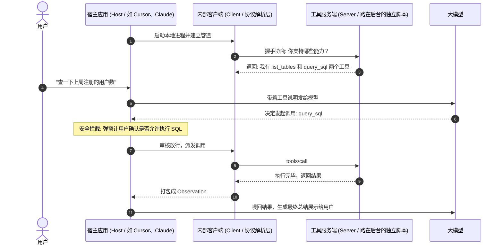
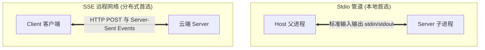

import { Quiz } from '@/components/Quiz'

# 4.2 MCP 协议深度解析：标准架构与 JSON-RPC 规范

> 几年前写编辑器插件时，每出一个新编辑器，各路语言团队就得把语法分析代码重写一遍。直到微软做了 LSP（Language Server Protocol），所有编辑器只要遵循统一协议，不管写 Python 还是 Go 都能直接补全。Anthropic 推出的 **MCP（Model Context Protocol）**，本质上就是 Agent 领域的 LSP：以前每换一个 Agent 框架，连数据库的工具就得重写一套；有了 MCP，工具只写一次，在哪都能插拔复用。这一节我们看懂它的架构分工与通信底层。

---

## 1. 为什么行业急需统一协议？

在 MCP 出现之前，生态里充满了重复造轮子的消耗：
* LangChain 搞了一套工具基类；
* LlamaIndex 搞了一套自己的 Tool 规范；
* AutoGen 和各家自研 Agent 也各有各的参数格式。

结果就是：一个查 GitHub 的插件，要为不同的框架写五遍适配层。

```mermaid
flowchart TD
    subgraph Bad["过去: N × M 网状重复适配"]
        A1[Agent 框架 A] --- S1[GitHub 插件]
        A1 --- S2[Postgres 插件]
        A2[Agent 框架 B] --- S1
        A2 --- S3[Slack 插件]
        A3[IDE 客户端] --- S2
    end

    subgraph Good["现在: N + M 星型标准总线 (MCP)"]
        Host1[Claude 客户端] --> Bus[统一 MCP 协议 (JSON-RPC 2.0)]
        Host2[Cursor / IDE] --> Bus
        Host3[自研 Agent 系统] --> Bus
        
        Bus --> M1[GitHub MCP Server]
        Bus --> M2[Postgres MCP Server]
        Bus --> M3[Slack MCP Server]
    end
```

MCP 的核心价值就一句话：**让工具开发者专注写逻辑，让 Agent 宿主专注做调度，中间用标准的 JSON-RPC 2.0 串起来。**

---

## 2. 核心架构：Host、Client 与 Server 各司其职

很多同学刚看文档容易把这三个名词搞混，其实它们的角色分界很干净：



1. **Host（宿主应用）**：你天天打交道的界面（如 Claude Desktop、Cursor、Antigravity）。它掌管 LLM 接口，**并且负责最重要的安全拦截**（比如弹窗警告用户“该工具将修改数据库，是否允许”）。
2. **Client（协议客户端）**：嵌入在 Host 内部的代码模块，负责通过标准管道收发 JSON-RPC 报文。
3. **Server（工具服务端）**：一个独立的小程序（比如一段 Node.js 或 Python 脚本），真正的工具逻辑写在这里。

---

## 3. MCP 的三大核心基元 (Primitives)

MCP 不止能跑函数，它规范了三种不同的数据载体：

| 基元类型 | 谁来驱动 | 到底是什么 | 典型例子 |
| :--- | :--- | :--- | :--- |
| **Tools（工具）** | 模型自主决定调不调 | 有副作用、会产生计算的操作 | 跑测试脚本、执行 SQL、发企业微信通知 |
| **Resources（资源）** | 宿主程序或用户指定加载 | 只读的数据内容（支持像 URI 一样读取） | 读项目的 `package.json`、监听实时构建日志流 |
| **Prompts（提示词模板）** | 用户手动输入斜杠触发 | 预先封好的常用工作流或提问模板 | 输入 `/code-review`，自动拉取当前 Git Diff 填好模板 |

---

## 4. 底层通信通道：为什么优先用 Stdio？

目前官方定义了两种主流传输通道：



### 本地工具为什么首选 Stdio（标准输入输出）？
1. **不用开端口**：没有端口占用冲突，也不怕防火墙拦截；
2. **天然安全**：通信完全限制在父子进程内部，局域网里的黑客扫不到你暴露的端口；
3. **同生共死**：Host 界面一关，子进程随之被操作系统强制销毁，决不会遗留僵尸进程占内存。

如果需要跨多台机器远程调用，再选用基于 HTTP 的 **SSE** 模式。

---

## 5. 动手写一个最小的 TypeScript MCP Server

```typescript
import { Server } from '@modelcontextprotocol/sdk/server/index.js';
import { StdioServerTransport } from '@modelcontextprotocol/sdk/server/stdio.js';
import { CallToolRequestSchema, ListToolsRequestSchema } from '@modelcontextprotocol/sdk/types.js';

// 1. 初始化服务信息
const server = new Server(
  { name: 'system-diagnostic-server', version: '1.0.0' },
  { capabilities: { tools: {} } }
);

// 2. 暴露可用工具列表
server.setRequestHandler(ListToolsRequestSchema, async () => ({
  tools: [{
    name: 'get_disk_free',
    description: '获取本地可用磁盘空间百分比',
    inputSchema: { type: 'object', properties: {} }
  }]
}));

// 3. 处理具体的调用执行
server.setRequestHandler(CallToolRequestSchema, async (request) => {
  if (request.params.name === 'get_disk_free') {
    return {
      content: [{ type: 'text', text: '磁盘剩余空间: 42%' }]
    };
  }
  throw new Error('未识别的工具名称');
});

// 4. 连接到标准输入输出流
const transport = new StdioServerTransport();
await server.connect(transport);
```

---

## 6. 随堂检验

<Quiz
  question="在本地桌面端或 IDE 中运行 MCP Server 时，为什么官方绝大多数情况下优先推荐 Stdio（标准输入输出）传输通道？"
  options={[
    {
      text: "A. 因为 Stdio 无需监听网络端口、避免局域网暴露风险，且子进程随宿主退出自动回收",
      isCorrect: true,
      explanation: "Stdio 通过操作系统的管道通信：不占端口、无法被外部网络扫描渗透，宿主崩溃时操作系统自动清理子进程，最适合本地工具链。"
    },
    {
      text: "B. 因为 Stdio 传输能够无视大模型上下文长度限制，直接传输无限大图片",
      isCorrect: false,
      explanation: "底层传输通道只负责字节交换，数据进大模型上下文依然受 Token 窗口限制。"
    },
    {
      text: "C. 因为 HTTP 协议被国际标准化组织明令禁止用于任何人工智能相关开发",
      isCorrect: false,
      explanation: "HTTP 是开放标准，MCP 的分布式远程模式（SSE）正是基于 HTTP 实现的。"
    },
    {
      text: "D. 这样可以完全省去编写任何参数校验代码的步骤",
      isCorrect: false,
      explanation: "参数解析与 Zod 校验依然是服务端必须承担的职责，与底层用不用 Stdio 无关。"
    }
  ]}
/>

---

## 延伸阅读

* 《AI Agents in Depth: Design Principles and Engineering Practice》（李博杰，2026）第 4.2 节。
* Anthropic Model Context Protocol 官方规范文档。
* 下一节：[4.3 工具动态发现与 MCP Zero 架构](/ch04-tools/03-dynamic-discovery-and-mcp-zero)
