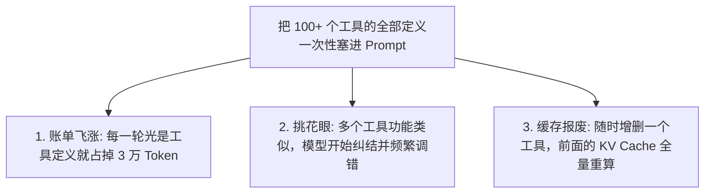
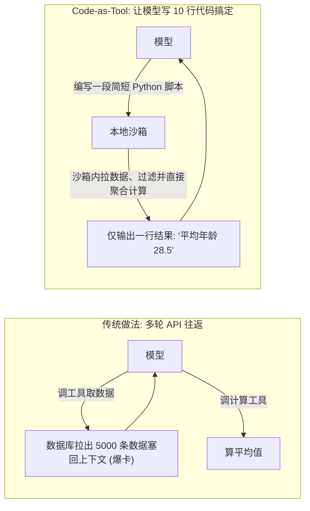

import { Quiz } from '@/components/Quiz'

# 4.3 工具爆炸破局：分层检索与 MCP-Zero 延迟挂载

> 刚做 Agent 时，手头就三四个工具：读文件、写文件、跑命令。这时候模型怎么调都很灵敏。但随着生态接入 AWS、Jira、GitHub、Slack 等一大堆 MCP 服务，工具列表一下子暴增到上百个。你会发现模型开始“变笨”了：经常选错工具、参数填串门，每一轮对话光是传那堆 JSON Schema 就要吃掉几万 Token。这一节我们聊聊如何按需加载工具，以及为什么高阶架构往往“用写代码替代几十个散装工具”。

---

## 1. 为什么工具塞多了，模型反而不会选了？

大模型也有“注意力负荷”。当一次性传给它的工具超过 30 个时，哪怕是 GPT-4o 或 Claude 3.5 Sonnet，选工具的准确率也会直线下降：



把全量工具一股脑摆在桌上，既贵又容易把模型搞糊涂。

---

## 2. 破局思路：把“找工具”本身做成一个元工具

解决工具过载的思路非常简单：**平时藏在抽屉里，要用的时候再翻出来。**

常驻给模型的只有 3 个核心工具：
1. `tool_search`：根据意图从工具库里搜索对应的工具；
2. `read_file` / `write_file`：基础读写；
3. `execute_code`：沙箱运行。

```mermaid
sequenceDiagram
    autonumber
    actor User as 用户
    participant Agent as 模型 (平时只常驻 tool_search)
    participant Reg as 工具库索引池 (后台藏着 200 个工具)
    participant Box as 执行沙箱

    User->>Agent: "帮我看一下 AWS S3 里昨天的备份文件"
    Note over Agent: 发现手头没有 S3 工具，先调 tool_search
    Agent->>Reg: tool_search(query: "AWS S3 storage")
    Reg-->>Agent: 搜出 2 个最相关的: s3_list_files, s3_download
    
    Note over Agent: 临时挂载这两个工具的 Schema
    Agent->>Box: 调用 s3_list_files(bucket: "my-backup")
    Box-->>Agent: 返回文件列表
    Agent-->>User: 呈现昨天的备份文件名
```

* **常驻层（极简）**：只有两三个基础工具，**保住了前缀静态缓存，首字响应极快**；
* **按需层（动态加载）**：上百个专业接口全在后台建立索引，搜到了才临时读进上下文，任务跑完当场卸载。

---

## 3. 终极收敛：代码即工具（Code as Tool）

在工具设计的演进中，Anthropic 和 Manus 的团队提过一个极具启发性的问题：
**“我们真的需要为每一个微小的操作，都单独写一个工具吗？”**

比如查询用户数据：
* 工具 1：`get_user_list()`
* 工具 2：`filter_users_by_city(city: string)`
* 工具 3：`calculate_avg_age(userIds: string[])`
* 工具 4：`sort_users_by_score(userIds: string[])`

为了各种排列组合去写几十个专用工具，不仅维护累死人，模型还得来回调好几轮。

**更高级的做法是：只给模型一个安全的运行沙箱（如 Python 容器），配上一套标准的 SDK。**



### 为什么这招碾压传统 API？
1. **大数据量免进上下文**：5000 条原始用户数据直接在沙箱内存里做 `filter` 和 `reduce`，根本不用流经大模型，不仅省钱，还绝不卡顿；
2. **零延迟组合复杂逻辑**：不用先调 A、看一眼、再调 B。写一段循环脚本直接跑完，省下大几十秒的网络与思考往返；
3. **工具数量收敛为 1**：一个强大的 `run_script`，直接顶替了成百上千个定制小工具。

---

## 4. 随堂检验

<Quiz
  question="当企业级 Agent 需要对接的外部工具多达几百个时，如何兼顾工具丰富度与调用准确率？"
  options={[
    {
      text: "A. 将全量上百个工具的完整 JSON Schema 每一轮都全量拼接在系统请求中",
      isCorrect: false,
      explanation: "全量拼接会导致上下文严重浪费，巨量的相似工具会极大稀释模型注意力导致频繁调错工具。"
    },
    {
      text: "B. 仅常驻基础元工具，通过 tool_search 按需检索并临时激活具体业务工具",
      isCorrect: true,
      explanation: "分层检索与延迟挂载（Lazy Loading）：常驻前缀精简稳定，需要时按需临时引入，保证了注意力聚焦和缓存命中。"
    },
    {
      text: "C. 彻底关闭所有外部工具，要求模型凭世界知识背出所有接口的返回值",
      isCorrect: false,
      explanation: "外部企业数据具有私密性和动态性，模型无法凭空预知未知的线上数据。"
    },
    {
      text: "D. 每次模型提问前随机从工具库里抽取 3 个工具塞进去碰运气",
      isCorrect: false,
      explanation: "随机抽取无法保障任务所需工具被命中，任务成功率几乎为零。"
    }
  ]}
/>

---

## 延伸阅读

* 《AI Agents in Depth: Design Principles and Engineering Practice》（李博杰，2026）第 4.3 节。
* [Agent 核心架构速查手册](/reference/agent-core-architecture)
* 下一节：[4.4 侧车沙箱与工具安全执行体系](/ch04-tools/04-sidecar-sandbox-and-safety)
