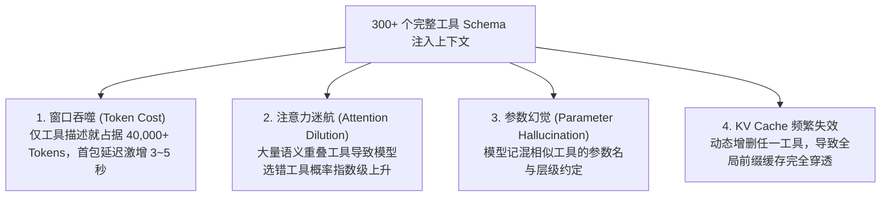
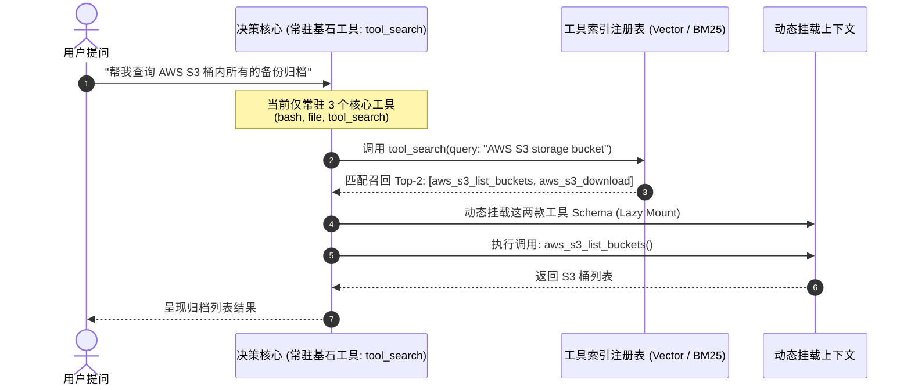
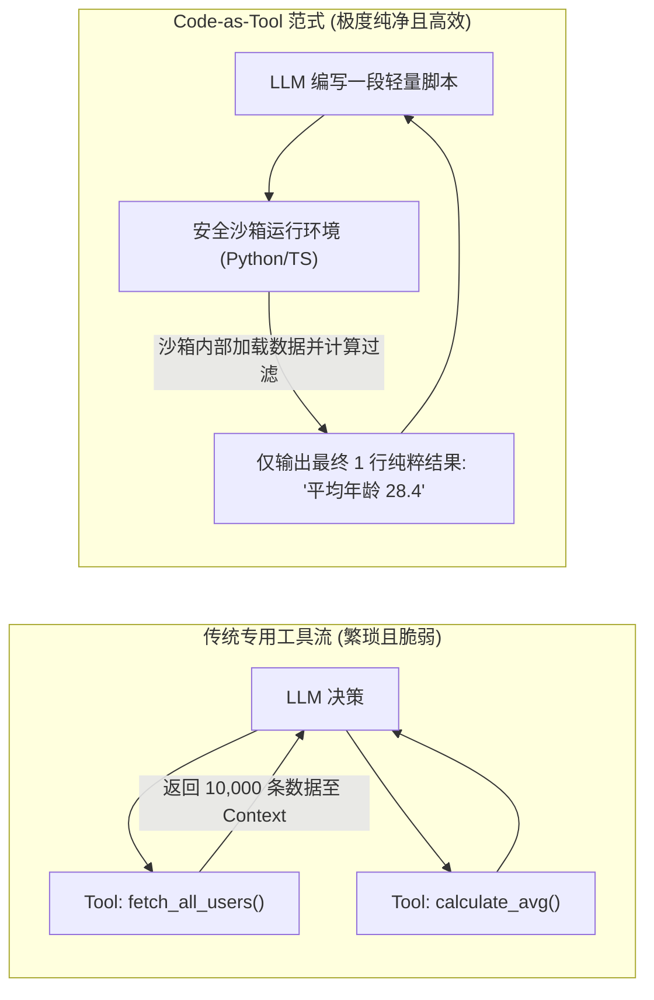

import { Quiz } from '@/components/Quiz'

# 4.3 工具爆炸破局：分层检索与 MCP-Zero 延迟挂载

> **本节要点**：当企业接入上百个 MCP 工具时，如何应对“工具定义撑爆上下文”、“决策注意力被稀释”的灾难；掌握两阶段 **分层工具发现（Hierarchical Tool Discovery）** 与 **按需延迟挂载（Lazy Tool Loading）**；领悟更高维度的 **MCP-Zero** 哲学与“代码即终极工具（Code as Tool）”架构范式。

---

## 1. 规模化困境：工具爆炸（Tool Overload）的四重灾难

在 Agent 开发初期，开发者往往只有 3~5 个工具（如 `read_file`, `write_file`, `bash`）。但随着生态接入 GitHub、Jira、Salesforce、AWS、K8s 等几十个企业级 MCP Server，工具总数迅速激增至数百个。

如果无脑地将所有 300 个工具的完整 JSON Schema 在每一轮会话中都喂给 LLM，系统将遭受毁灭性打击：



> 📌 **实验经验**：当一次性注入给模型的工具数量超过 **30 个** 时，哪怕是顶尖的 GPT-4o 或 Claude 3.5 Sonnet，其 Tool Selection 准确率都会出现明显滑坡；超过 **100 个** 时，模型常常甚至忘记用户最开始的提问。

---

## 2. 破局之道：两阶段分层工具发现 (Hierarchical Tool Discovery)

解决工具爆炸的核心思想极其朴素：**将“发现工具”本身变成一个元工具（Meta-Tool）！**

系统不再在初始化时加载所有工具，而是将绝大多数专业工具置于离线索引库中，按需“延迟检索并激活”。



### 生产级两阶段架构分工：
1. **常驻层（Resident Tier / Always-on）**：
   * 仅保持 3~5 个最基础的通用元工具，如 `tool_search`（检索工具库）、`manage_task`（状态管理）、`execute_code`（沙箱执行）；
   * 保证极高的 KV Cache 命中率与超低的首包冷启动延迟。
2. **离线发现层（Discovery Tier / On-Demand）**：
   * 将数百个 MCP 工具的名称、简短语义摘要以及所属分类建立混合检索索引（BM25 + 向量索引）；
   * Agent 识别到需要特定领域能力时，主动检索工具、在单次任务上下文中临时激活（Ephemeral Activation），任务结束立即卸载。

---

## 3. 终极收敛：MCP-Zero 与“代码即终极工具” (Code as Tool)

在工具工程演进的终点，学术界与工业界顶级团队（如 Anthropic、Manus）提出了发人深省的问题：

> **“我们真的需要为每一个微小的操作都定义一个专用 Tool 吗？”**

例如针对用户数据：
* 工具 A：`get_user_list()`
* 工具 B：`filter_users_by_city(city: string)`
* 工具 C：`calculate_average_age(userIds: string[])`
* 工具 D：`sort_users_by_score(userIds: string[])`

为每个排列组合编写并维护 API 是极其低效的，且会持续增加 Tool 数量。

**MCP-Zero / Code-as-Tool 范式** 将思维彻底逆转：**向 Agent 暴露一个通用的安全代码执行沙箱（如 Python 或 TypeScript 容器），以及一个通用的数据客户端！**



### Code-as-Tool 的碾压级优势：
1. **海量数据免进 Context**：如果数据源返回了 10,000 条记录，传统方式直接挤爆 LLM 窗口；而代码在沙箱内完成 `filter()` 和 `reduce()`，只有最终统计值被打印出来回传；
2. **逻辑组合零延迟**：循环、条件判断、多表关联完全由底层 V8 / Python 解释器在微秒级完成，省去了大模型几轮来回“思考-调用-观察”的网络往返；
3. **工具数量收敛到 1**：一个强大的 `execute_code` 工具，就相当于无限多个专有工具的超集。

---

## 4. 全栈实战：构建动态工具路由器 (Dynamic Tool Router)

下面我们用 TypeScript 实现一个支持按需搜索与延迟加载的动态工具调度器：

```typescript
// dynamic-tool-router.ts
import { OpenAI } from 'openai';

export interface ToolMetadata {
  id: string;
  name: string;
  description: string;
  category: string;
  schema: Record<string, any>;
}

export class DynamicToolRouter {
  // 离线工具知识库（存放成百上千个工具）
  private toolRegistry: Map<string, ToolMetadata> = new Map();
  // 当前会话中已激活挂载的活跃工具
  private activeTools: Map<string, ToolMetadata> = new Map();

  constructor() {
    // 默认仅注入元工具：tool_search
    this.registerMetaTool();
  }

  private registerMetaTool() {
    const searchToolMeta: ToolMetadata = {
      id: 'tool_search',
      name: 'tool_search',
      description: '当需要执行当前可用工具列表中未包含的操作时，搜索全量工具库并按需激活',
      category: 'meta',
      schema: {
        type: 'object',
        properties: {
          query: { type: 'string', description: '操作意图描述，如 "PostgreSQL 数据表备份"' },
        },
        required: ['query'],
      },
    };
    this.activeTools.set(searchToolMeta.name, searchToolMeta);
  }

  /**
   * 模拟语义搜索工具库并动态挂载激活
   */
  async searchAndMountTools(query: string): Promise<string> {
    console.log(`[Tool Router] 正在检索工具: "${query}"...`);
    
    // 实际生产中可使用向量检索或 BM25 倒排索引
    const matches: ToolMetadata[] = [];
    for (const tool of this.toolRegistry.values()) {
      if (tool.name.includes(query) || tool.description.includes(query)) {
        matches.push(tool);
      }
    }

    if (matches.length === 0) {
      return `未找到匹配 "${query}" 的专业工具，请尝试使用常规代码编写完成。`;
    }

    // 动态挂载至活跃会话上下文
    for (const matchedTool of matches) {
      this.activeTools.set(matchedTool.name, matchedTool);
    }

    return `成功激活 ${matches.length} 个新工具: [${matches.map((m) => m.name).join(', ')}]。你现在可以直接在后续轮次中调用它们。`;
  }

  /**
   * 获取传递给大模型当前轮次的工具清单
   */
  getActiveToolsForLLM() {
    return Array.from(this.activeTools.values()).map((t) => ({
      type: 'function' as const,
      function: {
        name: t.name,
        description: t.description,
        parameters: t.schema,
      },
    }));
  }
}
```

---

## 5. 本节练习与反思

<Quiz
  question="当一个系统集成了上百个 MCP Server 导致工具数量急剧膨胀时，以下哪种方案是解决'工具定义吞噬上下文与决策注意力稀释'的最优架构解法？"
  options={[
    "采用两阶段分层工具发现机制，仅常驻元搜索工具，其余专业工具通过语义索引按需检索并延迟挂载到上下文中",
    "将 500 个工具的所有字段描述用压缩软件打成 zip 包，要求大语言模型在内存中自行解压并阅读二进制文件",
    "在系统提示词中警告大模型必须在一秒内记住所有工具的参数定义，如果选错工具则扣减 token 余额",
    "取消所有工具的输入参数校验，让所有工具都只接受一个无类型限制的全局动态 any 对象"
  ]}
  correctIndex={0}
  explanation="分层工具发现（Hierarchical Tool Discovery）将海量工具作为外部知识库存储，仅向模型暴露按需检索工具的元能力。需要用什么能力就动态激活什么能力，既保护了初始上下文窗口和 KV Cache，又避免了海量相似工具对模型注意力的干扰。"
/>

<Quiz
  question="在 MCP-Zero 与'代码即终极工具（Code as Tool）'的架构思想中，相比为每一种数据统计需求单独编写专有 API 工具，直接提供沙箱代码执行环境的最大优势是什么？"
  options={[
    "数据可以在沙箱内存中直接流式过滤与汇总，无需将数万条中间冗余记录搬入 LLM 上下文窗口，且微秒级完成复杂逻辑组合",
    "大模型编写的代码不需要在任何实际操作系统中运行，仅靠自回归概率预测就能瞬间得出精准物理世界数值",
    "沙箱代码执行环境能够永久豁免所有网络防火墙与底层 Linux 内核权限检查",
    "利用代码执行可以彻底绕过所有大模型服务商的 API 调用计费与速率限制策略"
  ]}
  correctIndex={0}
  explanation="Code-as-Tool 将数据密集型计算（过滤、分组、求和、排序）留在沙箱环境内部完成，上下文只接收最终干净小巧的统计结果。同时避免了定义成百上千个微型 API 的维护负担，是构建深度自主 Agent 的终极工程范式。"
/>
