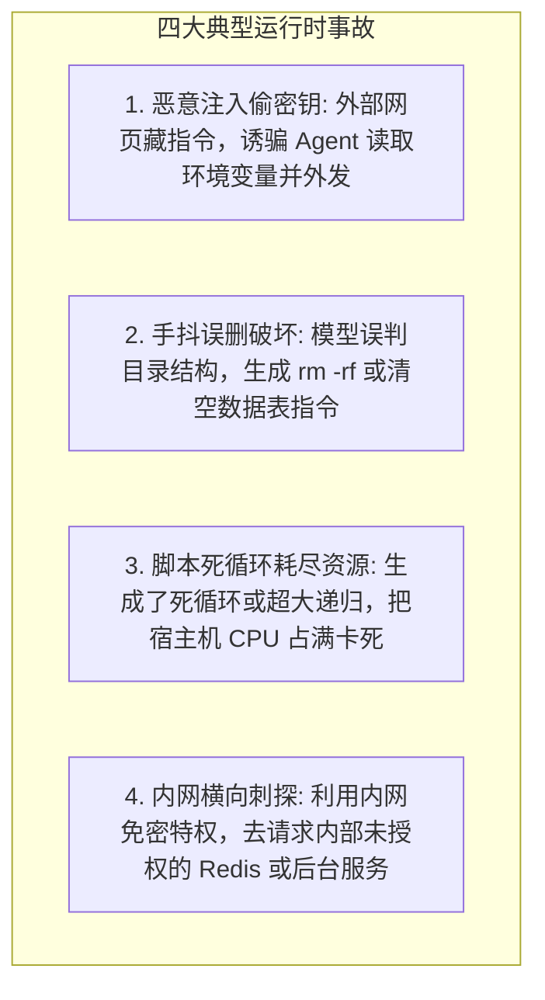
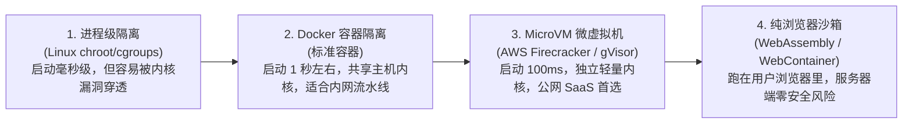
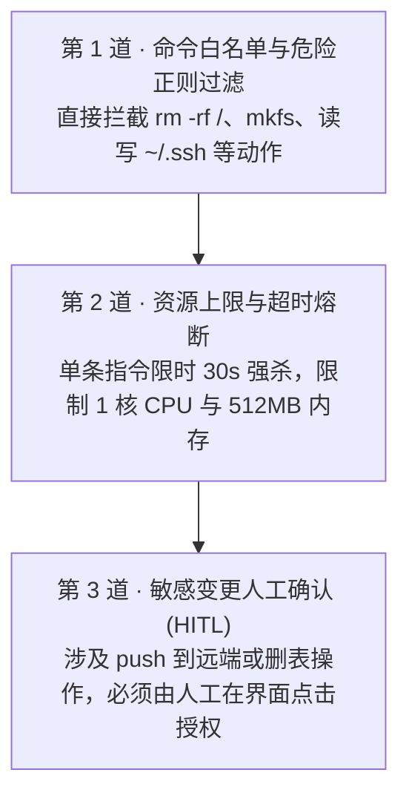

import { Quiz } from '@/components/Quiz'

# 4.4 生产级执行环境：Sidecar 容器沙箱与权限安全缰绳

> 在本地写 Agent 时，很多人图省事直接调 `child_process.exec(cmd)`。在个人电脑上改几个文件看着挺顺手，但如果推上线面对真实用户，这就相当于把整台服务器的 Root 权限挂在公网上。一旦外部输入里夹带了恶意 Prompt，诱骗 Agent 读取 `~/.ssh/id_rsa` 并外发，或者模型自己理解抽风把数据库当测试目录删了，损失不可挽回。这一节我们聊聊生产环境如何做容器沙箱与防爆拦截。

---

## 1. 为什么绝不能让模型在真实宿主机上“裸奔”？

大模型输出的命令本质上是概率推导出来的字符串，哪怕你加了一百句“请确保安全”，依然可能因为以下原因失控：



**工程硬规则：任何执行代码或 Shell 的操作，必须丢进与宿主机物理隔离的沙箱环境。**

---

## 2. 四种隔离技术选型对比

根据启动耗时和安全等级，工程上一般有四个梯度：



| 方案 | 启动耗时 | 隔离强度 | 典型适用场景 |
| :--- | :--- | :--- | :--- |
| **进程限制 (chroot)** | 1 ~ 5 ms | 极弱（内核提权即可逃逸） | 仅用于受信任开发者的本地小脚本 |
| **Docker 容器** | 1 ~ 2 秒 | 中等（容器逃逸仍有风险） | 公司内部受信的 CI/CD 自动构建流程 |
| **微虚拟机 (Firecracker)** | 100 ~ 200 ms | **极高（硬件级虚拟化，独立微内核）** | **面向公网未知用户的代码执行平台（如 Fly.io）** |
| **浏览器沙箱 (WebContainer)** | 毫秒级 | **服务端零风险（全在用户浏览器里跑）** | 在线代码演示器、前端互动教学环境 |

---

## 3. Sidecar 伴生一次性沙箱模式

在生产集群里，最稳妥的实践是**“用完即毁的一次性沙箱”**：

```mermaid
sequenceDiagram
    autonumber
    actor User as 开发者
    participant Svr as 调度后台
    participant Box as 临时沙箱容器 (Sidecar)
    participant Git as 代码仓库

    User->>Svr: "帮我重构用户模块并跑通单测"
    Svr->>Box: 动态启动一个只包含 Node.js 运行时的临时容器
    Box->>Git: 克隆专属测试分支代码
    
    loop 自主修改与调试
        Svr->>Box: 下发执行 npm test
        Box-->>Svr: 捕获返回日志与退出码
    end
    
    Svr->>Git: 测试全绿，提交 Pull Request
    Svr->>Box: 任务结束，彻底强制销毁并清空容器磁盘
```

* **短命性（Ephemeral）**：容器只在当前这一单任务存活。任务一完立刻销毁，任何木马或残留缓存都无法持久化；
* **单向外网限制**：沙箱只开特定域名的下载权限（如 npm 或 pip 镜像），完全封死任意公网 IP 连通，即使被注入也无法向外回传数据；
* **根目录只读**：除了工作区和 `/tmp`，系统其他核心系统目录全部以 Read-only 方式挂载。

---

## 4. 三道代码级安全防护网

哪怕外面套了容器，在把命令发给沙箱前，宿主程序依然要做好前置拦截：



### 拦截器核心逻辑示范

```typescript
export class CommandGuard {
  // 高危指令黑名单正则
  private static readonly BLOCKED_PATTERNS = [
    /\brm\s+(-[a-zA-Z]*r[a-zA-Z]*f?|-rf|-fr)\s+[\/\~]/i, // rm -rf / 或 ~
    /\b(mkfs|dd\s+if=)\b/i,                              // 裸写磁盘
    /\bchmod\s+(-R\s+)?777\s+\//i,                       // 根目录全开权限
    /\bcurl\b.*\|\s*\b(ba)?sh\b/i,                       // 管道直接执行公网脚本
  ];

  // 严禁碰的敏感系统路径
  private static readonly SENSITIVE_PATHS = [
    '/etc', '/root', '~/.ssh', '~/.aws', '.env'
  ];

  static check(command: string): { pass: boolean; reason?: string } {
    for (const pattern of this.BLOCKED_PATTERNS) {
      if (pattern.test(command)) {
        return { pass: false, reason: `命中危险破坏性指令: ${pattern}，已被安全策略阻断！` };
      }
    }
    return { pass: true };
  }
}
```

---

## 5. 随堂检验

<Quiz
  question="在为公网多租户用户提供在线 Coding Agent 代码执行服务时，哪种隔离架构在兼顾极速启动的同时安全性最高？"
  options={[
    {
      text: "A. 直接在业务主服务器主机上通过 Node.js 的 child_process.exec 裸奔运行",
      isCorrect: false,
      explanation: "宿主机裸奔极易遭到提权逃逸、窃取服务器环境变量与源码，属于严重安全事故。"
    },
    {
      text: "B. 采用轻量微虚拟机（如 Firecracker）构建硬件虚拟化的一次性独立沙箱",
      isCorrect: true,
      explanation: "Firecracker 微虚拟机具备独立内核与硬件级虚拟化，启动仅需百毫秒级，是公网未受信代码执行的黄金标准。"
    },
    {
      text: "C. 仅在系统提示词里写一句‘请你遵守法律不要破坏服务器’并不做任何代码隔离",
      isCorrect: false,
      explanation: "提示词属于无约束力的软规劝，面对恶意攻击注入时完全形同虚设。"
    },
    {
      text: "D. 严禁运行任何代码，所有编译报错全部要求用户手动复制到终端跑完再贴回",
      isCorrect: false,
      explanation: "完全放弃代码执行等于废除了 Coding Agent 的核心自愈能力，退化为普通聊天机器人。"
    }
  ]}
/>

---

## 延伸阅读

* 《AI Agents in Depth: Design Principles and Engineering Practice》（李博杰，2026）第 4.4 节。
* [Agent 核心架构速查手册](/reference/agent-core-architecture)
* 下一章：[第 5 章 Coding Agent 与自动化代码治理](/ch05-coding/01-coding-agent-tools)
