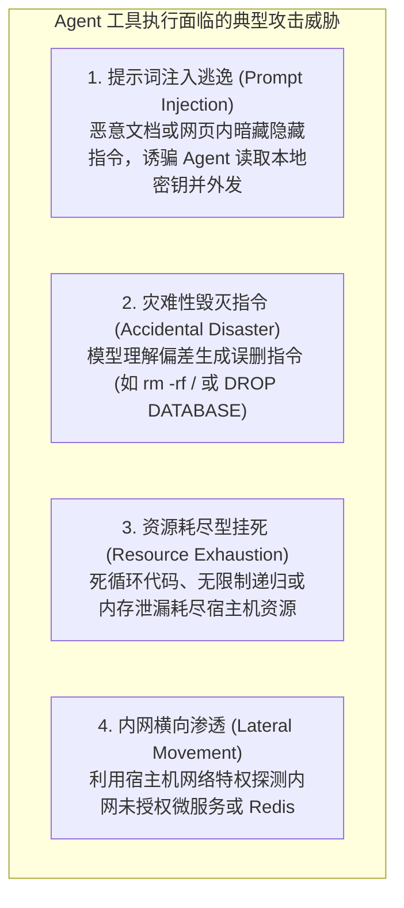
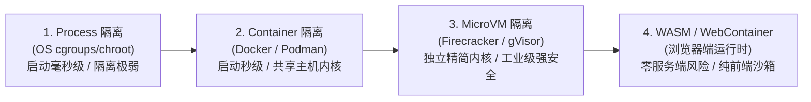
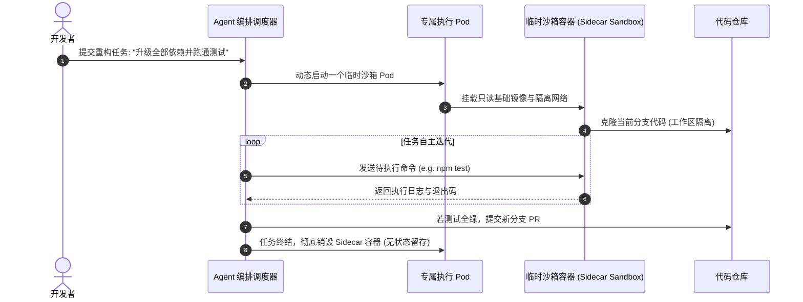
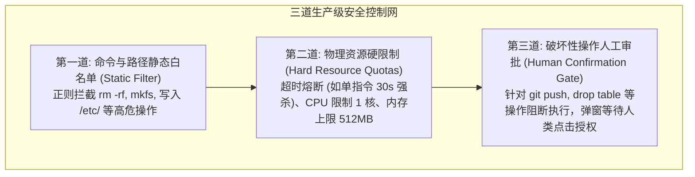

import { Quiz } from '@/components/Quiz'

# 4.4 生产级执行环境：Sidecar 容器沙箱与权限安全缰绳

> **本节要点**：赋予 Agent 代码执行与工具调用能力，等于将系统的“Root 权限钥匙”交给了概率模型。透视 Agent 运行时的安全威胁模型；建立从进程、容器到 MicroVM 的 **多层纵深防御体系（Defense-in-depth）**；掌握 **Sidecar 伴生沙箱容器架构**；构建命令白名单、资源配额硬限制与人工确认熔断的生产级安全缰绳。

---

## 1. 裸奔的代价：Agent 执行环境的严峻威胁模型

如果你在自己的工作电脑或者生产服务器上，直接赋予 Agent 原生 Shell 执行权限（例如无限制运行 `child_process.exec(cmd)`），你的系统实际上暴露在极度致命的风险之下：



> ⚠️ **生产铁律**：**严禁在没有沙箱隔离的宿主环境中直接运行 LLM 生成的代码或未受信 Shell 指令！**

---

## 2. 隔离演进：从轻量进程到 MicroVM 微虚拟机

现代工程实践根据安全级别与启动开销，演化出了四级防御纵深梯队：



| 隔离层级 | 典型底层技术 | 冷启动耗时 | 安全隔离强度 | 最佳适用场景 |
| :--- | :--- | :--- | :--- | :--- |
| **进程限制** | Linux cgroups, namespaces | 1 ~ 5 ms | 极低（易通过内核漏洞逃逸） | 纯只读本地分析小脚本 |
| **容器沙箱** | Docker, Podman, RunC | 500ms ~ 2s | 中等（容器逃逸仍有风险） | 内部受信任开发流水线、CI/CD |
| **微虚拟机** | AWS Firecracker, Google gVisor | 100 ~ 200 ms | **极高（独立微内核，完全硬件虚拟化）** | **企业级面向公网未受信代码运行平台（如 AWS Lambda, Fly.io）** |
| **浏览器沙箱** | WebAssembly, WebContainer | 毫秒级 | **零宿主机安全暴露（风险被局限在用户浏览器）** | 前端交互式 Agent 学习工坊、在线代码预览器 |

---

## 3. 架构模式：Sidecar 伴生一次性沙箱

在 Kubernetes 与微服务架构中，处理自主 Agent 任务的标准模式是 **Sidecar 伴生模式（Disposable Sidecar Sandbox）**：



### Sidecar 容器的关键特征
*   **短生命周期（Ephemeral）**：容器与单次任务生命周期强绑定，任务完成立即全盘物理擦除，防止后门与暗藏木马驻留；
*   **网络隔离（Egress Control）**：沙箱通常切断外网访问，或仅配置严格的白名单出口（如仅允许拉取 npm / pip 源，禁止连接公网任意 IP）；
*   **只读根文件系统（Read-only RootFS）**：除了 `/tmp` 和工作区目录外，其余系统目录均强制为只读挂载。

---

## 4. 三道生产级安全缰绳 (Safety Guardrails)

即使拥有沙箱，系统仍需在软件层面筑牢“安全缰绳”：



### 4.1 静态指令拦截器实现范例 (TypeScript)

```typescript
export class SecurityGuardrail {
  // 禁止直接执行的黑名单指令集
  private static readonly BLOCKED_COMMANDS = [
    /\brm\s+(-[a-zA-Z]*r[a-zA-Z]*f?|-rf|-fr)\s+[\/\~]/i, // rm -rf / 或 ~
    /\b(mkfs|dd\s+if=)\b/i,                              // 磁盘格式化与裸写
    /\b(:(){:|:&};:)\b/,                                // Fork 炸弹
    /\bchmod\s+(-R\s+)?777\s+\//i,                       // 根目录全权限开放
    /\bcurl\b.*\|\s*\b(ba)?sh\b/i,                       // 管道直接执行远程脚本
  ];

  // 禁止写入的系统敏感路径
  private static readonly RESTRICTED_PATHS = [
    '/etc', '/boot', '/usr', '/root', '~/.ssh', '~/.aws'
  ];

  static validateCommand(command: string): { allowed: boolean; reason?: string } {
    for (const pattern of this.BLOCKED_COMMANDS) {
      if (pattern.test(command)) {
        return {
          allowed: false,
          reason: `指令包含高危破坏性操作 [命中规则: ${pattern.toString()}]，已被安全缰绳拦截！`,
        };
      }
    }
    return { allowed: true };
  }

  static validatePathAccess(targetPath: string): { allowed: boolean; reason?: string } {
    for (const restricted of this.RESTRICTED_PATHS) {
      if (targetPath.startsWith(restricted)) {
        return {
          allowed: false,
          reason: `严禁读写系统关键保密路径: ${restricted}`,
        };
      }
    }
    return { allowed: true };
  }
}
```

---

## 5. 第 4 章全景回顾：打造坚不可摧的 Agent 手脚

回顾本章，我们彻底攻克了 Agent 与物理世界交互的工程护城河：
1. **4.1 工具分类学与 ACI**：确立了三级风险模型（Read-only / Modifying / World-Affecting），建立了以“极简入参”、“错误即自愈反馈”为核心的 ACI 界面设计五法则；
2. **4.2 MCP 协议架构**：深入剖析了由 Anthropic 推动的行业级标准协议，掌握了 Host-Client-Server 三角拓扑以及 Tools、Resources、Prompts 三大核心原语；
3. **4.3 分层检索与 MCP-Zero**：用两阶段元工具发现破解了工具爆炸的上下文灾难，领略了“代码即终极工具（Code-as-Tool）”将数据密集运算留在沙箱内的卓越架构优势；
4. **4.4 沙箱与安全缰绳**：从 Docker 到 MicroVM 搭建防御纵深，采用 Sidecar 一次性容器与三道安全缰绳，守住了系统稳定与数据保密的绝对底线。

---

## 6. 本节练习与反思

<Quiz
  question="在生产环境中部署允许自主执行代码的 AI Agent 时，关于安全架构设计，以下哪项叙述最为合理？"
  options={[
    "采用短生命周期的 Sidecar 容器或 MicroVM 沙箱进行隔离，配置白名单网络出口与超时熔断，且对外部破坏性操作引入人工确认门禁",
    "直接在拥有生产数据库管理员权限的宿主物理机上运行原生 Shell，因为大模型经过了对齐训练绝对不会出错",
    "只需要在 System Prompt 中写入'请你做一个遵守法律的好 AI'，即可彻底放弃所有的底层操作系统权限限制",
    "将所有的磁盘文件修改权限设置为 777，以防止 Agent 在执行编译任务时遇到权限拒绝异常"
  ]}
  correctIndex={0}
  explanation="提示词层面的道德约束在代码执行面前脆弱不堪，任何未知的提示词注入都能突破软性限制。真正的生产安全必须建立在底层物理与操作系统层级的硬隔离上（沙箱、MicroVM、无外网暴露、静态过滤、硬超时熔断与人工把关）。"
/>

<Quiz
  question="为什么在微服务架构中，面向复杂 Agent 任务强烈推荐使用'一次性（Disposable）Sidecar 沙箱'，而不是所有任务共享同一个持久化容器？"
  options={[
    "一次性沙箱在单次任务完成后立即全盘销毁，能够彻底根绝恶意木马、残留临时文件和被污染状态对后续任务造成横向感染",
    "因为 Linux 操作系统规定单个容器在开机运行满 5 分钟之后就必须被强制关机",
    "因为一次性沙箱不需要消耗任何物理内存和 CPU 核心，可以在零服务器成本下无限并发",
    "因为持久化容器只允许运行 Python 语言编写的代码，不支持执行 Shell 或 Node.js 脚本"
  ]}
  correctIndex={0}
  explanation="状态隔离是安全运维的基石。共享持久化容器会导致会话间交叉污染：前一个任务遗留的缓存、暗藏的恶意脚本或损坏的环境配置会破坏后续任务。任务即销毁的一次性沙箱保证了每一次 Agent 执行都在绝对干净的黄金镜像基线中启动。"
/>
