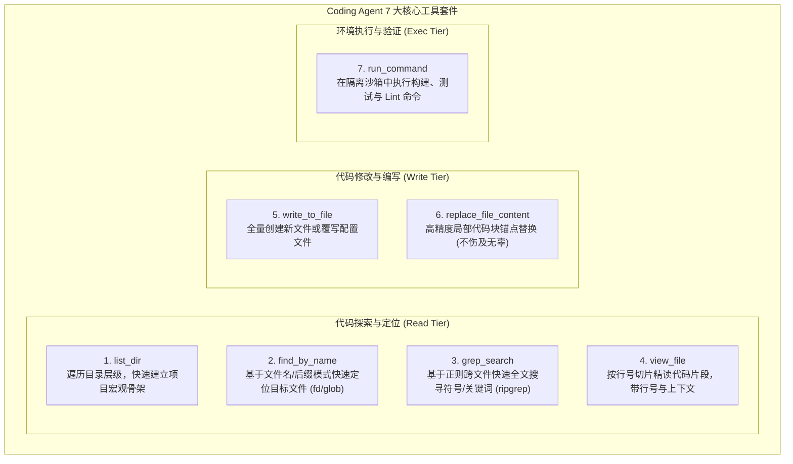
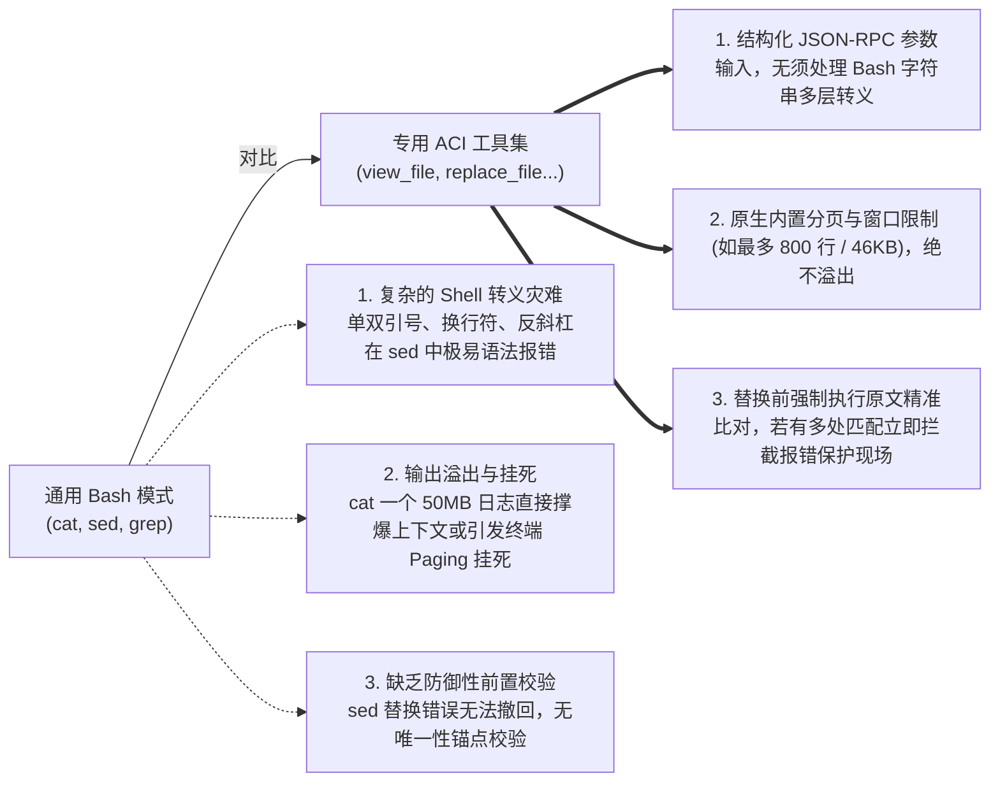

import { Quiz } from '@/components/Quiz'

# 5.1 编程智能体 7 大核心工具链设计

> **本节要点**：编程智能体（Coding Agent）是目前工程落地最成熟、商业价值最高的 Agent 领域。深度剖析支撑顶级编程智能体（如 GitHub Copilot Workspace, Devin, Cursor, Antigravity）运转的 **7 大核心基石工具集**；理解为什么专用工具比“无脑交给 Shell 执行 Bash”具备更高的成功率与安全性。

---

## 1. 编程智能体的工具中枢：7 大基石原子工具

在代码研发场景下，智能体面对的是由数千个代码文件、复杂的目录拓扑和严谨的抽象语法树（AST）构成的虚拟工程世界。
经过无数工业界团队（Aider、SWE-bench 评测体系、OpenClaw）的实践检验，一个顶尖的 Coding Agent 只需要 **7 个设计精良的原子工具**，即可覆盖 99% 的端到端研发需求：



---

## 2. 为什么专用工具远胜于“一个通用 Bash 搞定一切”？

初入 Agent 开发的工程师常常会问：
> *“为什么还要单独提供 `view_file`、`grep_search`、`replace_file_content`？难道不可以直接给 Agent 一个 `bash` 命令，让它自己去跑 `cat`、`grep`、`sed` 吗？”*

在 SWE-bench 基准测试中，**“仅提供 Bash 终端”的 Agent 得分往往比“提供专用 ACI 工具”的 Agent 低 30% 以上**！核心根源有四点：



---

## 3. 7 大基石工具的 ACI 设计精粹

### 3.1 探索层：`view_file`（代码精读）
*   **设计原则**：**默认禁止一次性 Dump 整文件！**
*   **参数约定**：强制支持 `start_line` 与 `end_line`，每次只允许查看至多 800 行代码；
*   **输出格式**：每一行输出必须加上 `12: const app = express()` 这种行号前缀，便于模型在后续替换时准确定位锚点。

### 3.2 定位层：`grep_search`（全局代码符号搜索）
*   **底层支撑**：直接绑定底层高性能 C/Rust 引擎（如 `ripgrep`）；
*   **参数约定**：支持 `case_insensitive`、`path_filter`（如 `*.tsx`）；
*   **输出截断**：超过 50 个匹配结果时强制截断，并提示“找到 230 处匹配，已为您展示前 50 处，建议增加目录过滤条件”，防止日志冲垮 Context。

### 3.3 修改层：`replace_file_content`（局部精准替换）
*   **入参**：`target_file`, `target_content`, `replacement_content`；
*   **铁律**：`target_content` 必须与原文件中的字符逐字匹配（含缩进与换行），若出现 0 次或超过 1 次（不唯一），执行器拒绝修改并报错：“在第 24 行与第 89 行均检测到相同代码，请提供更大范围的上下文锚点以消除歧义”。

---

## 4. 全栈实战：构建只读代码探索工具集 (TypeScript)

```typescript
// coding-tools.ts
import * as fs from 'fs/promises';
import { exec } from 'child_process';
import { promisify } from 'util';

const execAsync = promisify(exec);

export class CodingAgentToolKit {
  /**
   * view_file: 安全分页读取带行号的代码
   */
  static async viewFile(filePath: string, startLine = 1, endLine = 100): Promise<string> {
    try {
      const content = await fs.readFile(filePath, 'utf-8');
      const lines = content.split('\n');
      const totalLines = lines.length;

      const safeStart = Math.max(1, startLine);
      const safeEnd = Math.min(totalLines, endLine);

      if (safeStart > safeEnd) {
        return `错误：起始行 ${safeStart} 大于结束行 ${safeEnd} (文件共 ${totalLines} 行)`;
      }

      const sliced = lines.slice(safeStart - 1, safeEnd);
      const formatted = sliced.map((line, idx) => `${safeStart + idx}: ${line}`).join('\n');

      return `[文件路径: ${filePath} | 共 ${totalLines} 行 | 当前展示 ${safeStart}~${safeEnd} 行]\n${formatted}`;
    } catch (err: any) {
      return `读取文件失败: ${err.message}`;
    }
  }

  /**
   * grep_search: 基于 ripgrep 快速搜寻符号
   */
  static async grepSearch(pattern: string, searchDir = '.', maxResults = 30): Promise<string> {
    try {
      // 安全调用 rg (ripgrep)
      const { stdout } = await execAsync(
        `rg --line-number --no-heading --max-count ${maxResults} "${pattern.replace(/"/g, '\\"')}" ${searchDir}`
      );
      if (!stdout.trim()) {
        return `未在目录 ${searchDir} 下找到匹配模式 "${pattern}" 的内容。`;
      }
      return stdout.trim();
    } catch (err: any) {
      return `搜索无结果或执行异常: ${err.message}`;
    }
  }
}
```

---

## 5. 本节练习与反思

<Quiz
  question="在为编程智能体（Coding Agent）设计文件查看工具 view_file 时，为什么通常强制要求按行号区间（start_line, end_line）切片分页返回，并对单次返回行数设置上限？"
  options={[
    "防止大文件（如数千行的代码或长配置文件）一次性输出撑爆模型的上下文窗口，同时降低首包延迟并保留行号锚点",
    "因为底层的 Node.js 文件系统在单次读取超过 100 行代码时会导致操作系统内核崩溃",
    "因为大语言模型在阅读没有行号前缀的代码时，会自动触发商业授权版权保护并拒绝回复",
    "为了强制 Agent 每次都只能通过纯随机猜行号的方式来逐步寻找目标函数"
  ]}
  correctIndex={0}
  explanation="大型项目中的单文件常常超过数千行。一次性全量 Dump 不仅会浪费几万 token 导致上下文迅速饱和，还会引发严重的首包延迟和注意力的分散。分页配合行号让 Agent 可以先粗查再精读。"
/>

<Quiz
  question="相比于在 Shell 中使用 sed 或 awk 命令行直接修改文件，为什么专门设计的 replace_file_content 工具（要求精确匹配原代码片段）能够大幅提升修改成功率？"
  options={[
    "专用工具避免了复杂的 Shell 引号与换行转义地狱，且能在替换前执行严格的原文唯一性比对，杜绝误伤与格式坍塌",
    "因为使用 sed 命令修改文件会导致整个操作系统的 Git 历史记录被物理删除",
    "因为专用工具在执行修改时会直接跳过所有单元测试和语法检查",
    "因为大语言模型生成的代码只能被 Node.js 识别，无法被 Linux 系统的 Bash 进程解析"
  ]}
  correctIndex={0}
  explanation="在 Shell 中用 sed 修改包含各种单双引号、正则特殊符号和换行的现代多行代码极易发生转义崩溃。replace_file_content 通过结构化数据传递，在修改前强制校验目标内容是否存在、是否唯一，极大降低了代码编辑的事故率。"
/>
