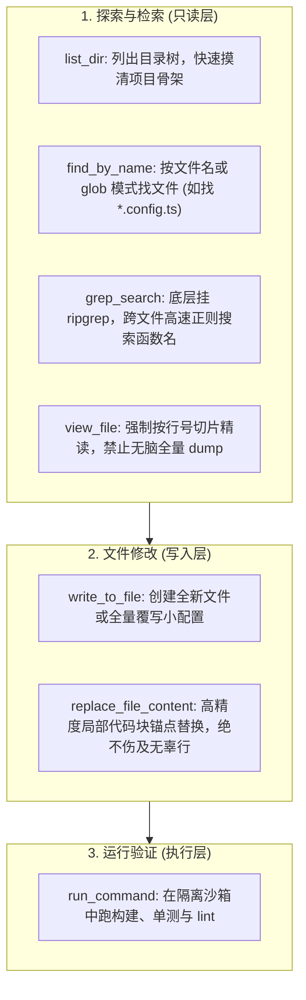
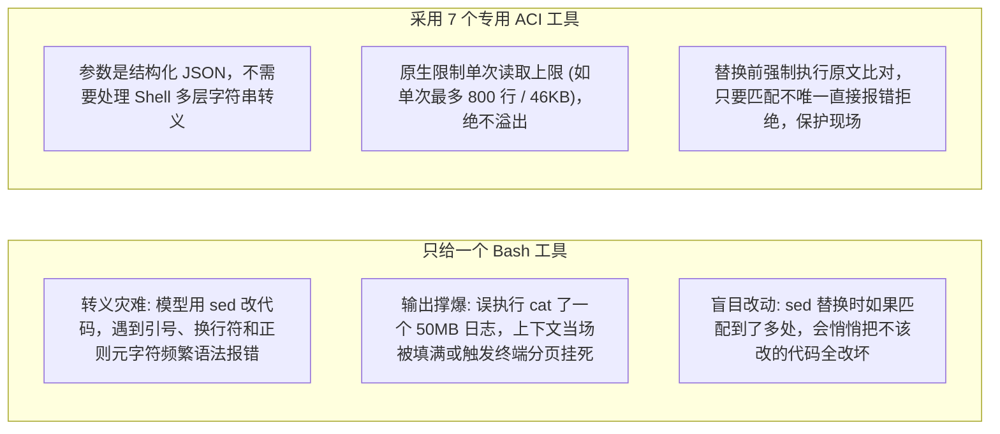

import { Quiz } from '@/components/Quiz'

# 5.1 编程智能体 7 大核心工具链设计

> 写代码类的 Agent（比如 Cursor、Claude Code、Aider），是目前各种 Agent 落地最成熟的方向。很多人第一反应是：“既然能给它开终端权限，直接给它一个 `bash` 工具，让它自己敲 `cat`、`grep`、`sed` 不就全齐了吗？”如果你真这么做，你的 Agent 很快就会在单双引号的复杂转义里频频崩溃，或者因为 `cat` 了一个大日志文件导致上下文瞬间被冲垮。各大编程 Agent 最终都收敛成了 **7 个专用的原子工具**。这一节我们聊聊这套工具的设计细节。

---

## 1. 撑起端到端研发的 7 个原子工具

在代码排障和重构场景中，面对成百上千个文件，成熟的编程 Agent 并不需要几十个五花八门的工具，真正靠得住的就这 7 个：

---

## 2. 为什么专用工具远比“一个 Bash 跑天下”稳定？

在 SWE-bench 评测中，**只给 Bash 终端的 Agent 得分，往往比配了专用工具的 Agent 低 30% 以上**。核心翻车原因有三个：

给 Agent 专门定制工具，不是限制它的自由，而是**替它挡掉底层的字符串转义泥潭**。

---

## 3. 关键工具的设计细节

### 1. `view_file`：严禁一次性倾倒整文件
* **必须传行号**：强制要求 `start_line` 和 `end_line`，单次上限一般设在 800 行以内；
* **必须附带行号前缀**：输出时在每行前标上行号（如 `42: const port = 3000`）。只有模型看清了具体行号，后面做精准替换才不会找错锚点。

### 2. `grep_search`：底层直连 ripgrep
* 不要自己用 Node.js 递归扫目录，直接调用底层 `rg`，毫秒级搜遍整个仓库；
* **结果强制截断**：匹配数超过 50 条时，立刻截断并提示：“已为您展示前 50 处，建议限定特定目录重搜”，避免控制台刷屏冲垮注意力。

### 3. `replace_file_content`：唯一性锚点校验
修改大文件时，最怕全量重写（耗费 Token 且极易漏写代码）。局部替换是唯一解，但必须遵守铁律：
* 传入待替换的原内容 `target_content` 与新内容 `replacement_content`；
* **如果原内容在目标文件中出现了 0 次，或者出现了 2 次以上，执行器直接报错回滚**：“在第 15 行和第 88 行都发现了相同代码，请携带更长的上下文以消除歧义”。

---

## 4. 随堂检验

<Quiz
  question="在为编程智能体设计文件查看工具 view_file 时，为什么通常强制要求按行号切片分页返回，并对单次返回行数设置上限？"
  options={[
    {
      text: "A. 防止大文件一次性输出直接撑爆模型的上下文窗口，同时降低延迟并保留清晰行号锚点",
      isCorrect: true,
      explanation: "大型代码单文件动辄数千行，全量 dump 会瞬间消耗几万 Token 导致上下文饱和，且容易引起首包超时。分页配合行号让 Agent 可以先查大纲、再按需精读。"
    },
    {
      text: "B. 因为底层 Node.js 文件系统只要单次读取超过 100 行就会导致系统内存崩溃",
      isCorrect: false,
      explanation: "Node.js 读几十兆文件毫秒级完成，限制完全是出于大模型上下文预算考量。"
    },
    {
      text: "C. 因为大模型只要看到没有行号的代码就会自动触发版权拦截拒绝作答",
      isCorrect: false,
      explanation: "大模型并不强制要求行号版权，行号是供模型后续准确定位修改锚点的工程辅助工具。"
    },
    {
      text: "D. 这样可以强迫 Agent 每次通过随机猜数字的方式寻找目标函数",
      isCorrect: false,
      explanation: "Agent 会先通过 grep 或文件大纲定位行号，而不是盲目随机猜测。"
    }
  ]}
/>

---

## 延伸阅读

* 《AI Agents in Depth: Design Principles and Engineering Practice》（李博杰，2026）第 5.1 节。
* [Agent 核心架构速查手册](/reference/agent-core-architecture)
* 下一节：[5.2 高精度文件编辑算法与容错重试](/ch05-coding/02-file-editing-algorithms)
