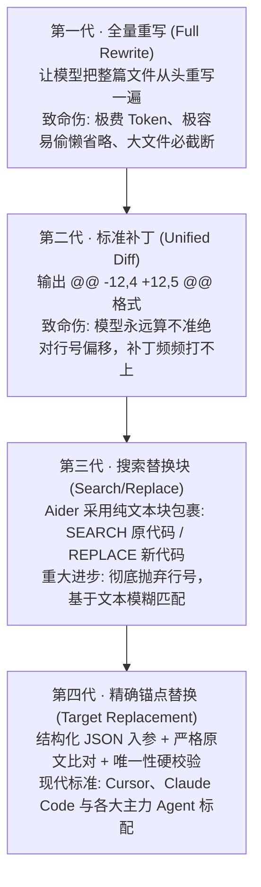
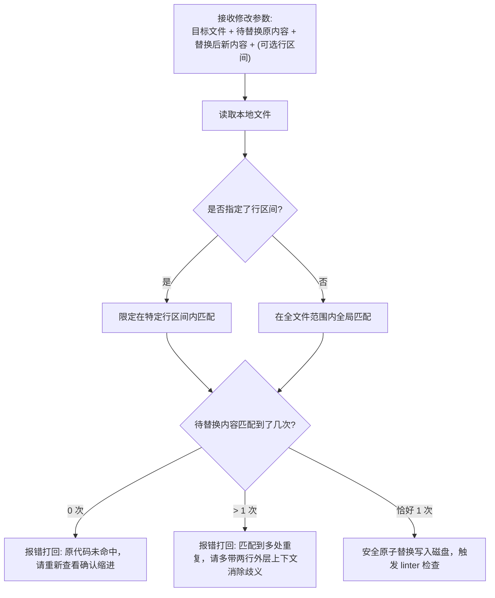

import { Quiz } from '@/components/Quiz'

# 5.2 文件编辑算法进化史：从 Diff 到精确锚点替换

> 让大模型写一段全新的独立函数很简单，但让它去修改一个 2000 行已有文件里的某两行，它经常能把人逼疯：要么它把整篇文件重新输出时，中间偷懒写了一句 `// ... 其余代码保持不变`，导致你大半个业务逻辑被删空；要么让它输出 Git diff 补丁，它推算出来的行号永远偏了两行，补丁直接报错打不上去。这一节我们看懂四代文件编辑算法的踩坑史，以及现代 Agent 为什么全面倒向了“精确锚点替换”。

---

## 1. 模型改代码时的两大致命软肋

大模型虽然懂语法，但在文本生成底层有两个先天的物理弱项：
1. **行号推算极弱**：模型是按 Token 概率顺流预测的，要在脑子里准确心算出“这几行在原文件的第 142 行到第 147 行”，对它来说计算负荷极高，算偏是常态。
2. **长输出容易“偷懒”或截断**：一个 3000 行的文件，哪怕只改 1 行，如果让它全量重写，输出到一半就容易撞上最大 Token 上限强行截断，或者自作聪明用省略号替代原有函数。

---

## 2. 四代代码编辑算法的演进之路



| 算法模式 | 典型代表 | 核心优势 | 致命缺陷与踩坑点 |
| :--- | :--- | :--- | :--- |
| **1. 全量重写** | 早期简单脚本 | 代码写起来最省事，不需要写本地对比逻辑 | 浪费 90% 以上 Token；极慢；大文件必截断丢代码 |
| **2. Unified Diff** | 标准 `git apply` | 输出极短，兼容系统自带的补丁命令 | **模型极难精确算准行号**，微小偏移直接导致整个补丁被拒 |
| **3. 搜索替换块** | Aider 等开源项目 | 摆脱了行号束缚，支持基于编辑距离的模糊匹配 | 缺乏结构化 JSON 校验，解析边界容易与源码中的符号冲突 |
| **4. 精确锚点替换** | Claude Code, Antigravity | **原子替换；强行校验全局唯一性；可选传入行范围缩小区间** | 必须严格提供准确的上下文，原代码字符不能打错 |

---

## 3. 现代标准：精确锚点替换（Target Replacement）

目前主流的专业编程 Agent（包括 Claude Code 与各大 IDE），都采用了第四代做法：



### 为什么强制要求“唯一性校验”？
假设文件中存在好几个 `return false;`。如果 Agent 发来：
* `targetContent: "return false;"`
* `replacementContent: "return true;"`

如果外层程序不加防备直接执行 `str.replace()`，它会把第一个碰到的 `return false` 给改掉，结果改错了地方，引发暗藏的致命 Bug。
**唯一性校验会直接拦截它**：“在第 21 行和第 85 行都发现了相同语句，无法确认你要改哪一个，请把外层的 `if (check())` 一起带上再提交”。

---

## 4. 最小实战代码：带唯一性保障的安全编辑器

```typescript
import * as fs from 'fs/promises';

interface EditRequest {
  filePath: string;
  targetContent: string;
  replacementContent: string;
}

export async function safeReplace(opts: EditRequest): Promise<{ ok: boolean; msg: string }> {
  const { filePath, targetContent, replacementContent } = opts;
  const rawText = await fs.readFile(filePath, 'utf-8');

  // 1. 检查目标代码出现的次数
  const matches = rawText.split(targetContent).length - 1;

  if (matches === 0) {
    return {
      ok: false,
      msg: '修改失败：原文件中未找到匹配的代码块，请确认换行符与空格缩进是否一致。'
    };
  }

  if (matches > 1) {
    return {
      ok: false,
      msg: `修改失败：在文件中检测到 ${matches} 处相同的代码块，无法定位目标。请多附带几行上下文以确保唯一性。`
    };
  }

  // 2. 恰好 1 处，执行原子替换
  const newText = rawText.replace(targetContent, replacementContent);
  await fs.writeFile(filePath, newText, 'utf-8');
  return { ok: true, msg: '替换成功！' };
}
```

---

## 5. 随堂检验

<Quiz
  question="为什么现代成熟的 Coding Agent 在修改大文件时普遍放弃了生成 Unified Diff 补丁，转而采用基于原代码块的精确锚点替换？"
  options={[
    {
      text: "A. 大模型无法准确推算绝对行号偏移，行号稍偏一行整个补丁就会被拒绝执行",
      isCorrect: true,
      explanation: "自回归大模型对行号计算存在天然缺陷，Unified Diff 的 @@ -xx,yy @@ 只要行号不准就会直接被 patch 引擎拒绝，而锚点替换依靠文本内容定位，完全不受行号微小偏差干扰。"
    },
    {
      text: "B. 因为现在的操作系统已经全盘删除了 patch 命令行工具",
      isCorrect: false,
      explanation: "各类 Linux 与类 Unix 系统均原生内置 patch 命令，原因在于模型输出质量而非系统缺失工具。"
    },
    {
      text: "C. 因为 Unified Diff 会导致整个操作系统的磁盘碎片化严重",
      isCorrect: false,
      explanation: "Diff 是普通的文本操作，与磁盘物理碎片化毫无关系。"
    },
    {
      text: "D. 锚点替换能够绕过所有测试直接把代码强行部署上线",
      isCorrect: false,
      explanation: "文件修改只是第一步，修改完毕后仍必须经过后续的测试与编译门禁检验。"
    }
  ]}
/>

---

## 延伸阅读

* 《AI Agents in Depth: Design Principles and Engineering Practice》（李博杰，2026）第 5.2 节。
* [Agent 核心架构速查手册](/reference/agent-core-architecture)
* 下一节：[5.3 TDD 闭环与防作弊验证体系](/ch05-coding/03-tdd-closed-loop-and-anti-cheating)
