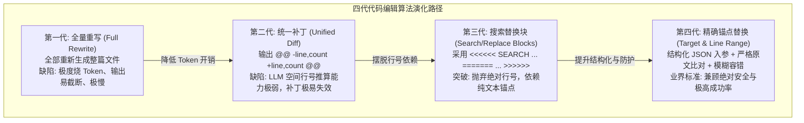
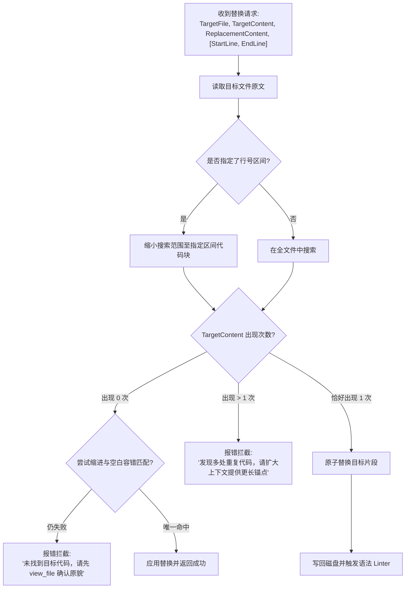

import { Quiz } from '@/components/Quiz'

# 5.2 文件编辑算法进化史：从 Diff 到精确锚点替换

> **本节要点**：让 LLM 可靠地修改代码是 Coding Agent 最难攻克的工程细节。系统梳理四代文件编辑算法的演进轨迹（全量重写、Unified Diff、Aider 搜索替换块、精确字符串锚点替换）；深度分析大模型在行号推算上的天然缺陷；使用 TypeScript 实现一套带缩进容错与唯一性锚点校验的现代代码编辑引擎。

---

## 1. 编程智能体的“手抖”难题：如何精准修改代码？

让大语言模型“读懂代码”相对容易，但让它“精准修改已有文件中的 3 行代码”却困难重重：
* 如果要求它把几千行的文件从头到尾重新生成一遍，它经常在中途因为达到 Max Tokens 限制而被强行截断，或者在第 800 行顺手“偷懒”漏掉了某段原有逻辑；
* 如果要求它输出标准的 Linux Patch，它几乎永远算不准 `@@ -124,12 +124,15 @@` 里的具体偏移行数；
* 如果改坏了原文件的格式或缩进，现代编译器（如 TypeScript、Python）将立即报错挂死。

因此，**文件编辑算法的设计，直接决定了 Coding Agent 的工程可用性**。

---

## 2. 四代文件编辑算法深度演进对比



### 四代编辑算法特性全景表

| 算法模式 | 代表项目 / 工具 | 典型输入输出结构 | 核心优势 | 致命缺陷 |
| :--- | :--- | :--- | :--- | :--- |
| **1. 全量重写** | 早期 ChatGPT、简单脚本 | 整个 2000 行新代码文件 | 实现最简单，无需任何本地差异比对逻辑 | 浪费 99% 的 Token；极易输出截断；丢失原有注释 |
| **2. Unified Diff** | Git patch, Cursor 早期 | `@@ -42,6 +42,7 @@` 标准补丁 | 表达精炼，直接兼容现有 `patch` 命令行工具 | **LLM 极难精确推算行号**；微小行偏移即导致补丁被拒绝 |
| **3. Search/Replace** | Aider, Mentat | `<<<<<<< SEARCH`<br/>原代码<br/>`=======`<br/>新代码<br/>`>>>>>>> REPLACE` | 摆脱了行号束缚；支持基于编辑距离的模糊匹配 | 缺乏结构化 JSON-RPC 约束；解析边界可能被代码内容干扰 |
| **4. 精确锚点替换** | Antigravity, Claude Computer Use | `{ target_content, replacement_content, start_line, end_line }` | **强类型入参；原子性替换；唯一性冲突硬拦截；支持精确行区间限制** | 要求模型必须提供完全一致的原始代码（含空格缩进） |

---

## 3. 工业级突破：精确锚点替换（Target Replacement）

目前以 Antigravity、Claude Code 以及顶尖 Coding Agent 为代表的工业系统，均全面采用了**第四代精确锚点替换算法**。



### 为什么必须强制“唯一性检查”？
假设文件中存在多个 `return null;`，如果 Agent 仅发来：
* `target_content: "return null;"`
* `replacement_content: "return response;"`

若不加校验盲目替换，可能会把错误位置的语句破坏掉。现代系统会立即打回：“文件中共有 4 处 `return null;`，无法确定目标位置，请附带包裹它的 `if (err) { ... }` 上下文再次提交”。

---

## 4. 全栈实战：构建带缩进容错的代码替换引擎

下面我们用 TypeScript 实现一个工业级第四代代码替换核心类：

```typescript
// file-editor.ts
import * as fs from 'fs/promises';

export interface ReplaceOptions {
  filePath: string;
  targetContent: string;
  replacementContent: string;
  startLine?: number;
  endLine?: number;
}

export class SafeFileEditor {
  /**
   * 执行精确锚点替换
   */
  static async replaceContent(opts: ReplaceOptions): Promise<{ success: boolean; message: string }> {
    const { filePath, targetContent, replacementContent, startLine, endLine } = opts;

    let fileText: string;
    try {
      fileText = await fs.readFile(filePath, 'utf-8');
    } catch (err: any) {
      return { success: false, message: `无法读取文件: ${err.message}` };
    }

    // 1. 如果指定了行号区间，只在区间内检索与替换
    if (startLine !== undefined && endLine !== undefined) {
      const lines = fileText.split('\n');
      const prefixLines = lines.slice(0, startLine - 1);
      const targetLines = lines.slice(startLine - 1, endLine);
      const suffixLines = lines.slice(endLine);

      const targetBlock = targetLines.join('\n');
      const count = targetBlock.split(targetContent).length - 1;

      if (count === 0) {
        return {
          success: false,
          message: `在第 ${startLine} 至 ${endLine} 行区间内未找到精确匹配的 targetContent。`,
        };
      }
      if (count > 1) {
        return {
          success: false,
          message: `在指定区间内找到 ${count} 处重复匹配，请扩大锚点消除歧义。`,
        };
      }

      const replacedBlock = targetBlock.replace(targetContent, replacementContent);
      const fullNewContent = [...prefixLines, replacedBlock, ...suffixLines].join('\n');
      await fs.writeFile(filePath, fullNewContent, 'utf-8');
      return { success: true, message: `成功在第 ${startLine}~${endLine} 行完成代码原子替换。` };
    }

    // 2. 全局模式：要求全局唯一
    const occurrences = fileText.split(targetContent).length - 1;
    if (occurrences === 0) {
      // 可选扩展：在这里触发模糊匹配（例如去除前后空行或忽略尾部空格）
      return {
        success: false,
        message: `在整篇文件中未找到匹配的 targetContent，请确认是否有未注意的换行或缩进差异。`,
      };
    }
    if (occurrences > 1) {
      return {
        success: false,
        message: `目标代码在文件中出现了 ${occurrences} 次。为防止误伤，请使用 startLine/endLine 限定区间，或在 targetContent 中包含更多外层代码。`,
      };
    }

    // 唯一匹配，安全替换
    const newContent = fileText.replace(targetContent, replacementContent);
    await fs.writeFile(filePath, newContent, 'utf-8');
    return { success: true, message: `成功完成文件唯一代码锚点替换。` };
  }
}
```

---

## 5. 本节练习与反思

<Quiz
  question="为什么要求大模型输出标准的 Git Unified Diff 补丁（如 @@ -45,8 +45,9 @@）在实际 Coding Agent 中失败率较高？"
  options={[
    "因为自回归大模型在准确计算行号偏移与修改行数（Hunk Line Counts）上表现极为脆弱，极易导致 patch 命令因行号不符而报错拒绝",
    "因为 Linux 操作系统内核对 Git Diff 格式具有 128 字节的最大长度硬限制",
    "因为 Unified Diff 格式只能用于对比 C 语言代码，无法支持 TypeScript 或 Python 语言",
    "因为目前所有大语言模型服务商均对 diff 关键字设置了强制的内容安全过滤审查"
  ]}
  correctIndex={0}
  explanation="行号计算是大语言模型的天然软肋。模型在生成补丁头部 @@ -a,b +c,d @@ 时，需要前瞻性地数出后面生成代码的精确行数，这违背了自回归逐 Token 生成的机理。微小的行数计算偏差就会让标准 patch 命令报错拒绝应用。"
/>

<Quiz
  question="在第四代精确锚点替换（TargetContent Replacement）算法中，当检测到目标代码在文件中匹配到多次（Count > 1）时，为什么必须拒绝执行并向 Agent 报错？"
  options={[
    "防止由于锚点过于简短模糊而误改了其他不相关的同名代码段，通过报错提示引导 Agent 携带更多上下文外层代码消除歧义",
    "因为文件系统每次只允许同时写入一个字节，出现多次匹配会导致硬盘发生物理坏道",
    "因为大语言模型要求每次修改的文件总行数必须是质数，多次替换会破坏该规则",
    "因为操作系统会自动将包含重复代码的文件判定为病毒并隔离到回收站"
  ]}
  correctIndex={0}
  explanation="代码中存在大量相似的惯用句（如 return true; 或 if (err) throw err;）。如果未对唯一性进行拦截校验，系统就会误改其他位置的代码，导致极为隐蔽的恶性 Bug。报错并提示模型补充更多上下文包裹代码，是确保代码编辑百分之百可靠的底线防护。"
/>
