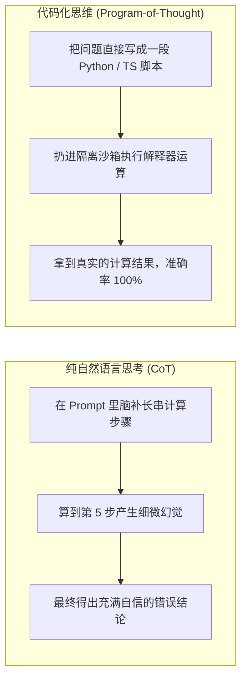

import { Quiz } from '@/components/Quiz'

# 5.4 代码作为元能力：智能体的 6 维可执行思维

> 很多人对 Coding Agent 的理解还停留在“帮我写几行代码的打字员”。但在成熟的系统里，代码根本不仅是最终产物，更是它自己的**思考工具**。比如要统计 50 个文件的代码行数并找出重复率最高的函数，如果让模型用自然语言在脑子里“一步一步想”，它很容易算到一半就开始胡编乱造；但如果让它**写一段 5 行的 Python 脚本在沙箱里跑一下**，几毫秒就能拿到 100% 准确的数字。这一节我们聊聊为什么“用代码代替自然语言思考”是 Agent 进阶的核心分水岭。

---

## 1. 为什么自然语言推理靠不住？

大模型是用自然语言训练出来的，但自然语言天生存在两个致命缺陷：
* **概率模糊性**：词语之间全凭概率接龙，多步运算只要有一步算偏，后面的推导就会满盘皆输；
* **无法原地验证**：在对话里写了“第一步、第二步”，模型自己无法证实每一步算得到底对不对。

而代码恰恰相反：**语法严谨、类型完备，而且能在沙箱里真实跑起来。**



从学术界的 **PAL（程序辅助推理）** 到游戏智能体 **Voyager**，实验反复证明：**让解释器代替模型心算，任务解决率会有质的提升。**

---

## 2. 智能体的 6 维代码化实践

顶尖的 Agent 架构师，通常会在以下 6 个环节用代码替代纯文本：


### 举个排障的实际例子：探针脚本（Probe Script）
普通的 Agent 遇到 Bug，喜欢在对话里反复反思：“我猜可能是端口冲突了，也可能是权限问题”。
而成熟的 Agent 会在本地临时写一个 `probe.ts`：
```typescript
// 临时探针脚本：打印真实的操作系统状态
console.log('端口占用:', await checkPort(3000));
console.log('环境变量:', process.env.DATABASE_URL ? '已配置' : '缺失');
```
跑一次脚本，拿到真实的客观日志，几秒钟就能切中病灶。

---

## 3. Voyager 的技能积木库（Skill as Code）

英伟达著名的 Minecraft 智能体 **Voyager** 给工业界带来过巨大震撼：它在游戏里没有人工标注的数据集，却能自主通关挖钻石。
它的核心杀手锏就是 **把学会的动作写成 JavaScript 函数存进硬盘**：
* 第一天学会了“砍树”，就存一个 `mineWood()` 函数；
* 第二天需要“造工作台”，它直接在代码里调用 `mineWood()`；
* 随着时间推移，它的本地函数库堆成了几百个积木，复杂动作越来越纯熟。

在我们的企业级项目中也是一样：**Agent 解决过的棘手配置和脚本，沉淀为本地可执行代码，永远比留在 Prompt 聊天记录里管用得多。**

---

## 4. 随堂检验

<Quiz
  question="在让 Agent 解决多步骤数学计算或跨文件依赖分析时，为什么‘代码化思维（Program-of-Thought / PAL）’比纯自然语言思维链（CoT）更稳健？"
  options={[
    {
      text: "A. 将逻辑转移给确定性的沙箱解释器运行，消除了大模型在多步自回归心算中的累积幻觉与计算偏差",
      isCorrect: true,
      explanation: "解释器执行是确定性的数学物理过程，不依赖概率猜词，从根本上杜绝了大模型在复杂数字运算和逻辑跳转上的幻觉。"
    },
    {
      text: "B. 因为写成代码后，大模型就能自动跳过所有电能消耗直接得到答案",
      isCorrect: false,
      explanation: "代码执行依然依赖硬件 CPU 资源，优势在于确定性而非免除算力消耗。"
    },
    {
      text: "C. 任何编程语言的代码字数在所有情况下都比自然语言多出 10 倍以上",
      isCorrect: false,
      explanation: "代码往往比冗长的自然语言解释更为精炼，字数多少与推理准确度无必然关联。"
    },
    {
      text: "D. 这样可以完全省去对业务逻辑的任何思考过程直接得到完美代码",
      isCorrect: false,
      explanation: "模型仍然需要负责生成这段求解代码，依然需要理解业务意图与算法结构。"
    }
  ]}
/>

---

## 延伸阅读

* 《AI Agents in Depth: Design Principles and Engineering Practice》（李博杰，2026）第 5.4 节。
* [Agent 核心架构速查手册](/reference/agent-core-architecture)
* 下一节：[5.5 致命三元组风险与代码安全红线](/ch05-coding/05-lethal-triad-and-security)
