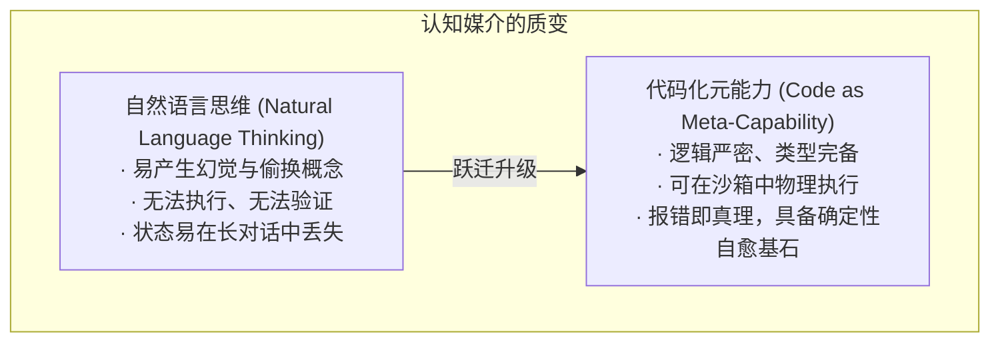
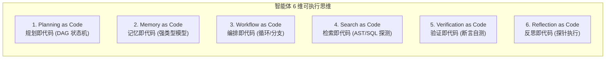

import { Quiz } from '@/components/Quiz'

# 5.4 代码作为元能力：智能体的 6 维可执行思维

> **本节要点**：突破“代码只是最终交付物”的狭隘认知，领悟 **Code as Meta-Capability（代码作为元能力）** 的核心思想；深度掌握智能体在 **规划、记忆、工作流、检索、自验、反思** 6 个维度的代码化表达范式；学习如何将自然语言的模糊思维转化为高精度、可自愈的确定性程序。

---

## 1. 认知跃迁：从“代码作为产物”到“代码作为思维”

在许多初学者眼中，代码只是 Agent 最终写在磁盘上的结果（产物）。然而在《AI Agents in Depth》中，李博杰博士揭示了一个颠覆性的工程现实：

> **自然语言是模糊、跳跃且充满概率不确定性的；而代码是严谨、图灵完备且具备确定性因果链条的。**
> 当 Agent 学会将自己的内部认知过程（推理、拆解、记忆）转化为代码时，它的能力边界将发生质的飞跃。



---

## 2. 智能体的 6 维代码化能力矩阵 (Six Executable Dimensions)

顶级 Agent 架构师将智能体的全生命周期抽象为 6 个维度的代码化实践：



### 2.1 规划即代码 (Planning as Code)
*   **反模式**：在 System Prompt 中让模型输出：“第一步做A，第二步做B，第三步做C”。这种纯文本规划容易在中途执行时被模型遗忘或错乱；
*   **代码范式**：让 Agent 输出一个**可执行的有向无环图（DAG）脚本**。每一个任务节点都是一个函数，具备明确的前置依赖（Dependencies）与超时断言。

### 2.2 记忆即代码 (Memory as Code)
*   将用户偏好与业务规则保存为具有强类型约束的 TypeScript 配置文件或 SQLite Schema，而不是存为散漫的 Markdown 文本。利用编译器的类型检查确保记忆不会在演进中出现语法腐烂。

### 2.3 检索即代码 (Search as Code)
*   不再通过模糊的自然语言一次次猜测搜索关键词，而是编写轻量脚本（如用 Python 遍历 AST 抽象语法树，或者执行几行 Node.js 代码提取所有包含特定装饰器的类）。检索的精准度提升到 100%。

### 2.4 验证与反思即代码 (Verification & Reflection as Code)
*   遇到疑难 Bug 时，优秀的 Agent 不会在上下文里干想（空洞反思），而是**自发编写一段微型探针脚本（Scratch Probe Script）**，在控制台中打印真实内存变量、网络响应体或文件权限，依据物理事实做出归因修正。

---

## 3. 经典架构范式演进：从 PAL 到 Voyager

学术界与工业界在“代码作为认知媒介”上的探索脉络非常清晰：

| 范式 / 代表作 | 核心提出点 | 认知升级意义 |
| :--- | :--- | :--- |
| **PAL (Program-Aided LM)** | 将数学与逻辑推理问题转化为 Python 代码交由外部解释器执行 | 解决了大语言模型自回归乘除法进位不准的顽疾，计算准确率提升至 100% |
| **PoT (Program-of-Thought)** | 用可执行的程序代码代替 CoT（思维链）中的自然语言步骤 | 摆脱了自然语言逻辑推理中的幻觉跳步，每一步中间结果都有解释器担保 |
| **Voyager (MineCraft Agent)** | 将 Agent 学会的所有复杂技能（如砍树、打怪、合成）封装为 JS 函数库并持久化 | **构建了可不断扩充的 Code Skill Library**，下层技能成为上层复杂行为的积木 |

---

## 4. 全栈实战：将自然语言规划编译为可执行任务图 (TypeScript)

下面我们演示如何将用户抽象的需求，编译为严格依赖追踪的可执行代码任务流：

```typescript
// planning-as-code.ts

export interface TaskNode {
  id: string;
  name: string;
  dependencies: string[]; // 依赖的前置任务 ID
  status: 'pending' | 'running' | 'completed' | 'failed';
  execute: () => Promise<void>;
}

export class ExecutablePlanEngine {
  private tasks: Map<string, TaskNode> = new Map();

  addTask(task: TaskNode) {
    this.tasks.set(task.id, task);
  }

  /**
   * 拓扑排序校验并按依赖层级执行
   */
  async runPlan() {
    console.log('[Plan Engine] 启动代码化计划执行引擎...');
    
    const completedTasks = new Set<string>();
    const remainingTasks = new Set(this.tasks.keys());

    while (remainingTasks.size > 0) {
      // 找出当前所有前置依赖均已满足的就绪任务
      const readyTasks: TaskNode[] = [];
      for (const taskId of remainingTasks) {
        const node = this.tasks.get(taskId)!;
        const allDepsMet = node.dependencies.every((dep) => completedTasks.has(dep));
        if (allDepsMet) {
          readyTasks.push(node);
        }
      }

      if (readyTasks.length === 0) {
        throw new Error('检测到计划中存在循环依赖死锁 (Circular Dependency Deadlock)！');
      }

      // 并发执行所有就绪任务
      await Promise.all(
        readyTasks.map(async (task) => {
          console.log(`[Plan Engine] 正在并发执行节点: ${task.name} (${task.id})`);
          task.status = 'running';
          try {
            await task.execute();
            task.status = 'completed';
            completedTasks.add(task.id);
            remainingTasks.delete(task.id);
          } catch (err: any) {
            task.status = 'failed';
            throw new Error(`任务节点 ${task.id} 失败: ${err.message}`);
          }
        })
      );
    }

    console.log('[Plan Engine] 全量代码化计划成功完成全绿交付！');
  }
}
```

---

## 5. 本节练习与反思

<Quiz
  question="在 Agent 解决高精度数学计算或多表数据聚合等复杂问题时，为什么'代码作为思维（Program-of-Thought / PAL）'的方法比纯自然语言 CoT（思维链）更加可靠？"
  options={[
    "因为代码将概率性语言生成的逻辑转移到了确定性运行的外部解释器中，避免了自回归概率模型对数字和分支条件的幻觉与漂移",
    "因为写成代码后，大语言模型就可以直接从硬件底层跳过一切浮点数运算",
    "因为编程语言的代码行数在任何情况下都比自然语言单词数多出 10 倍以上",
    "因为使用代码可以强行将外部服务器的内存条物理超频到两倍速率"
  ]}
  correctIndex={0}
  explanation="自然语言 CoT 仍然是在依靠概率预测下一个 Token，在面对复杂的加减乘除、长数组排序和日期比对时极易出现微小错漏。PoT 将生成目标转为编写 Python / JS 代码，由外部确定的解释器来运行得出真理，彻底解决了数学和强逻辑推理中的幻觉。"
/>

<Quiz
  question="在 Voyager 和现代顶尖 Agent 中，将 Agent 获得的技能保存为'可复用代码库（Code Skill Library）'的最大工程价值是什么？"
  options={[
    "底层代码技能可以被后续更高阶的任务像搭积木一样直接调用，实现能力的永久累积与指数级能力涌现",
    "保存为代码后可以彻底绕过大模型的任何版本升级，让旧模型永远保持最高算力",
    "使得所有生成的代码自动获得国际专利保护并禁止第三方运行",
    "能够让 Agent 在完全断电的情况下不需要任何硬件就能保持逻辑运行"
  ]}
  correctIndex={0}
  explanation="代码是软件工程中最强大的抽象与封装工具。将探索学到的模式（如如何连接数据库、如何编译特定库）打包为标准化函数，新任务就能直接站在这些成熟函数的肩膀上，避免每次面对新任务都从最底层的原子操作重新摸索。"
/>
