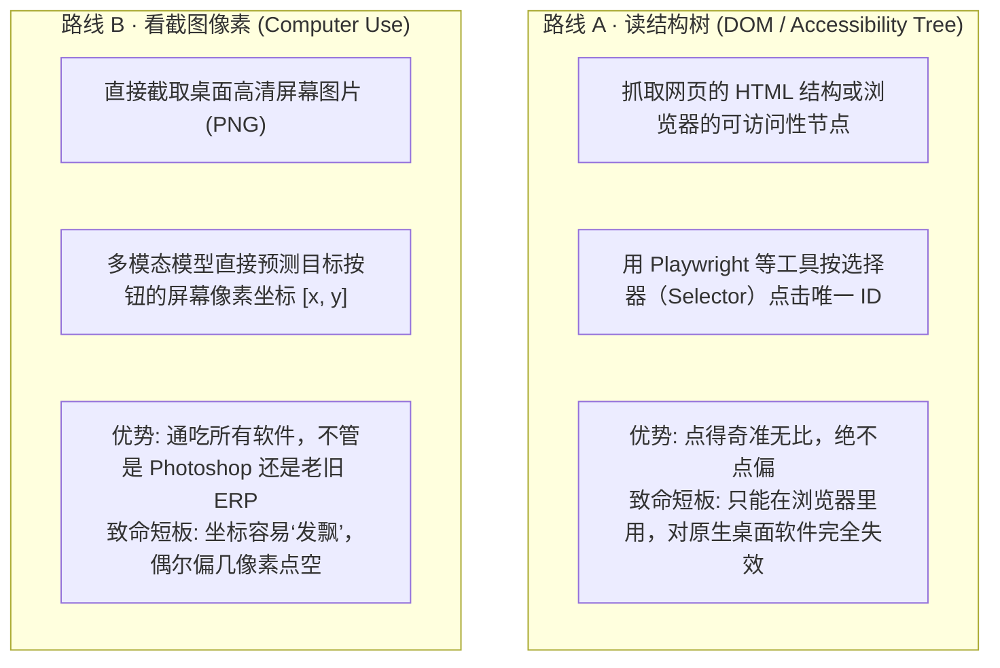
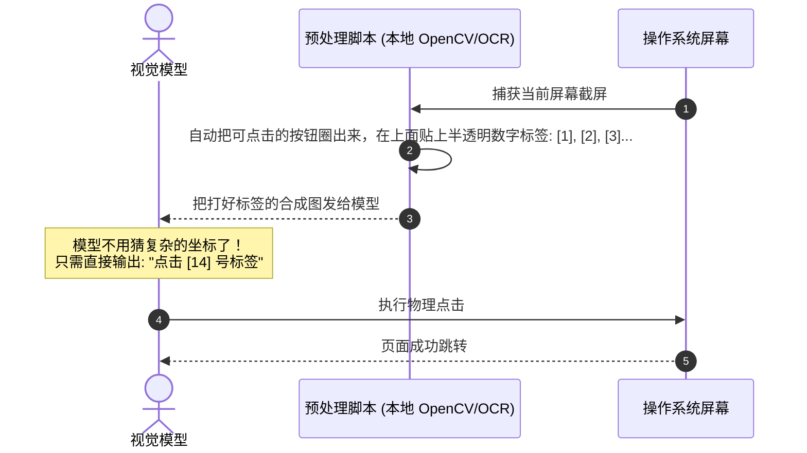

import { Quiz } from '@/components/Quiz'

# 6.1 GUI 智能体与 Computer Use：视觉像素与 DOM 双模定位

> 理想情况下，所有系统都应该有现成的开放 API。但现实很骨感：公司里用了十几年的老财务软件、进销存后台或者特定的桌面客户端，**压根没有提供任何 API 接口**。要想让 Agent 接手这些繁琐流程，它就必须学会“看懂显示器屏幕”并“操控鼠标键盘”。这一节我们看懂 GUI Agent 是怎么在屏幕上找按钮的，以及为什么给按钮贴数字标签（Set-of-Marks）能让点击准确率从 60% 飙升到 90% 以上。

---

## 1. 怎么在屏幕上找按钮？两套截然不同的路线

工业界在定位界面元素时，主要有两条技术路线：



| 维度 | 路线 A：读 DOM / 辅助功能树 | 路线 B：看截图像素 (Computer Use) |
| :--- | :--- | :--- |
| **代表方案** | Playwright, Puppeteer | Anthropic Claude 3.5 Computer Use |
| **输入格式** | 提取出的 HTML 字符串或 JSON 节点树 | 一张屏幕截屏图像 |
| **点击精度** | **100% 精确**（直接绑定元素节点） | 靠坐标估算（偶发有 5~10 像素偏移） |
| **通用程度** | 较差（仅限 Web 网页与部分 Electron 应用） | **全能通用**（所有 Windows/Mac 原生软件通吃） |
| **Token 开销** | 复杂大网页 DOM 树动辄几万 Token | 固定图片开销（约 1000 Token/帧） |

---

## 2. 解决点击发飘的绝招：Set-of-Marks (SoM) 标签法

让大模型直接从一张 1920×1080 的截图里猜“立即提交”按钮在 `[x: 432, y: 891]`，模型非常容易算偏。

微软和学术界提出了一个非常巧妙的办法——**Set-of-Marks (SoM)**：



* **把“填空题”变成了“单选题”**：模型不用再去猜连续的二维坐标，只要从截图中辨认出哪个方框里是“提交”，输出数字代号即可；
* 实验表明，加上 SoM 之后，模型在复杂表单里的点击准确率直接从 **62% 暴涨到 93%**！

---

## 3. 生产级最佳实践：DOM 优先，视觉坐标兜底

在真实的网页自动化场景中，最聪明的策略一定是**双模混合**：

```mermaid
flowchart TD
    Task[需要点击 '确认支付' 按钮] --> Step1{先用 DOM 选择器定位}
    Step1 -->|成功找到唯一节点| Click1[直接通过 Playwright 点击节点 (100% 稳)]
    Step1 -->|找不到/被 Shadow DOM 挡住| Step2{再用可见文本定位}
    Step2 -->|文本唯一可见| Click2[通过 getByText 点击]
    Step2 -->|还是找不到| Step3[截取屏幕，由视觉多模态预测像素坐标物理点击 (兜底)]
```

能通过代码结构直接点到的，绝不费周折去猜坐标；只有遇到复杂的 Canvas 绘图、防爬机制或者桌面软件时，才降级到视觉模拟硬件点击。

---

## 4. 随堂检验

<Quiz
  question="在基于视觉截屏的 GUI 操作（Computer Use）中，为什么引入 Set-of-Marks（在截图中为按钮标注数字标签）能大幅提升点击准确率？"
  options={[
    {
      text: "A. 将高难度的二维连续像素坐标预测，降维成了极其容易识别的离散序号多选题",
      isCorrect: true,
      explanation: "直接预测 [x, y] 坐标极易产生偏移，而预先打上数字标记后，大模型只需看图指出包含目标按钮的序号，完全避开了坐标回归的精度损失。"
    },
    {
      text: "B. 因为贴了数字标签后，操作系统就会自动免密直接授权管理员权限",
      isCorrect: false,
      explanation: "视觉标记只是给大模型看的图像增强，与系统权限授权无关。"
    },
    {
      text: "C. 这样可以强行阻止用户在操作过程中关闭电脑屏幕电源",
      isCorrect: false,
      explanation: "图像处理无法控制硬件物理电源开关。"
    },
    {
      text: "D. 这样可以完全省去大模型对截屏图片的任何视觉理解计算",
      isCorrect: false,
      explanation: "模型仍然需要看图比对意图与标签位置，只是输出形式从坐标变成了序号。"
    }
  ]}
/>

---

## 延伸阅读

* 《AI Agents in Depth: Design Principles and Engineering Practice》（李博杰，2026）第 6.1 节。
* Anthropic 官方指南：《Computer Use (Beta) Overview》。
* 下一节：[6.2 语音智能体：端到端全双工与毫秒级打断](/ch06-interaction/02-voice-agent-and-full-duplex)
