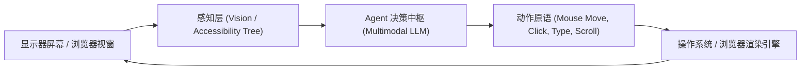
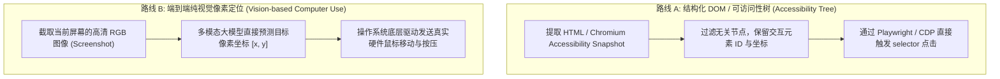
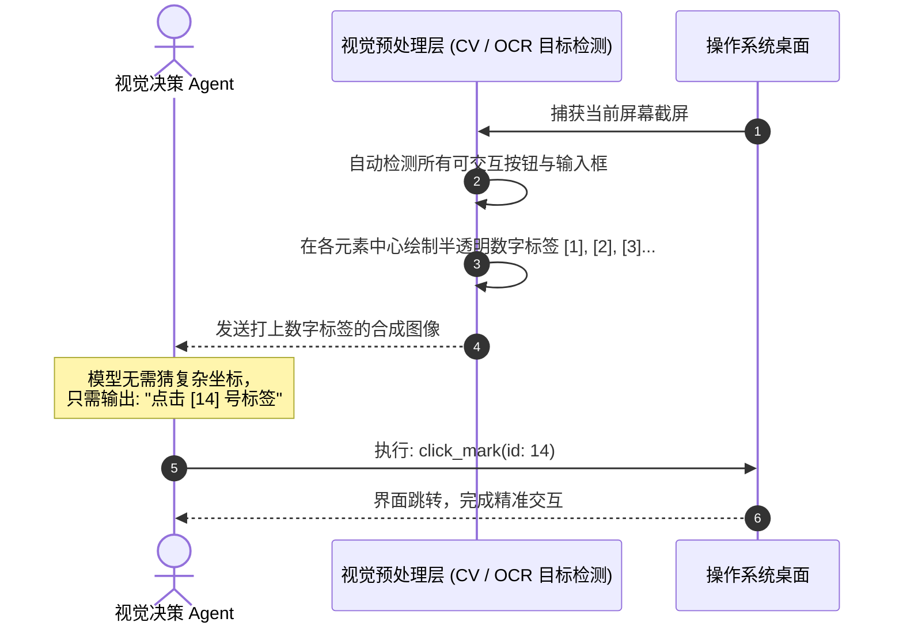

import { Quiz } from '@/components/Quiz'

# 6.1 GUI 智能体与 Computer Use：视觉像素与 DOM 双模定位

> **本节要点**：突破纯文本与 API 接口的藩篱，让 Agent 像人类一样通过屏幕（GUI）操纵软件与网页。深度解密两代 GUI 交互范式：**基于 DOM/Accessibility Tree 的结构化定位** 与 **基于像素截屏的纯视觉定位（Anthropic Computer Use）**；掌握 **Set-of-Marks (SoM)** 视觉提示标记法；构建兼顾精确度与通用性的工业级双模调度架构。

---

## 1. 终极人机界面：为什么需要 GUI 智能体？

在理想世界中，所有软件都应该提供完善、安全且免费的 RESTful API 或 MCP 接口。
然而在现实物理世界中：
* 绝大多数企业内部 ERP、传统财务系统和桌面端软件（如 Photoshop、Excel 宏插件）**根本没有开放任何 API**；
* 互联网上海量的商业网站为了反爬虫与安全风控，频繁变更接口签名；
* 人类在数字世界中 90% 的生产力都是通过**图形用户界面（GUI，鼠标点击、滚动、键盘输入）**完成的。

**GUI Agent（界面智能体）** 的核心使命，就是赋予大模型“看懂显示器屏幕”并“操控键盘鼠标”的能力，从而无缝兼容人类历史上遗留的所有软件遗产。



---

## 2. 两代 GUI 定位技术路线深度对比

在如何定位界面元素（如“登录按钮”）的技术路线上，工业界分裂为两大派系：



| 评估维度 | 路线 A：结构化 DOM / A11y 树 | 路线 B：纯视觉像素定位 (Computer Use) |
| :--- | :--- | :--- |
| **代表方案** | Playwright, Browserbase, Puppeteer | Anthropic Claude 3.5 Computer Use, UI-TARS |
| **感知输入** | 精简后的 DOM 树或 A11y JSON 文本 | 屏幕截屏图片 (PNG/JPEG) |
| **定位精度** | **100% 精确**（直接绑定 DOM 节点唯一 ID） | 依赖像素坐标预测（可能出现 5~10 像素偏移） |
| **跨软件通用性** | 极差（仅局限于 Web 浏览器与部分 Electron 应用） | **全能通用**（支持 Windows/macOS/Linux 原生桌面软件） |
| **Token 消耗** | 较多（长网页 DOM 树动辄消耗几万 Token） | 固定图片 Token（约 800~1600 Tokens/帧） |
| **抗反爬与遮挡** | 容易被 Canvas、反爬框架和复杂 Shadow DOM 欺骗 | 与人类所见完全一致，天然免疫 DOM 混淆 |

---

## 3. 视觉标记破局：Set-of-Marks (SoM) 提示法

大语言模型直接根据裸图预测 `[x: 432, y: 891]` 往往存在坐标发飘（Coordinate Drift）的现象。微软与斯坦福大学提出了划时代的 **Set-of-Marks (SoM) 视觉标记法**：



> 💡 **SoM 的威力**：将复杂的“连续空间二维坐标回归任务”，降维为极其简单的“离散整数多选题（Classification）”。实验证明，SoM 使得模型在复杂界面的点击准确率直接从 62% 跃升至 **93%**！

---

## 4. 全栈实战：构建 DOM 与视觉混合的浏览器点击控制器 (TypeScript)

在现代 Web Agent 架构中，最顶尖的方案是**“以 DOM 为首选主攻、视觉截屏为兜底验证”的双模闭环**：

```typescript
// hybrid-gui-controller.ts
import { Page } from 'playwright';

export interface ClickTarget {
  selector?: string;      // DOM 路径优先
  textPattern?: string;   // 可视文本
  fallbackCoords?: { x: number; y: number }; // 视觉坐标保底
}

export class HybridBrowserController {
  constructor(private page: Page) {}

  /**
   * 双模稳健点击：DOM 尝试 -> 视觉坐标兜底
   */
  async robustClick(target: ClickTarget): Promise<string> {
    // 1. 尝试使用 DOM 路径精准命中
    if (target.selector) {
      try {
        const element = await this.page.waitForSelector(target.selector, { timeout: 3000 });
        if (element && (await element.isVisible())) {
          await element.click();
          return `【DOM 成功】：通过选择器 "${target.selector}" 完成高精度点击`;
        }
      } catch {
        console.warn(`[GUI Controller] DOM 选择器 ${target.selector} 超时或不可见，触发降级方案...`);
      }
    }

    // 2. 尝试使用可见文本定位
    if (target.textPattern) {
      try {
        const textBtn = this.page.getByText(target.textPattern).first();
        if (await textBtn.isVisible()) {
          await textBtn.click();
          return `【文本定位成功】：通过界面文本 "${target.textPattern}" 触发点击`;
        }
      } catch {
        console.warn(`[GUI Controller] 文本匹配失败，触发视觉像素绝对坐标点击...`);
      }
    }

    // 3. 终极兜底：基于像素坐标的模拟硬件物理点击
    if (target.fallbackCoords) {
      const { x, y } = target.fallbackCoords;
      await this.page.mouse.move(x, y);
      await this.page.mouse.down();
      await this.page.mouse.up();
      return `【视觉坐标兜底】：在像素坐标 [${x}, ${y}] 处完成硬件模拟物理点击`;
    }

    throw new Error('所有点击定位策略均宣告失败，请重新截屏评估界面状态！');
  }
}
```

---

## 5. 本节练习与反思

<Quiz
  question="在开发 Web 自动化 Agent 时，为什么基于纯 DOM 树的方案面对包含 Canvas 绘图或桌面原生弹窗的网页时会彻底失效？"
  options={[
    "因为 Canvas 内部图形和系统原生弹窗完全不会在 HTML DOM 树中生成对应的子节点，在 DOM 树视角下它们只是一块黑盒或不可见的透明图层",
    "因为现代浏览器规定 DOM 树的最大节点总数不得超过 100 个",
    "因为 Canvas 元素只允许使用 C++ 语言编写的专用大模型进行解析",
    "因为读取 Canvas 元素会自动导致当前网页的 SSL 证书失效"
  ]}
  correctIndex={0}
  explanation="DOM 树只能反映 HTML 标签。Canvas（以及 WebGL、桌面原生菜单）将所有视觉元素绘制在统一的位图像素缓冲区中，DOM 树上只有一个孤立的 canvas 标签，内部逻辑对 DOM 遍历完全不可见。此时必须依赖纯视觉 Computer Use 方案进行像素级定位。"
/>

<Quiz
  question="在视觉 GUI 智能体中，Set-of-Marks (SoM) 提示法之所以能够显著提升模型点击按钮的准确率，其核心机理是什么？"
  options={[
    "通过在界面候选元素上预先叠加带有数字编号的视觉标记，将预测浮点像素坐标的连续难题转化为选择特定整数编号的离散任务",
    "通过自动调高显卡的刷新率，使得大语言模型的推理速度加快三倍",
    "通过向显示器屏幕发送红外信号，直接从硬件物理上锁定鼠标光标的位置",
    "通过将所有截屏图片的分辨率强制缩小至 16x16 像素以降低噪声"
  ]}
  correctIndex={0}
  explanation="大语言模型在连续二维空间坐标回归（如准确说出[532, 712]）上容易产生轻微偏差；而将候选框预打上[1]、[2]、[3]等标签后，模型只需进行分类决策（'点击标签 2'），彻底消除了坐标漂移的痛点。"
/>
