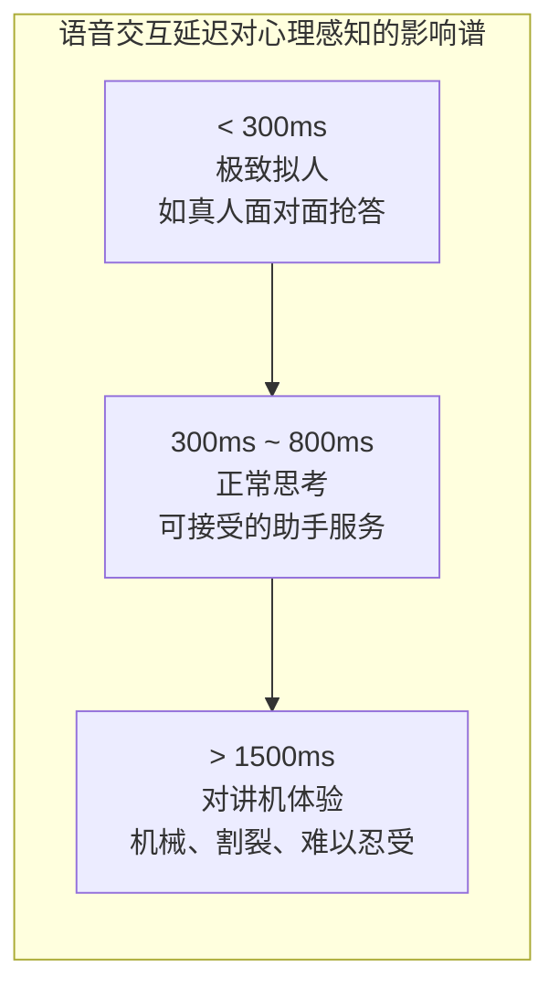
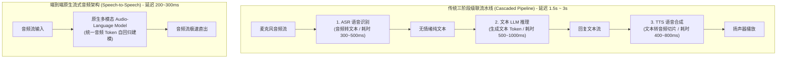
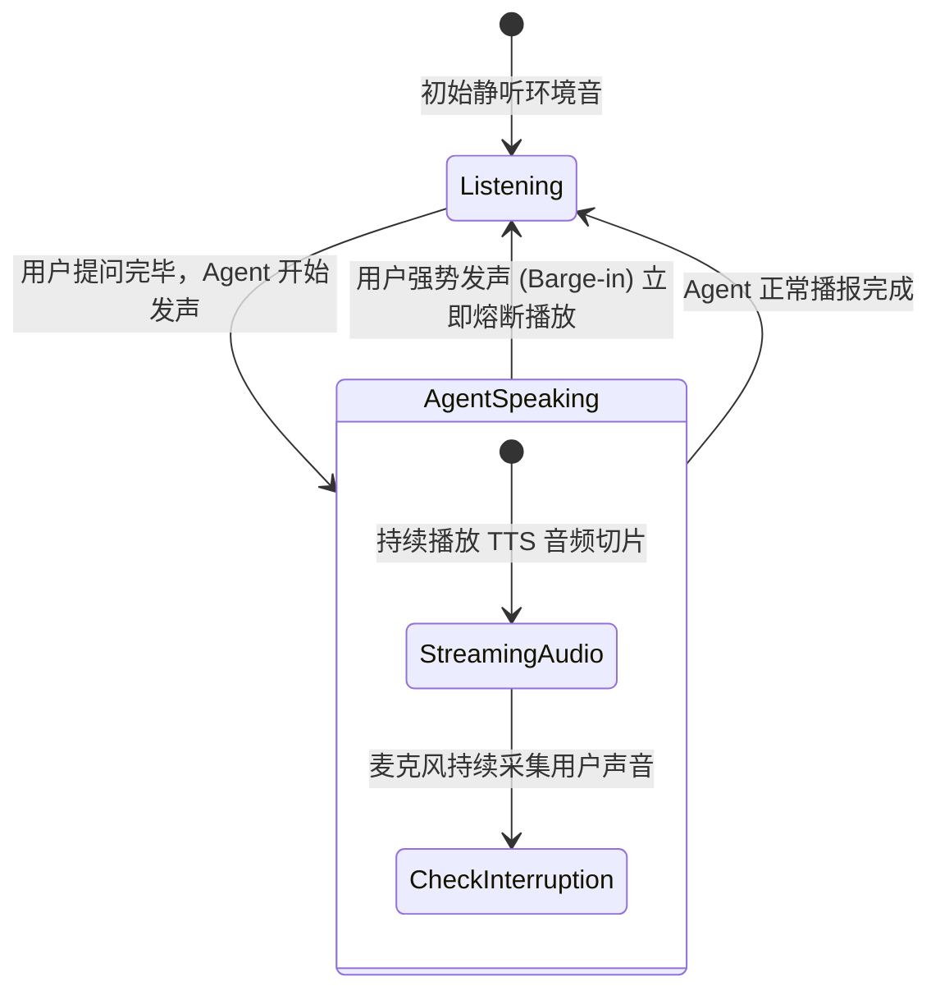

import { Quiz } from '@/components/Quiz'

# 6.2 拟人全双工语音智能体：VAD 打断与端到端流式架构

> **本节要点**：突破传统语音助手“像对讲机一样机械轮询”的尴尬体验；深入对比 **ASR-LLM-TTS 三级传统级联** 与 **端到端原生音频模型（Speech-to-Speech）** 的延迟与情感表达差异；攻克 **全双工（Full-Duplex）** 通信中的核心技术：VAD 语音活动检测、倾听反馈（Backchanneling）与即时智能打断（Barge-in）机制。

---

## 1. 拟人体验的生死线：延迟与呼吸感

在人机语音交互中，**延迟是第一杀手**：
* 心理学研究表明：人类日常面对面对话的平均正常反应停顿时间约为 **200 ~ 300 毫秒**；
* 如果响应延迟超过 **800 毫秒**，人类用户就会本能地怀疑对方走神或通话断线；
* 如果延迟突破 **1.5 秒**，对话体验就会彻底退化为“对讲机（Walkie-Talkie）模式”，毫无生机与陪伴感。



---

## 2. 架构代际革命：级联拼装 vs. 原生端到端



### 级联模式的两大无法逾越的阿喀琉斯之踵
1. **多重流水线延迟累加（Multi-hop Latency）**：三个独立模型串联，每一个模型的首包时间（TTFT）互相叠加，很难压缩至 600ms 以内；
2. **情感与副语言信息彻底灭失（Loss of Paralinguistics）**：
   * 用户带着哭腔或讽刺说：“你可真是太聪明了！”
   * ASR 识别出的文本只是冰冷的八个字，文本 LLM 误以为用户在夸奖自己；
   * 原生 Speech-to-Speech 能够直接捕捉音高、语速、叹息与呼吸声，实现原生富情绪共鸣。

---

## 3. 全双工通信与智能打断机制 (Barge-in)

人类交谈是**全双工（Full-Duplex）**的：在一方说话的同时，双方的双耳和嘴巴始终保持在线，随时可以插话、纠偏或点头回应。



### 3.1 VAD（语音活动检测）与能量判决
系统必须在麦克风底层实时运行轻量级 VAD 引擎（如 Silero VAD 或 WebRTC VAD），以毫秒级时间窗评估环境音频帧：
* 计算短时能量与过零率，过滤背景空调风噪；
* 一旦检测到人类发声概率超过阈值（如 > 0.85），立即发出中断事件。

### 3.2 倾听反馈（Backchanneling） vs. 恶意截断
全双工最精妙的细节在于**区分“回应”与“打断”**：
*   **回应音（Backchannel）**：Agent 在讲长篇故事，用户下意识发出“嗯”、“对”、“好的”。**此时 Agent 绝对不能停！** 应当微调语速自然继续；
*   **实质打断（Barge-in）**：用户大声说“别说了，我想问的是另一个问题”。**此时系统必须在 50ms 内立刻静音扬声器、清空本地声卡缓冲区**，并重置生成状态。

---

## 4. 全栈实战：构建全双工音频流调度状态机 (TypeScript)

```typescript
// full-duplex-audio-controller.ts
import { EventEmitter } from 'events';

export type AudioState = 'IDLE' | 'LISTENING' | 'AGENT_SPEAKING' | 'INTERRUPTED';

export class FullDuplexAudioController extends EventEmitter {
  private currentState: AudioState = 'IDLE';
  private audioPlaybackQueue: Buffer[] = [];
  private isMuted = false;

  constructor() {
    super();
    this.initMicrophoneStream();
  }

  private initMicrophoneStream() {
    // 模拟持续监听麦克风 VAD 事件
    console.log('[Audio Controller] 麦克风 VAD 全双工常驻监听就绪');
  }

  /**
   * 当底层 VAD 检测到人类发声时触发
   */
  handleUserVoiceDetected(amplitude: number, isSubstantiveSpeech: boolean) {
    if (this.currentState === 'AGENT_SPEAKING') {
      if (isSubstantiveSpeech) {
        // 触发实质性打断 (Barge-in)
        console.warn('⚡ [Barge-in] 检测到用户明确插话，立即熔断 Agent 播放！');
        this.interruptPlayback();
      } else {
        // 仅为 "嗯/啊" 的倾听音，忽略打断保持播放
        console.log('👂 [Backchannel] 捕获到用户倾听语气词，保持自然输出');
      }
    }
  }

  /**
   * 立即强行打断 Agent 的当前音频播放流
   */
  interruptPlayback() {
    this.currentState = 'INTERRUPTED';
    // 1. 物理清空声卡待播放缓冲区
    this.audioPlaybackQueue = [];
    this.isMuted = true;
    
    // 2. 通知后端大模型中断当前正在进行的自回归流式生成 (AbortController)
    this.emit('abort_generation');
    
    // 3. 瞬间切回倾听模式捕获用户新意图
    this.currentState = 'LISTENING';
    this.isMuted = false;
    this.emit('ready_for_new_input');
  }

  /**
   * 模拟接收并播放大模型推送过来的音频帧切片
   */
  enqueueAudioChunk(chunk: Buffer) {
    if (this.currentState === 'INTERRUPTED') {
      return; // 已被用户打断，直接丢弃后续残留音频切片
    }
    this.currentState = 'AGENT_SPEAKING';
    this.audioPlaybackQueue.push(chunk);
    // 驱动声卡 DMA 缓冲区播放...
  }
}
```

---

## 5. 本节练习与反思

<Quiz
  question="为什么由 ASR（语音识别）+ 文本 LLM + TTS（语音合成）拼装的传统级联系统，在实现'极致拟人自然语音交互'上面临无法克服的上限？"
  options={[
    "串联流水线造成的多重首包延迟极难压缩至 500ms 以内，且 ASR 转纯文本过程中彻底丢失了语气、情绪、叹息等关键副语言特征",
    "因为传统 ASR 模型只允许识别纯英文，无法处理包括中文在内的任何其他语言",
    "因为 TTS 引擎必须连接在机械硬盘上才能将文本合成为声波振动",
    "因为传统流水线架构完全无法在带有无线网卡的笔记本电脑上运行"
  ]}
  correctIndex={0}
  explanation="传统三级拼装架构中，每个独立模型都要完成解码或前向计算，延迟层层累加，导致整体响应时间通常突破 1.5 秒。更重要的是，情绪、抑扬顿挫和微妙停顿等超文本信号在被 ASR 抹平为纯文本的一瞬间彻底丢失，导致后续回答机械冰冷。"
/>

<Quiz
  question="在全双工语音智能体中，区分'倾听反馈音（Backchanneling，如嗯、对）'与'实质性打断（Barge-in）'的核心价值是什么？"
  options={[
    "避免用户只是下意识点头应答时 Agent 出现神经质般的瞬间停顿闭嘴，维护流畅连贯的倾听沉浸感",
    "为了让系统能够在检测到用户咳嗽时自动向医院急救中心发送报警短信",
    "为了让麦克风能够自动降低室内空调和电风扇的实际耗电量",
    "为了强制用户在对话过程中每隔五秒钟必须大声说出一句特定赞美词"
  ]}
  correctIndex={0}
  explanation="人类在认真倾听时会频繁发出'嗯'、'好的'等无意图倾听反馈。如果系统机械地只要听到声音就立即掐断自身播报，会导致 Agent 的讲话不断被自己的忠实听众打得支离破碎。优秀的系统能够识别这种反馈，既保持自信连贯，又能在实质插话时果断让出话语权。"
/>
