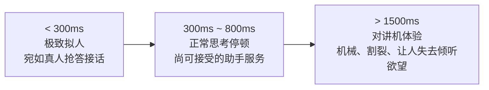
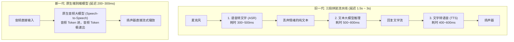
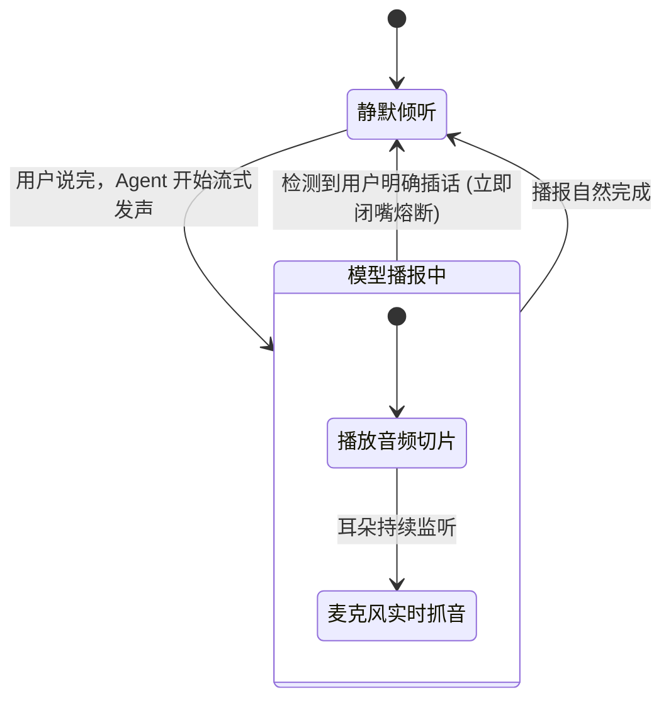

import { Quiz } from '@/components/Quiz'

# 6.2 拟人全双工语音智能体：VAD 打断与端到端流式架构

> 过去的智能音箱之所以让人觉得“笨拙”，主要体验像在用对讲机：你说完一句，得对着空气尴尬等待两秒钟；要是它说偏了你想打断，它根本听不见，非得滔滔不绝把预设台词背完不可。而新一代实时语音助手（如 GPT-4o 语音模式）之所以让人惊艳，核心就两点：**响应延迟压到了 300 毫秒以内**，以及**随时能被人类插话打断（全双工）**。这一节我们聊聊语音 Agent 底层的技术跃迁。

---

## 1. 延迟与呼吸感：多等半秒就失去了人味

心理学和人机工程实测显示，人类对对话延迟极其敏感：
* **200 ~ 300 毫秒**：这是两个真人面对面聊天时最自然的反应间隔，甚至能感知到对方的微弱呼吸与抢答；
* **超过 800 毫秒**：人类用户就会本能地怀疑对方走神了、或者网络连接卡顿；
* **超过 1.5 秒**：交互彻底退化成机械的“你一句、我一句”对讲机模式。



---

## 2. 两代语音架构演进：传统拼装 vs 原生端到端



### 为什么三段式拼装做不出真拟人？
1. **多级延迟不可避免地累加**：三个模型串联，哪怕每个首包只要 300ms，加起来也直接奔着 1 秒去了；
2. **反讽与情感信息全被丢光**：
   * 用户带着哭腔或冷笑讽刺说：“你可真是太聪明了！”
   * 第一步 ASR 把它转成了冷冰冰的八个字，中间的文本大模型还以为用户在真诚表扬它；
   * 而原生端到端模型能直接听出音高、语速、颤音和叹息，直接用带着安慰或歉意的语气回话。

---

## 3. 全双工通信：随时被打断（Barge-in）

真人的耳朵和嘴巴是随时并行的，说话的同时耳朵一刻没闭上。这就是**全双工（Full-Duplex）**。



### 前端如何处理打断细节？
1. **区分“附和声”与“真打断”**：
   * **附和（Backchannel）**：Agent 在讲长段落，用户顺口说了句“嗯”、“对”。**这时候模型绝对不能停！** 应该微调语速自然继续；
   * **实质打断（Barge-in）**：用户突然提高了音量说“等一下，不是这个”。**前端必须在 50 毫秒内瞬间清空本地声卡播放缓冲区**，并立刻向后端发送 `abort` 信号停止大模型生成。

---

## 4. 最小实战代码：全双工打断控制器

```typescript
import { EventEmitter } from 'events';

export class FullDuplexAudio extends EventEmitter {
  private isSpeaking = false;
  private audioBufferQueue: Buffer[] = [];

  // 当麦克风 VAD 检测到用户发声
  onUserSpoke(isSignificantSpeech: boolean) {
    if (this.isSpeaking) {
      if (isSignificantSpeech) {
        // 用户严肃插话，触发强制打断 (Barge-in)
        console.warn('⚡ 用户插话，立即熔断扬声器并重置状态！');
        this.stopSpeakingAndReset();
      } else {
        // 仅为 "嗯/好" 等语气词，保持自然发声
        console.log('用户仅在语气附和，继续播放。');
      }
    }
  }

  private stopSpeakingAndReset() {
    this.isSpeaking = false;
    // 1. 物理清空声卡待播队列
    this.audioBufferQueue = [];
    // 2. 发送信号让后端中断正在跑的大模型自回归生成
    this.emit('abort_generation');
    // 3. 切回倾听模式接收用户最新指令
    this.emit('ready_to_listen');
  }

  // 接收后端推送过来的音频切片
  pushChunk(chunk: Buffer) {
    if (!this.isSpeaking) return;
    this.audioBufferQueue.push(chunk);
  }
}
```

---

## 5. 随堂检验

<Quiz
  question="在全双工人机语音交互中，为什么传统‘语音识别(ASR) + 文本大模型 + 语音合成(TTS)’三级拼装方案在体验上很难超越原生端到端音频模型？"
  options={[
    {
      text: "A. 三级独立流水线导致单次交互延迟层层累加，且中间纯文本环节丢失了声调、哭腔和情绪信息",
      isCorrect: true,
      explanation: "传统级联方案的致命伤就在于两点：各环节延迟串联叠加突破人类忍耐极限；将音频拍平为纯文本时丢弃了音高、重音、反讽等关键副语言信息。"
    },
    {
      text: "B. 因为国际无线电管理组织禁止在服务器上同时安装 ASR 和 TTS 两个服务",
      isCorrect: false,
      explanation: "技术选型属于应用层架构设计，与无线电频谱管理无关。"
    },
    {
      text: "C. 传统三级流水线完全无法播放超过 3 秒钟的任何人类语音文件",
      isCorrect: false,
      explanation: "传统方案可以播放长音频，问题在于启动延迟高和无法及时打断。"
    },
    {
      text: "D. 原生端到端模型会自动消耗掉用户电脑中所有的物理显存",
      isCorrect: false,
      explanation: "端到端模型大部分部署在云端 GPU 集群，客户端仅通过 WebRTC 传输低码率音频流。"
    }
  ]}
/>

---

## 延伸阅读

* 《AI Agents in Depth: Design Principles and Engineering Practice》（李博杰，2026）第 6.2 节。
* [Agent 核心架构速查手册](/reference/agent-core-architecture)
* 下一节：[6.3 人在回路 (HITL) 与协同交互设计](/ch06-interaction/03-human-in-the-loop-collaboration)
