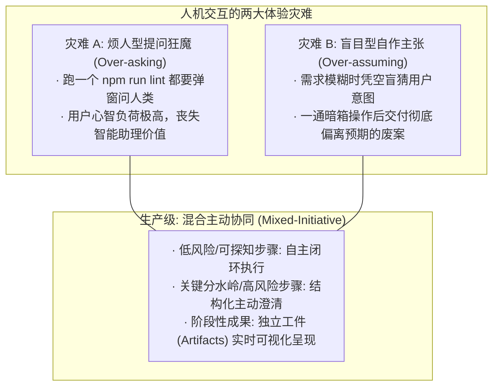
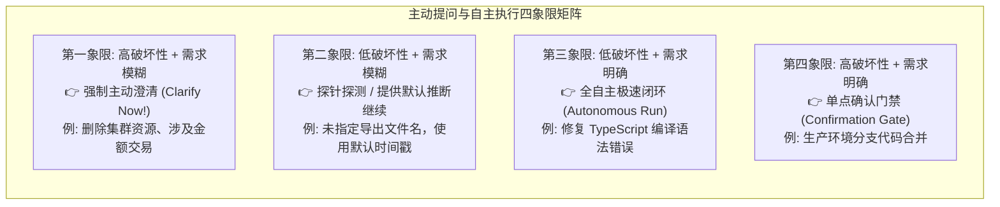
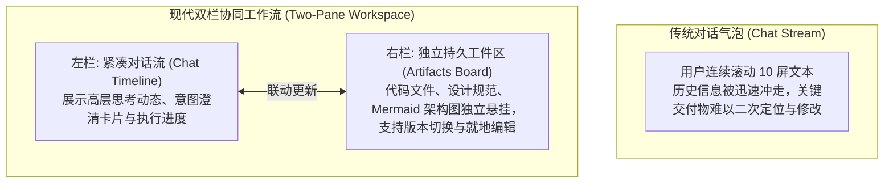

import { Quiz } from '@/components/Quiz'

# 6.3 混合主动人机协同：主动澄清时机与 Generative UI

> **本节要点**：跳出“全自动黑盒”与“事事请示烦死用户”的两极摆动，掌握 **混合主动协同（Mixed-Initiative Interaction）** 的精髓；建立基于风险与置信度的 **主动澄清（Clarification）黄金决策模型**；掌握以 **Generative UI（动态生成式界面）** 与 **独立工件（Artifacts）** 为核心的现代高密度交互界面范式。

---

## 1. 交互的钟摆效应：事无巨细 vs. 闭门造车

在人机协同的实践中，初学者往往陷入两种极端的体验灾难：



---

## 2. 判定模型：何时自主决断？何时主动提问？

现代 Agent 必须内嵌一套严谨的**提问仲裁逻辑**，根据“信息可探知度”与“操作破坏性”进行四象限决策：



### 高级澄清提问的三大原则
1. **优先通过环境探针自查**：若用户说“部署我的博客”，**严禁直接反问用户“你的博客是哪个框架”**！Agent 应先调用 `list_dir` 查看是否存在 `package.json`，若发现 `nextra` 依赖则自动推断出框架；
2. **拒绝宽泛开放式反问**：不要问“你想要什么样的布局？”，而应提供带有推荐倾向的结构化单选：“已为您分析出两种方案，推荐采用具备侧边栏的标准文档布局（选项 A）”；
3. **附带合理的默认回退值**：如果用户选择跳过或直接回车，系统应能安全沿着推荐路径继续前进。

---

## 3. 超越纯文本：Generative UI 与 Artifacts 工件范式

在复杂任务交互中，长篇累赘的 Markdown 对话气泡早已无法满足人类的高效视觉与操作诉求：



### 3.1 Generative UI（动态生成界面）
Agent 在遇到需要用户决策或填写的场景时，不再输出死板的文本提示，而是**由模型动态生成一个定制的 React 表单组件**（如一个具备单选框、日历选择器与价格滑块的卡片），直接嵌入对话流中，用户点击后无缝回传结构化 JSON。

### 3.2 Artifacts（工件看板）
将大于 15 行的代码、技术架构文档或图表剥离出聊天记录，保存为具有独立生命周期的 **Artifacts**，具备三大特性：
* **可直接执行/渲染**：代码可一键运行预览，Mermaid 可直接渲染交互；
* **支持原地版本回滚**：人类可直接在右侧修改代码并保存，Agent 自动感知上下文变更；
* **保持聊天上下文纯净**：免去全量代码在长对话中被反复引用的 Token 浪费。

---

## 4. 全栈实战：构建带澄清仲裁的交互控制器 (TypeScript)

```typescript
// interaction-orchestrator.ts

export interface ClarificationQuestion {
  question: string;
  recommendedOption: string;
  options: string[];
}

export class MixedInitiativeController {
  /**
   * 仲裁是否需要打断用户并主动发起提问
   */
  static evaluateNeedForClarification(taskDescription: string, environmentEvidence: Record<string, any>): {
    needClarify: boolean;
    clarification?: ClarificationQuestion;
  } {
    // 1. 如果缺少关键信息，且无法从本地磁盘/配置中推断
    if (taskDescription.includes('发布新版本') && !environmentEvidence.hasVersionSpecified) {
      return {
        needClarify: true,
        clarification: {
          question: '检测到您希望发布新版本，请明确遵循的语义化版本号升级规则：',
          recommendedOption: 'Patch (小补丁 1.0.x，仅修复 Bug)',
          options: [
            'Patch (小补丁 1.0.x，仅修复 Bug)',
            'Minor (功能特性 1.x.0，向后兼容新特性)',
            'Major (主版本升级 2.0.0，包含破坏性变更)',
          ],
        },
      };
    }

    // 2. 信息完备或已可通过环境探针获得，直接全自动静默执行
    return { needClarify: false };
  }
}
```

---

## 5. 本节练习与反思

<Quiz
  question="在混合主动协同（Mixed-Initiative Interaction）中，当 Agent 接收到一个略微模糊的用户指令时，以下哪种做法最符合顶级交互设计原则？"
  options={[
    "优先调用环境探测工具（如查看配置文件、读取 Git 状态）尝试自发寻找答案；若仍有不可逆的重大分歧，再抛出带有推荐答案的结构化选择题",
    "无论问题大小，立即向用户抛出 10 个开放式长篇大论的问答题，要求用户全部填写完整才允许继续",
    "绝对不问任何问题，在暗箱中完全凭借概率盲猜一个最极端的操作并直接执行",
    "直接在终端向用户发送一条毫无上下文说明的红色系统报错"
  ]}
  correctIndex={0}
  explanation="高情商、高效率的 Agent 始终追求在'尽可能少打扰人类'与'杜绝灾难性盲猜'之间取得精妙平衡。它会先用手头的只读探针去观察环境线索，当确实存在关键分歧时，提供精准的结构化选项让用户一键确认。"
/>

<Quiz
  question="在现代 Agent 桌面与网页应用中，将大段代码、方案报告等交付物渲染为独立的'Artifacts（工件面板）'而不是混在聊天记录流中的核心收益是什么？"
  options={[
    "使核心交付物脱离被聊天流迅速冲走淹没的命运，提供独立持久的展示、就地编辑与版本回滚能力，同时大幅净化对话上下文",
    "因为现代浏览器在单个聊天气泡中渲染超过 20 个汉字时会导致 GPU 严重过热",
    "为了强制用户在每次打开工件面板时都必须重新扫码登录一次账号",
    "因为 Artifacts 面板中展示的内容完全不需要消耗任何前端 DOM 内存"
  ]}
  correctIndex={0}
  explanation="对话流天然具有线性、易逝性；而工作交付物（代码、设计文档、架构图）具有状态化、需反复迭代的特征。工件面板将两者解耦，极大提升了生产力与查阅体验，是现代顶级 Agent IDE 的标配范式。"
/>
