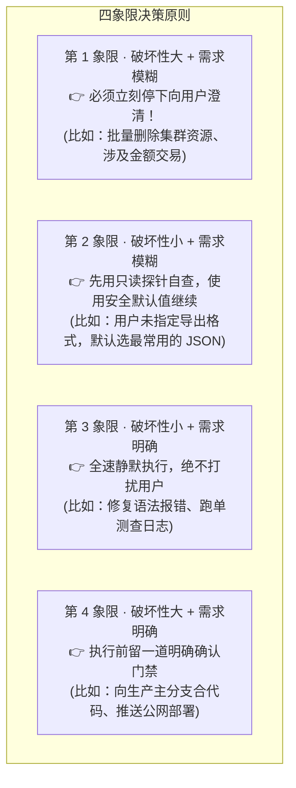
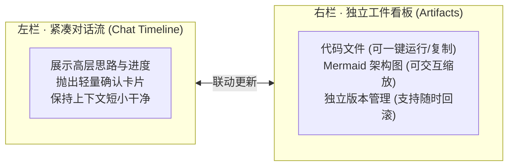

import { Quiz } from '@/components/Quiz'

# 6.3 混合主动人机协同：主动澄清时机与 Generative UI

> 做过 Agent 产品的同学，大概率体会过这种两头不讨好的尴尬：要么把它做成了“提问狂魔”——跑个 `git status` 都要弹窗问你“是否允许”，五分钟弹了十次窗，用户烦得想直接卸载；要么把它做成了“闷葫芦”——需求明明很模糊，它一声不吭在后台瞎猜硬干，二十分钟后交出一堆南辕北辙的废代码。怎样在“少打扰人”和“不瞎胡搞”之间拿捏好分寸？这一节我们聊聊混合主动协同与现代工件面板（Artifacts）的设计。

---

## 1. 什么时候自己定？什么时候停下问？

成熟的 Agent 绝不能靠拍脑袋决定要不要弹窗，而是遵循一套清晰的**四象限决策网**：

---

## 2. 高情商 Agent 的三大提问铁律

同样是向用户提问，低级 Agent 和高级 Agent 给人的感受天差地别：

### 1. 先自己看一眼，绝不当“伸手党”
* **反面教材**：用户说“帮我把博客部署了”。Agent 立刻弹窗反问：“请问你的博客是用什么框架写的？打包命令是什么？”
* **正面做法**：先调 `list_dir` 扫一眼目录，看到 `package.json` 里写着 `nextra`，直接自动推断这是 Next.js 静态博客，全程不发一言直接开始打包。

### 2. 给单选题，别给开放式作文题
* **反面教材**：“这个页面你想怎么设计？”（用户还要花精力打几百字解释，累觉不爱）
* **正面做法**：“已分析当前产品，为您梳理出两种可行布局：推荐采用‘带侧边栏的标准文档布局’（选项 A），请确认。”

### 3. 提供合理的回退默认值
提问卡片必须允许用户直接按回车放行：如果用户懒得选，默认就沿着你推荐的最佳路径往下走。

---

## 3. 告别纯文本：右侧工件看板（Artifacts）

在写代码或做设计时，如果把几百行代码全贴在聊天气泡里，对话流马上会被刷屏，上一句提了什么要求转眼就找不到了。

目前主流工具（如 Claude、Antigravity）普遍采用**左右双栏架构**：

* **交付物不被冲走**：代码和设计文档固定挂在右侧，左边聊得再多，右边的代码依然稳稳悬停；
* **支持原地修改与对比**：用户可以直接在右侧面板里改动几行代码并保存，Agent 立刻就能感知到最新的改动，不需要在输入框里反反复复复制粘贴。

---

## 4. 随堂检验

<Quiz
  question="在人机协同设计中，当用户下达了一个略显模糊的任务（如‘帮我把项目跑起来’）时，Agent 最合理的处理行为是什么？"
  options={[
    {
      text: "A. 优先调工具查看本地 package.json 或环境配置自查；若仍有关键分歧，再抛出带推荐选项的选择题",
      isCorrect: true,
      explanation: "先用只读探针摸清现场，避免问弱智问题打扰用户；真正遇到业务分水岭时，提供有倾向的结构化单选，把用户的操作成本降到最低。"
    },
    {
      text: "B. 无论大事小事，立刻向用户抛出 10 道长篇问答题要求用户逐项作答完毕才开工",
      isCorrect: false,
      explanation: "过度提问会给用户带来巨大的认知负荷，完全丧失了智能助理的提效价值。"
    },
    {
      text: "C. 一声不吭，在后台凭运气盲猜一个最极端的操作并直接删盘重装",
      isCorrect: false,
      explanation: "盲目自作主张极易产生灾难性后果，完全破坏用户信任。"
    },
    {
      text: "D. 只要需求有一丁点不明确，就立刻向控制台输出红色系统报错并直接关机",
      isCorrect: false,
      explanation: "粗暴报错是缺乏基本容错和上下文探知能力的体现。"
    }
  ]}
/>

---

## 延伸阅读

* 《AI Agents in Depth: Design Principles and Engineering Practice》（李博杰，2026）第 6.3 节。
* [Agent 核心架构速查手册](/reference/agent-core-architecture)
* 下一节：[6.4 具身智能体与 Sim2Real 现实迁移](/ch06-interaction/04-embodied-agent-and-sim2real)
