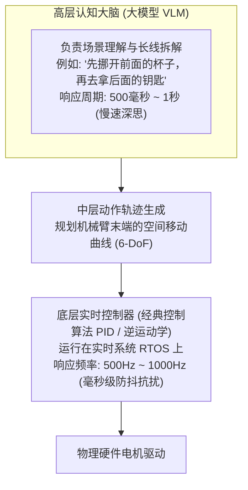
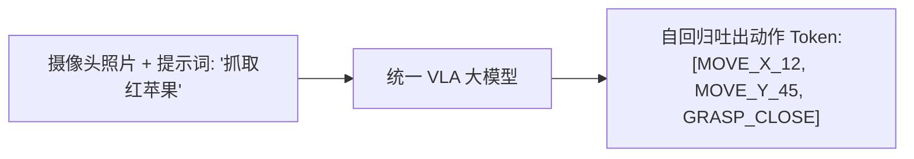
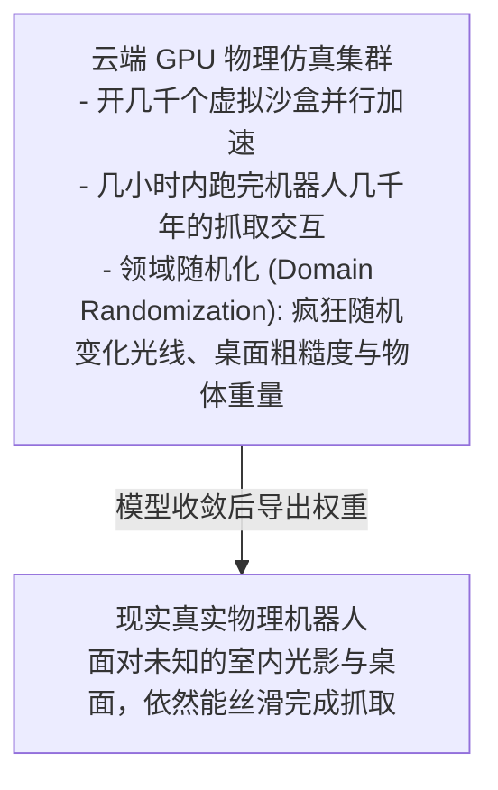

import { Quiz } from '@/components/Quiz'

# 6.4 具身物理交互演进：从数字沙盒到 Sim-to-Real 迁移

> 写纯软件的 Agent 时，最坏的结果无非是报错退出，大不了 `git checkout` 回滚重试，没有任何物理损失。但如果把 Agent 的大脑装进一台真实的机械臂或人型机器人里，试错成本就彻底变了：动作稍微算偏几厘米，就可能把桌上的玻璃杯打碎，甚至把几万块的伺服电机直接烧毁。为什么大模型不能直接去操纵机器人的关节电流？机器人为什么必须先在虚拟仿真世界里“死”上几万次才能来到现实？这一节我们聊聊具身智能（Embodied AI）的分层控制架构。

---

## 1. 软件试错 vs 物理试错：为什么不能让大模型直接控电机？

在纯软件世界里，操作的是文件、数据库和 API，失败成本几乎为零。但在真实的物理世界里，机器人面对的是重力、摩擦力和惯性。

很多人第一反应是：“既然大模型这么强，能不能让它每毫秒直接算一次电机输出电流？”
**答案是绝对不行！**

大模型推理一次哪怕只要 300 毫秒，在这 300 毫秒内，失去平衡的机器人早就倒在地上了。
所以成熟的具身系统必定是**分层解耦**的：
* **大模型负责“宏观想明白”**（每秒做一次高层决策）；
* **底层专用芯片负责“高频控制”**（每秒微调 1000 次电机电流，维持平衡与防撞）。

---

## 2. VLA 统一大模型：把动作也当成 Token

过去做机器人，视觉识别、路径规划和手臂抓取各由一套算法拼接而成，中间很容易信息丢失。

近两年前沿的 **VLA（Vision-Language-Action，视觉-语言-动作）** 模型（如 Google RT-2、OpenVLA）把思路彻底统一了：
**把机械臂末端的空间移动坐标和手指开合，也编成一组特殊的离散 Token 词表！**

大模型不仅能输出汉字和英文，也能顺流吐出控制末端动作的坐标代码，真正实现了“看见画面 -> 意图理解 -> 直接输出动作”的端到端闭环。

---

## 3. 跨越现实鸿沟：在仿真器里先跑“一千年”

让真实的机器人直接在现实办公室里从零试错，成本高昂且极度危险。
现代机器人的训练，99% 是在英伟达的 Isaac Sim 或 MuJoCo 等**物理仿真沙盒**里跑出来的：

### 什么是“领域随机化（Domain Randomization）”？
真实世界的物理细节太丰富了，任何仿真器都不可能百分之百还原现实。
工程师的绝招就是**在仿真器里故意搞破坏**：
随机把灯光调暗、把摩擦力调大、给物体加上随机纹理、让机械臂各关节带上随机晃动。机器人一旦在成千上万种恶劣的虚拟环境里都能把苹果抓稳，来到现实世界时，无论真实办公室的光线多奇葩，它都能轻松应对。

---

## 4. 随堂检验

<Quiz
  question="在具身智能机器人系统中，为什么通常由百亿级大模型负责高层任务拆解，而底层的电机力矩控制交由 1000Hz 的经典实时控制器接管？"
  options={[
    {
      text: "A. 百亿大模型单次前向推理通常需要数百毫秒，无法满足机器人毫秒级实时平衡与防撞的硬性时延要求",
      isCorrect: true,
      explanation: "底层电机伺服必须在 1 毫秒（1000Hz）内完成闭环反馈以抗击微小物理颠簸；大模型推理过慢，只能作为低频的高层决策大脑，底层必须由经典控制算法（如 PID / MPC）稳妥执行。"
    },
    {
      text: "B. 因为国际法律严格规定大语言模型只能用于手机屏幕，严禁连入任何机械电机",
      isCorrect: false,
      explanation: "没有任何法律做此规定，这完全是物理世界硬实时控制的工程客观规律。"
    },
    {
      text: "C. 因为电机所使用的铜线线圈无法导通大模型输出的虚拟浮点数数据",
      isCorrect: false,
      explanation: "数字信号通过数模转换器即可转化为电机电信号，瓶颈在于响应时延而非电信号无法传导。"
    },
    {
      text: "D. 这样可以完全省去对机械臂进行任何动力学建模与逆运动学求解的步骤",
      isCorrect: false,
      explanation: "底层的实时控制器依然高度依赖逆运动学（IK）和精确的动力学求解。"
    }
  ]}
/>

---

## 延伸阅读

* 《AI Agents in Depth: Design Principles and Engineering Practice》（李博杰，2026）第 6.4 节。
* [Agent 核心架构速查手册](/reference/agent-core-architecture)
* 下一章：[第 7 章 智能体评测危机与可观测性工程](/ch07-evaluation/01-evaluation-crisis-and-end-state)
