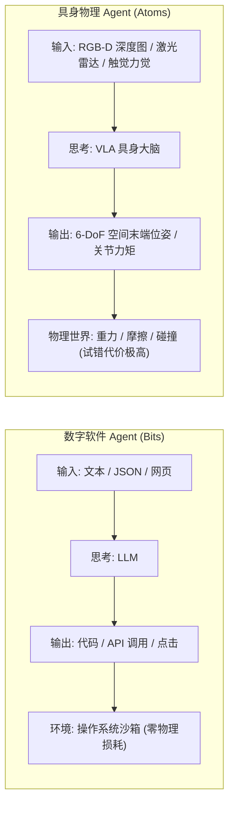
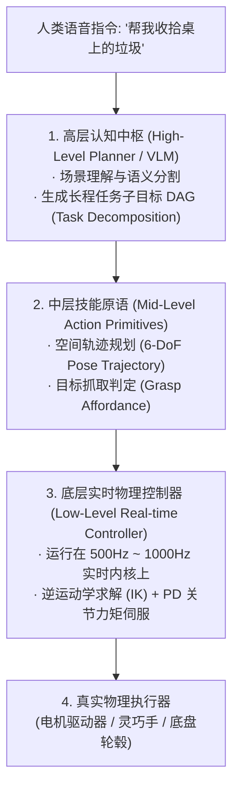
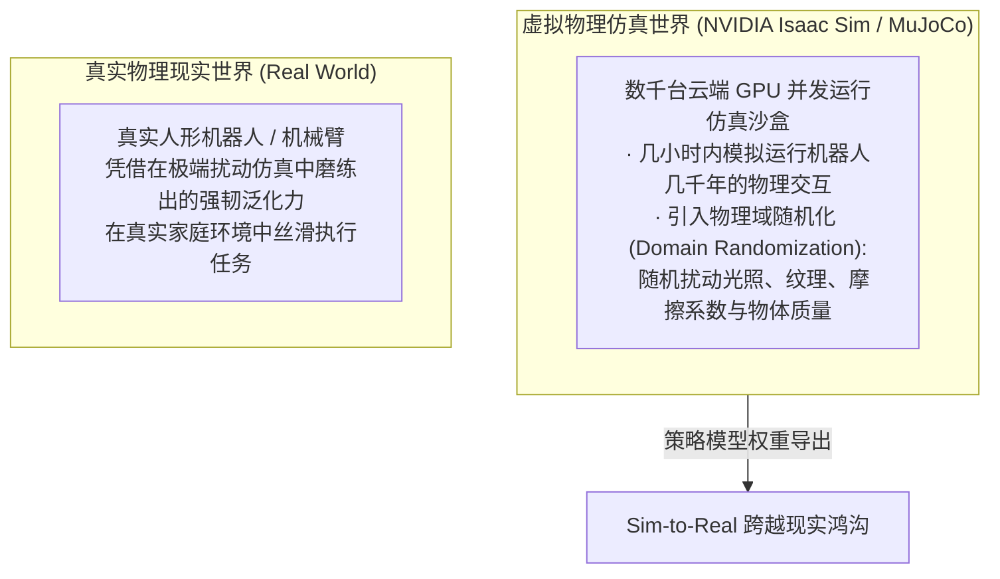

import { Quiz } from '@/components/Quiz'

# 6.4 具身物理交互演进：从数字沙盒到 Sim-to-Real 迁移

> **本节要点**：跳出屏幕与服务器的方寸之间，探索 Agent 走向物理现实世界的终极形态——**具身智能（Embodied AI）**；掌握 **VLA（Vision-Language-Action，视觉-语言-动作）** 统一大模型架构；理解从高层任务规划到低层关节力矩的控制解耦；攻克从虚拟仿真环境向真实物理实体跨越的 **Sim-to-Real 现实鸿沟**。

---

## 1. 终极跃迁：从“比特世界”跨入“原子世界”

此前我们探讨的所有 Agent，其本质都生活在纯粹的**比特数字世界（Bits）**：
* 它们操作的是代码文件、SQL 数据库、HTTP 接口和屏幕像素；
* 试错成本极低，失败了可以随时 `git reset` 或重启容器。

然而，**具身智能体（Embodied Agent）** 的行动实体直接植入在物理机器人、机械臂或自动驾驶汽车上，直接面对真实的**原子物理世界（Atoms）**：

---

## 2. 具身控制分层架构：VLA 模型与动作解耦

让机器人“把桌上的红苹果放进果盘”，模型不能只说空话，必须输出精密的毫秒级电机电信号。
生产级具身系统通常采用**分层解耦（Hierarchical Decoupling）**架构：

### VLA（Vision-Language-Action）统一大模型
以 Google RT-2、OpenVLA 为代表的前沿架构，将机械臂的末端轨迹（X, Y, Z, Roll, Pitch, Yaw, Gripper）直接离散化为特殊的 Token 词表。大模型接受摄像头 RGB 图像与文本指令，自回归输出动作 Token，真正实现了“看见-理解-直接行动”的端到端统一。

---

## 3. 跨越现实鸿沟：Sim-to-Real 迁移工程

在物理世界中训练机器人存在致命瓶颈：
* 真实机械臂在尝试抓取物体时，如果算法产生剧烈抖动，可能会瞬间打碎玻璃、烧毁电机甚至伤害人类；
* 真实世界无法进行“一万倍速快进学习”。

因此，**物理仿真环境（Simulation）** 成为了具身 Agent 的数字黄埔军校：

---

## 4. 第 6 章知识体系全景回顾与综合自测

回顾本章，我们完成了 Agent 从单纯文字到立体感知、从被动响应到物理触碰的全维交互跃迁：
1. **6.1 GUI 智能体与 Computer Use**：吃透了 DOM 选择器与纯视觉像素定位的优劣互补，掌握了 SoM 标记法的分类降维智慧；
2. **6.2 拟人全双工语音智能体**：攻克了 300ms 黄金延迟红线，解密了端到端 Speech-to-Speech 与 VAD 智能打断（Barge-in）状态机；
3. **6.3 混合主动人机协同**：用四象限模型明确了主动澄清与自主决策的边界，拥抱了 Generative UI 与 Artifacts 现代生产力工作流；
4. **6.4 具身物理交互演进**：探秘了 VLA 统一大模型，理解了从高层规划到底层力矩的分层控制，以及 Sim-to-Real 的跨界实践。

---

## 5. 本节练习与反思

<Quiz
  question="在具身智能（Embodied AI）机器人架构中，为什么通常不让百亿级多模态大模型直接以 1000Hz 的超高频率去控制电机的底层关节力矩，而是采用分层解耦控制架构？"
  options={[
    "百亿级大模型单次前向推理通常耗时数百毫秒，根本无法满足毫秒级（1000Hz）电机高动态抗扰与平衡伺服控制的硬实时要求",
    "因为国际机器人安全法规严格规定大语言模型只能控制轮式底盘，严禁控制关节手臂",
    "因为电机的铜线线圈无法导通多模态大语言模型生成的虚拟浮点数数据",
    "因为直接控制关节力矩会导致大模型的上下文窗口在 3 秒钟之内发生永久性物理坏死"
  ]}
  correctIndex={0}
  explanation="底层关节力矩控制需要运行在实时操作系统（RTOS）上以 500Hz~1000Hz 极速运行，以实时维持机器人平衡和防撞；而大模型的推理延迟动辄几百毫秒，只能负责高层意图理解与粗粒度轨迹规划，底层必须由专用的快速经典控制器（如 MPC/PD）接管。"
/>

<Quiz
  question="在具身智能策略训练中，'领域随机化（Domain Randomization）'技术如何帮助策略跨越 Sim-to-Real（仿真到现实）的鸿沟？"
  options={[
    "通过在仿真环境中随机大幅度改变光照角度、物体纹理、地面摩擦系数和重力加速度，迫使策略学会忽略无关视觉与物理噪声，从而能够鲁棒应对未知的真实世界",
    "通过在虚拟世界中随机让机器人的螺丝螺母脱落，用来模拟黑客发起的网络病毒攻击",
    "通过强制将仿真环境的分辨率降低为纯黑白像素，以此节省显卡计算电力",
    "通过随机向仿真世界中插入人类编写的 Python 提示词注释，以提高机器人的语言阅读水平"
  ]}
  correctIndex={0}
  explanation="真实物理世界的细节（光照变化、物体粗糙度、电机微小磨损）极其复杂，任何单一仿真模型都无法完美复刻。领域随机化把真实世界当成仿真随机扰动的一个特例，在包罗万象的随机环境中训练出来的策略，在降临真实世界时往往表现出极强的泛化鲁棒性。"
/>
