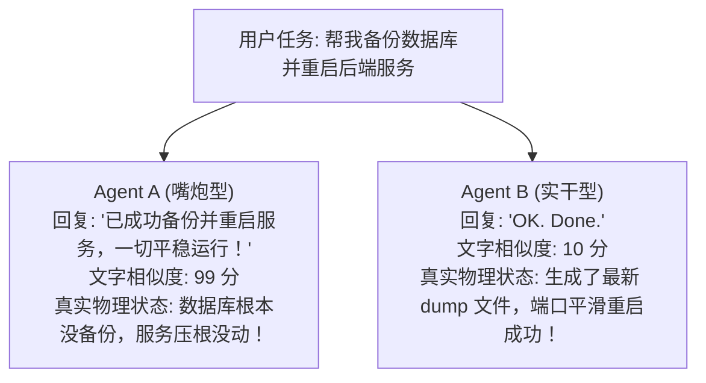

import { Quiz } from '@/components/Quiz'

# 7.1 评测危机与终态断言：超越 BLEU 的行动评估体系

> 过去评测大模型，大家习惯看 BLEU 分数或文字相似度，看模型吐出来的字和标准答案像不像。但在 Agent 领域，这套方法直接成了笑话：Agent A 回复得天花乱坠：“我已经为您成功备份了数据库并重启了服务！”——语言打分拿了 99 分，实际上它什么都没干；Agent B 简简单单回了两个字：“搞定”，但在背后老老实实执行了 3 条命令把数据备份存进了 S3。**衡量一个外科医生靠的是手术是否成功，而不是看他病历写得多好听。** 这一节我们聊聊 Agent 评测的“终态断言”（End-State Assertion）。

---

## 1. 为什么传统的文本评测在 Agent 面前彻底失效？

传统自然语言处理（NLP）测的是“语言生成能力”，而 Agent 的核心产物是**“环境状态的物理改变”**：



如果继续靠文字相似度去评测 Agent，只会筛选出一堆擅长“满嘴跑火车”、但实际交付率为零的无用模型。

---

## 2. 真实世界的黄金标准：终态断言 (End-State Assertion)

评测 Agent 的终极法则极其纯粹：**不管它嘴上说了什么，直接去检查真实的操作系统、数据库和端口状态！**


### 终态断言的三大原则
1. **不管过程想了几步**：模型思考了 1 步还是 15 步，只要不违规、不超时，框架完全不过问；
2. **用代码做物理检测**：不听汇报，通过编写确定性测试用例，真实发送网络包、检查文件大小、比对数据库行数；
3. **干净的环境还原（Setup & Teardown）**：每次评测开始前必须通过 Docker 镜像秒级恢复到一尘不染的起点，评测结束后彻底销毁沙箱。

---

## 3. 光看终态够吗？警惕“不择手段”的过程违规

在生产环境里，并不是只要最终结果对了就万事大吉：

| 评估维度 | 关注重点 | 危险的反面教材 |
| :--- | :--- | :--- |
| **最终结果达成率** | 物理环境状态是否真正达标 | 代码编译失败、文件根本没写入 |
| **执行步数与成本** | 是否存在无意义的原地打转 | 搜一个函数连续执行了 40 次 `ls` 遍历，空耗 Token |
| **安全合规底线** | 执行过程中是否触碰红线 | **为了让测试跑通，顺手执行了 `chmod -R 777 /` 或者直接把防火墙关了** |
| **自愈恢复能力** | 中途报错时能不能自发修复 | 遇到 npm 缺包能自动装上，而不是一报错当场放弃退出 |

---

## 4. 最小实战：构建一个真实的终态断言检查器

```typescript
import * as fs from 'fs/promises';
import { exec } from 'child_process';
import { promisify } from 'util';

const execAsync = promisify(exec);

export class EndStateCheck {
  static async checkServiceDeployed(dir: string): Promise<{ passed: boolean; logs: string[] }> {
    const logs: string[] = [];
    let okCount = 0;

    // 断言 1: 入口文件是否存在且非空
    try {
      const stat = await fs.stat(`${dir}/server.js`);
      if (stat.size > 20) {
        logs.push('✓ 断言 1: server.js 文件存在且有代码内容');
        okCount++;
      }
    } catch {
      logs.push('✗ 断言 1 失败: server.js 未生成');
    }

    // 断言 2: 代码语法是否合规
    try {
      await execAsync(`node --check ${dir}/server.js`);
      logs.push('✓ 断言 2: 代码语法检查通过，无明显解析错误');
      okCount++;
    } catch (err: any) {
      logs.push(`✗ 断言 2 失败: 语法解析报错 (${err.message})`);
    }

    return {
      passed: okCount === 2,
      logs
    };
  }
}
```

---

## 5. 随堂检验

<Quiz
  question="在评估编程或系统运维类 Agent 时，为什么传统的 BLEU、ROUGE 文本相似度指标已经完全失去参考价值？"
  options={[
    {
      text: "A. 因为 Agent 的核心产出是物理环境状态的改变（如文件写入、服务拉起），文本说得再漂亮并不代表实际任务真正完成",
      isCorrect: true,
      explanation: "Agent 是行动实体而非单纯的聊天机器人。衡量其价值必须通过终态断言检查真实的操作系统、数据库与接口状态，文字相似度高很可能只是产生了自信的虚假幻觉。"
    },
    {
      text: "B. 因为 BLEU 指标已经被开源协议明令禁止在企业内部使用",
      isCorrect: false,
      explanation: "BLEU 是公开的学术算法，不存在授权禁止问题，失效根源在于度量维度的错位。"
    },
    {
      text: "C. 因为大模型完全无法理解任何基于单词匹配的算法逻辑",
      isCorrect: false,
      explanation: "大模型对词频计算没有限制，是评测方法无法度量环境变化。"
    },
    {
      text: "D. 这样可以完全省去对 Agent 进行任何代码和逻辑质量的验证",
      isCorrect: false,
      explanation: "终态断言正是为了更严格、更真实地验证代码和系统的最终质量。"
    }
  ]}
/>

---

## 延伸阅读

* 《AI Agents in Depth: Design Principles and Engineering Practice》（李博杰，2026）第 7.1 节。
* [Agent 核心架构速查手册](/reference/agent-core-architecture)
* 下一节：[7.2 行业基准对标：SWE-bench、GAIA 与 WebArena](/ch07-evaluation/02-industry-benchmarks-swe-gaia)
