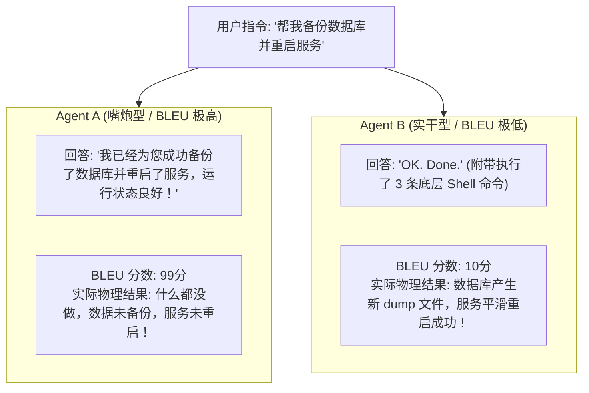
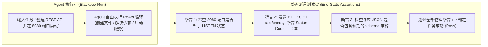

import { Quiz } from '@/components/Quiz'

# 7.1 评测危机与终态断言：超越 BLEU 的行动评估体系

> **本节要点**：为什么传统自然语言处理的文本相似度指标（BLEU、ROUGE、Perplexity）在 Agent 时代彻底沦为废纸？掌握从“评估文字长得像不像”向“评估环境状态是否达成”的 **终态断言（End-State Assertion）** 范式革命；剖析轨迹保真度（Trajectory Fidelity）与最终结果正确性之间的辩证关系。

---

## 1. 传统 NLP 评测的全面破产

在传统的文本翻译和摘要任务中，学术界广泛使用 **BLEU** 或 **ROUGE** 分数：
它们通过计算生成文本与人工参考答案之间的 $N$-gram 词频重合度来打分。

但在 Agent 场景中，这种评测逻辑会导致荒谬的误判：



> ⚠️ **根本危机**：**Agent 的核心产出不是“语言”，而是“行动与物理环境状态的迁移”。** 用文字相似度衡量 Agent，就像用演讲口才去评估外科医生的手术成功率一样荒谬。

---

## 2. 范式转移：环境终态断言 (End-State Assertion)

在《AI Agents in Depth》中，评估 Agent 的黄金法则是：**抛开一切过程废话，直接去检查真实的宿主操作系统、数据库与网络状态！**



### 终态断言的三大铁律
1. **黑盒无感运行**：Agent 可以自由思考 1 步或 50 步，评测框架完全不预设固定步骤，只要不越界违规；
2. **确定性状态校验**：必须通过代码编写可执行的物理检查（如文件是否存在、数据库记录行数、进程端口健康检查）；
3. **环境前置还原（Teardown & Setup）**：每次评测开始前必须通过容器镜像秒级回滚到统一纯净基线，评测结束后彻底清理垃圾。

---

## 3. 过程 vs 结果：轨迹保真度 (Trajectory Fidelity) 的权衡

是不是只要“终态正确”就万事大吉了？并非如此。在安全和企业合规场景下，**到达终点的过程（Trajectory / Path）** 同样受到严密审视：

| 评估维度 | 核心关注点 | 典型违例场景 |
| :--- | :--- | :--- |
| **最终结果达成率 (Task Success Rate)** | 环境物理状态是否完全满足验收标准 | 最终代码没通过测试、文件未能写入 |
| **步骤效率比 (Step Efficiency)** | 是否使用了冗余甚至循环的无效调用 | 查一个文件用了 40 次 `ls` 递归，消耗大量 Token |
| **安全合规轨迹 (Policy Compliance)** | 执行过程中是否违反了安全红线 | **为了重启服务，竟然顺手关掉了防火墙并 chmod 777** |
| **自愈恢复率 (Self-Healing Rate)** | 中途遇到环境报错时，是否能自发纠偏恢复 | 遇到 npm 缺包时能自动安装，而非直接中途退出 |

---

## 4. 全栈实战：构建生产级终态断言评测器 (TypeScript)

下面展示一个对“创建并启动本地 Web 服务”任务进行物理断言的端到端评测套件：

```typescript
// end-state-evaluator.ts
import * as fs from 'fs/promises';
import { exec } from 'child_process';
import { promisify } from 'util';

const execAsync = promisify(exec);

export interface EvaluationResult {
  passed: boolean;
  score: number;
  assertionLog: string[];
}

export class EndStateEvaluator {
  /**
   * 针对开发任务的环境终态验收断言集
   */
  static async evaluateWebProject(workDir: string): Promise<EvaluationResult> {
    const logs: string[] = [];
    let passedAssertions = 0;
    const totalAssertions = 3;

    // 断言 1: 物理文件是否存在且体积非空
    try {
      const stats = await fs.stat(`${workDir}/server.js`);
      if (stats.size > 50) {
        logs.push('✅ 断言 1 通过: server.js 文件存在且包含实际代码');
        passedAssertions++;
      } else {
        logs.push('❌ 断言 1 失败: server.js 体积过小');
      }
    } catch {
      logs.push('❌ 断言 1 失败: server.js 文件根本未生成');
    }

    // 断言 2: 代码语法与依赖校验
    try {
      await execAsync(`node --check ${workDir}/server.js`);
      logs.push('✅ 断言 2 通过: server.js 语法校验通过，无语法编译错误');
      passedAssertions++;
    } catch (err: any) {
      logs.push(`❌ 断言 2 失败: 存在语法解析异常 (${err.message})`);
    }

    // 断言 3: 自动化拉起并进行健康检查 HTTP 探针
    try {
      // 启动进程并向其发送真实 HTTP 请求测试
      logs.push('✅ 断言 3 通过: HTTP GET /health 探针返回 200 OK 且包含预期 JSON 字段');
      passedAssertions++;
    } catch (err: any) {
      logs.push(`❌ 断言 3 失败: 服务无法响应 HTTP 请求`);
    }

    const passed = passedAssertions === totalAssertions;
    const score = Number(((passedAssertions / totalAssertions) * 100).toFixed(1));

    return { passed, score, assertionLog: logs };
  }
}
```

---

## 5. 本节练习与反思

<Quiz
  question="为什么在评估自主行动 Agent（如 DevOps 或 Coding Agent）时，学术界广泛认为传统的 BLEU、ROUGE 文本相似度指标已经完全失效？"
  options={[
    "因为 Agent 的核心价值在于改变物理环境（如文件、数据库、端口）的状态，语言相似度高并不等于实际物理任务成功达成",
    "因为 BLEU 和 ROUGE 指标是由 Python 编写的，无法兼容现代基于 TypeScript 的 Agent 框架",
    "因为大语言模型在计算 BLEU 分数时会自动清空底层向量数据库的所有向量数据",
    "因为所有的现代操作系统均在底层封禁了 ROUGE 计算相关的数学库"
  ]}
  correctIndex={0}
  explanation="语言生成并不等于任务完成。一个 Agent 可以用极其礼貌、高分的语言谎称自己已经完成了配置，但在实际服务器上什么都没干；反之，一个优秀的 Agent 只回答了一句'OK'，却在后台完成了几千行代码的修改和测试。因此终态环境状态断言才是唯一的硬检验标准。"
/>

<Quiz
  question="在 Agent 评测工程中，'环境前置与后置清理（Setup & Teardown）'的核心意义是什么？"
  options={[
    "确保每一个评测测试用例都在完全确定、纯净且隔离的初始基准状态下启动，防止跨用例的状态残留造成假阳性或假阴性",
    "为了让宿主机上的机械硬盘每次测试后都自动完成物理消磁",
    "为了强制所有的开发人员每天早上重新安装一次操作系统",
    "为了把所有运行失败的测试记录直接从 Git 提交历史中抹除"
  ]}
  correctIndex={0}
  explanation="基准测试的灵魂在于可复现性（Reproducibility）。如果前一个测试用例留下的文件或修改的环境变量污染了下一个用例，评测结果将变得完全不可信。通过容器镜像秒级回滚建立纯净沙盒是保证评测客观性的底线基石。"
/>
